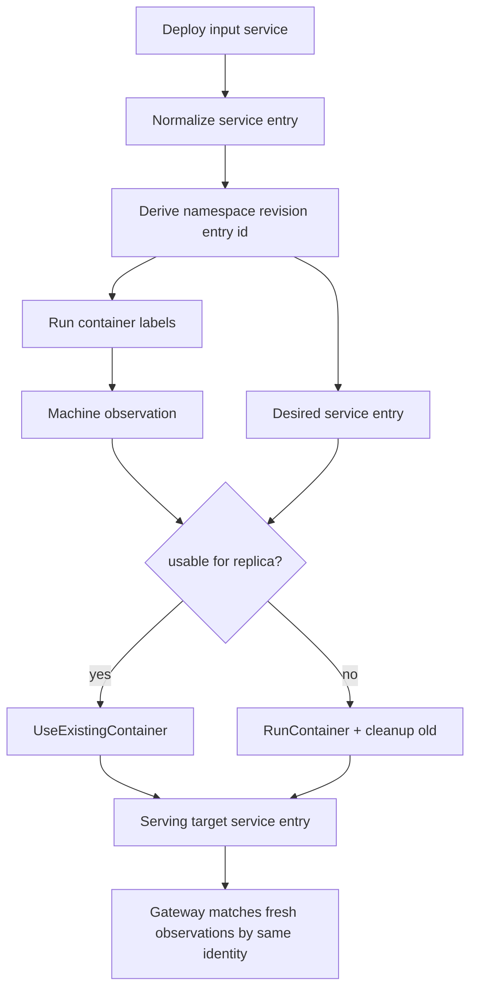
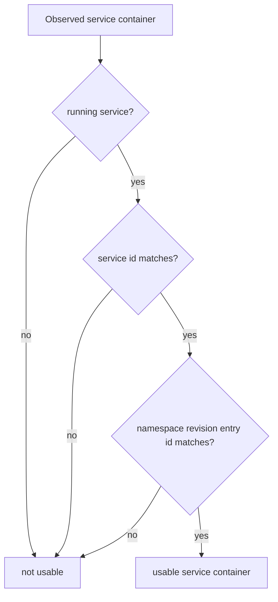

# Deploy Update Equivalence - Plan

## Goal Capsule

- **Objective:** Make deploy planning decide whether each service container needs replacement by comparing normalized namespace revision entry identity, not by treating every namespace revision id change as container drift.
- **Authority:** `VISION.md`, `CONTEXT.md`, `AGENTS.md`, `docs/plans/2026-06-30-001-feat-namespace-deploy-spine-plan.md`, ADR 0004, ADR 0008, ADR 0009.
- **Execution profile:** Focused follow-up. Keep the deploy worker shape and current operation evidence; change the identity and planning inputs that decide usable service containers.
- **Stop conditions:** Stop if the work grows into dependency phases, canaries, mutable in-place Docker updates, route-protection changes, or a generic diff engine.
- **Tail ownership:** Rust core owns runtime deploy planning. Cloud may supply deploy input, but core derives namespace revision entry identity and decides replacement.

---

## Product Contract

### Summary

Ployz should decide whether a service container is already usable for a deploy by comparing the container's observed namespace revision entry identity to the desired namespace revision entry. A namespace revision can change because another service changed; unchanged services should not restart just because the namespace-level graph id changed.

This follows the useful Uncloud shape: compare current normalized service spec to the requested service spec, then choose leave, replace, or cleanup. The first Ployz version only needs leave-or-replace; in-place updates and mutable Docker resource updates stay deferred.

### Problem Frame

The current deploy planner already has a reuse step: `UseExistingContainer` is emitted when an observed container is running for the requested service and target revision. That is too coarse once namespace deploys become the public model. If the request uses one namespace revision id for every service, then changing `api` can make `web` appear stale even when `web`'s service definition did not change.

Reusing an old namespace-revision container as a new namespace-revision container is not safe either. Gateway projection keys serving eligibility by service id, revision id, and endpoint port, so a plan that pretends old labels satisfy a new revision can complete while routes find no matching upstreams.

### Requirements

**Namespace revision entry identity**

- R1. Core must derive a stable namespace revision entry identity from normalized service deploy input.
- R2. A namespace revision entry identity must change when a field that requires container replacement changes, including the service image reference or routed endpoint port.
- R3. A namespace revision entry identity must remain stable when unrelated services in the same namespace change.
- R4. Namespace revision identity may still describe the full normalized namespace graph, but service containers must be reusable by namespace revision entry identity.

**Planning behavior**

- R5. Deploy planning must classify a running observed service container as usable only when service id, namespace revision entry identity, and running state match the desired namespace revision entry.
- R6. Deploy planning must emit `UseExistingContainer` for usable containers before scheduling new containers.
- R7. Deploy planning must emit `RunContainer` and cleanup for containers whose namespace revision entry identity no longer matches the desired namespace revision entry.
- R8. Deploy planning must not require eligible machines when all desired replicas are already satisfied by usable observed containers.
- R9. Deploy planning must not infer replacement need from stale passive observations alone; operation-owned runtime snapshots remain the planning input.

**Runtime evidence**

- R10. Machine-created service containers must carry enough labels to reconstruct namespace revision entry identity in runtime observations.
- R11. Managed container observations must expose the namespace revision entry identity needed by the planner and passive projections.
- R12. Gateway and route projections must continue matching the same identity that serving targets publish for service entries.
- R13. Public Rust and TypeScript wire fields must use `namespace_revision_id` for namespace graph identity and `namespace_revision_entry_id` for service entry identity.

**Scope control**

- R14. This plan must not implement Docker in-place updates for mutable resources.
- R15. This plan must not resolve mutable image tags by querying registries unless deploy input already contains an immutable image reference.
- R16. This plan must not add a generic service-spec diff engine beyond the current deploy input fields.

### Acceptance Examples

- AE1. **Unchanged service in changed namespace:** Given a namespace currently runs `web` and `api`, when a deploy changes only `api`, then the planner reuses healthy matching `web` containers and replaces only `api` containers.
- AE2. **Changed image:** Given `api` currently runs `ghcr.io/acme/api:old`, when deploy input asks for `ghcr.io/acme/api:new`, then `api` containers are not usable and replacements are planned.
- AE3. **Changed route endpoint:** Given `web` currently exposes endpoint port `3000`, when deploy input requires endpoint port `8080`, then `web` gets a new namespace revision entry id and existing `web` containers are replaced.
- AE4. **Scaled replicas:** Given two usable `worker` containers and deploy input asks for three replicas, then the planner reuses two and schedules one new container.
- AE5. **Fully satisfied deploy:** Given all desired replicas already have usable containers, when no eligible machines are available, then planning succeeds with only `UseExistingContainer` steps.
- AE6. **Mutable tag limitation:** Given deploy input still says `nginx:latest` and no digest or pull-always policy is present, when the remote tag changes, then Ployz does not claim to detect that change.

### Scope Boundaries

#### In Scope

- Stable normalized namespace revision entry identity for the current deploy service fields.
- Service container labels and observations that carry that identity.
- Planner reuse and cleanup decisions based on usable service container rules.
- Serving target and gateway identity alignment so reused containers remain routeable.
- Focused tests around unchanged service reuse, changed service replacement, endpoint mismatch, and scale changes.

#### Deferred to Follow-Up Work

- Pull-policy support such as `always` or `if-not-present`.
- Registry digest resolution for mutable tags.
- Mutable Docker resource updates that do not recreate a container.
- Dependency-derived phases and canary rollout.
- Rich Compose adapter equivalence for volumes, configs, commands, environment, hooks, and placement once those fields exist.

#### Out of Scope

- Reusing old-revision container labels by pretending they belong to a new revision.
- Background reconciliation that silently mutates cluster truth.
- A generic operation engine or generic spec-diff framework.
- Cloud-side runtime diffing.

---

## Planning Contract

### Key Technical Decisions

- KTD1. **Use namespace revision entry identity for container usability.** Namespace revision identity is too broad for unchanged-service reuse because one service change would invalidate every container in the namespace.
- KTD2. **Keep namespace revision entry derivation in `ployz-core`.** The same normalized identity must drive labels, observations, planner reuse, serving target entries, SDK types, and tests.
- KTD3. **Start with replace-only decisions.** Uncloud has `up-to-date`, `needs-update`, and `needs-recreate`; Ployz should implement `usable` vs. `replace` first because current machine runtime creates or removes containers, not in-place resource updates.
- KTD4. **Do not detect mutable tag drift without immutable input.** If callers deploy `latest` repeatedly, Ployz can compare only the image reference string unless deploy input carries a resolved digest or pull policy.
- KTD5. **Gateway identity must match planner identity.** A container reused by the planner must be eligible for the serving target without label rewriting or route sleight of hand.
- KTD6. **Replace generic revision ids with named revision ids.** Use `NamespaceRevisionId` for the full namespace graph and `NamespaceRevisionEntryId` for one service entry so Rust types expose the domain split.
- KTD7. **Rename wire fields without compatibility aliases.** This greenfield reset should expose `namespace_revision_id` and `namespace_revision_entry_id` directly instead of preserving `target_revision`.

### High-Level Technical Design

### Assumptions

- The current deploy service fields are service id, image reference, replica count, and optional route endpoint; namespace revision entry identity should cover only fields that describe one service container's runtime shape, including routed endpoint port.
- Replica count belongs to the desired namespace revision entry but not to one container's identity.
- Route target hostname is a binding concern; endpoint port is part of namespace revision entry identity because current labels and gateway matching need that port.
- Replace the current generic `RevisionId` with explicit `NamespaceRevisionId` and `NamespaceRevisionEntryId` types instead of preserving a transition alias.

### Risks & Dependencies

- **Rename churn:** The code currently uses `RevisionId` and `target_revision` broadly. Implementation must update call sites, labels, gateway input, tests, and generated TypeScript together.
- **Wire contract churn:** Public SDK types already expose `DeployRequest.target_revision`. Rename it without aliases and cover Rust and TypeScript fixtures in the same change.
- **Gateway mismatch:** If serving targets publish namespace revision while observations publish namespace revision entry identity, reused containers will not route.
- **Digest ambiguity:** Operators may expect `latest` to refresh. The plan must document that string-equal mutable tags are unchanged until pull policy or digest resolution exists.

### Sources & Research

- `VISION.md`
- `CONTEXT.md`
- `STRATEGY.md`
- `docs/plans/2026-06-30-001-feat-namespace-deploy-spine-plan.md`
- `docs/brainstorms/2026-06-07-namespace-succeed-or-die-operations-requirements.md`
- `docs/adr/0004-deploys-are-namespace-reconciliation-attempts.md`
- `docs/adr/0008-deploy-replacement-is-explicit-policy-with-failure-evidence.md`
- `docs/adr/0009-serving-eligibility-uses-fresh-observations.md`
- `crates/ployz-core/src/deploy.rs`
- `crates/ployz-core/src/machine_runtime.rs`
- `crates/ployzd/src/deploy_worker.rs`
- `crates/ployzd/src/gateway.rs`
- `crates/ployzd/src/machine_runtime/runner.rs`
- Uncloud reference: `pkg/client/deploy/container.go`

---

## Implementation Units

### U1. Add Namespace Revision Entry Identity

- **Goal:** Add a stable normalized identity for one desired service container shape.
- **Requirements:** R1, R2, R3, R4, R14, AE1, AE2, AE6, KTD1, KTD2, KTD4.
- **Dependencies:** None.
- **Files:**
  - `crates/ployz-core/src/ids.rs`
  - `crates/ployz-core/src/deploy.rs`
  - `crates/ployz-core/tests/deploy_planner.rs`
  - `crates/ployz-core/tests/wire_contract.rs`
  - `packages/ployz-sdk/src/generated.ts`
  - `packages/ployz-sdk/test/operations.test.ts`
- **Approach:** Replace the generic `RevisionId` with `NamespaceRevisionId` and `NamespaceRevisionEntryId`, then derive a namespace revision entry id from normalized service fields that affect container replacement. Keep replica count outside that id. Keep image comparison string-based for now.
- **Execution note:** Start with core tests that prove unchanged service identity survives unrelated namespace changes.
- **Patterns to follow:** Typed id wrappers and `serde(deny_unknown_fields)` in `DeployRequest`, `ImageReference`, and `ReplicaCount`.
- **Test scenarios:**
  - Two normalized services with the same service id, image, and endpoint requirement derive the same namespace revision entry id.
  - Changing only another service in the namespace does not change this service's namespace revision entry id.
  - Changing image reference changes this service's namespace revision entry id.
  - Changing replica count does not change one container's namespace revision entry id.
  - Changing routed endpoint port changes namespace revision entry id.
  - Repeating `nginx:latest` derives the same id when no digest or pull policy exists.
- **Verification:** Core tests prove equivalence is stable where replacement is unnecessary and changes where replacement is required by current fields.

### U2. Carry Entry Identity Through Labels And Observations

- **Goal:** Ensure machine-created containers publish the identity deploy planning needs on the next operation.
- **Requirements:** R10, R11, R12, AE1, AE2, AE3, KTD2, KTD5.
- **Dependencies:** U1.
- **Files:**
  - `crates/ployz-core/src/machine_runtime.rs`
  - `crates/ployzd/src/docker/labels.rs`
  - `crates/ployzd/src/docker/runner.rs`
  - `crates/ployzd/src/machine_runtime/runner.rs`
  - `crates/ployzd/src/machine_runtime/protocol.rs`
  - `crates/ployzd/src/machine_runtime/process.rs`
  - `crates/ployzd/tests/machine_service_runtime.rs`
  - `crates/ployzd/tests/docker_observer.rs`
  - `crates/ployzd/tests/machine_rpc.rs`
- **Approach:** Add the namespace revision entry id to managed container labels, machine run requests, and managed container observations. Existing Docker summaries already become `ExistingManagedContainer` through label parsing; extend that path so observation snapshots carry the same identity used by core planning.
- **Patterns to follow:** `ManagedContainerLabels::render`, `ManagedContainerLabels::parse`, `managed_container_labels`, and `publish_machine_observation_snapshot`.
- **Test scenarios:**
  - Creating a managed service container renders the namespace revision entry label.
  - Parsing Docker labels rejects missing or invalid namespace revision entry values for managed service containers.
  - Machine observation snapshots include namespace revision entry id for running and stopped managed service containers.
  - NATS machine RPC run request round-trips the namespace revision entry id.
  - Existing operation-step conflict behavior still compares operation and step identity separately from namespace revision entry identity.
- **Verification:** Machine runtime tests prove new containers and future observations preserve namespace revision entry evidence.

### U3. Plan Usable Service Containers By Entry Identity

- **Goal:** Update deploy preparation and planning so usable containers are selected by namespace revision entry identity.
- **Requirements:** R5, R6, R7, R8, R9, AE1, AE2, AE3, AE4, AE5, KTD1, KTD3.
- **Dependencies:** U1, U2.
- **Files:**
  - `crates/ployz-core/src/deploy.rs`
  - `crates/ployz-core/tests/deploy_planner.rs`
  - `crates/ployzd/src/deploy_worker/preparation.rs`
  - `crates/ployzd/src/deploy_worker/facts.rs`
  - `crates/ployzd/tests/deploy_command_preparation.rs`
  - `crates/ployzd/tests/deploy_command_preparation_nats.rs`
- **Approach:** Replace the current target-revision-only reusable check with a `UsableServiceContainer` check that requires running state, service id, and namespace revision entry id. Keep the existing round-robin scheduling for missing replicas and existing cleanup candidate behavior for stale service containers.
- **Execution note:** Add planner tests before changing preparation; this is the smallest proof that unchanged services do not restart.
- **Patterns to follow:** Current `existing_replicas`, `reusable_for_route`, `plan_deploy_service`, and duplicate-observation deduping in `deploy.rs`.
- **Test scenarios:**
  - Unchanged `web` service is reused when `api` has a different namespace revision entry id.
  - Changed image for `api` causes `api` run steps and cleanup candidates for old `api` containers.
  - Endpoint port change prevents reuse by changing the namespace revision entry id.
  - Two usable containers and desired three replicas produce two `UseExistingContainer` steps and one `RunContainer`.
  - Desired replicas fully satisfied by usable containers succeeds with no eligible machines.
  - Duplicate observations for the same usable container count once.
  - A passive stale observation alone is not accepted as an operation-owned runtime snapshot input.
- **Verification:** Planner and preparation tests prove leave-or-replace decisions match the current runtime snapshot.

### U4. Align Serving Target And Gateway Matching

- **Goal:** Make the identity published by serving targets match the identity carried by reusable containers.
- **Requirements:** R4, R12, AE1, AE3, KTD5.
- **Dependencies:** U1, U2, U3.
- **Files:**
  - `crates/ployz-core/src/state.rs`
  - `crates/ployzd/src/deploy_worker/types.rs`
  - `crates/ployzd/src/deploy_worker.rs`
  - `crates/ployzd/src/gateway.rs`
  - `crates/ployzd/src/gateway_source.rs`
  - `crates/ployzd/tests/deploy_operation.rs`
  - `crates/ployzd/tests/gateway_projection.rs`
  - `crates/ployzd/tests/gateway_process_runtime.rs`
- **Approach:** Ensure active service or future namespace serving-target entries reference the desired namespace revision entry identity for each service entry. Update `UseExistingContainer` execution records so reused containers keep their observed identity and still satisfy health and gateway projection. Do not rewrite Docker labels on reused containers.
- **Patterns to follow:** `GatewayUpstreamKey`, `DeployContainer`, `active_service_state`, and current gateway projection tests.
- **Test scenarios:**
  - A reused container appears as a healthy upstream after serving target commit.
  - A container with matching service id but different namespace revision entry id is ignored by gateway projection.
  - A container with the old endpoint port is ignored because it has the old namespace revision entry id.
  - Deploy operation health checks include reused containers under the identity gateway will use.
- **Verification:** Deploy and gateway tests prove reused containers remain serveable without relabeling.

### U5. Refresh Public Contract And Operator Documentation

- **Goal:** Make the API contract and docs clear about what Ployz can and cannot detect.
- **Requirements:** R13, R14, R15, AE6, KTD3, KTD4.
- **Dependencies:** U1, U2, U3, U4.
- **Files:**
  - `crates/ployz-core/tests/wire_contract.rs`
  - `crates/ployz-sdk-types/tests/exports.rs`
  - `packages/ployz-sdk/src/generated.ts`
  - `README.md`
  - `docs/plans/2026-06-30-001-feat-namespace-deploy-spine-plan.md`
- **Approach:** Rename generated SDK fields to `namespace_revision_id` and `namespace_revision_entry_id` with no old-name aliases. Add a short note to the namespace deploy spine plan or README that mutable tag refresh is deferred until pull policy or digest resolution exists. Avoid broad documentation rewrites.
- **Patterns to follow:** Existing SDK export fixture tests and concise README wording.
- **Test scenarios:**
  - Wire contract rejects unknown or malformed namespace revision entry identity fields.
  - Wire contract rejects old `target_revision` fields.
  - TypeScript generated types expose `namespace_revision_id` and `namespace_revision_entry_id`.
  - Documentation states that same image reference means unchanged unless a future digest or pull-policy feature says otherwise.
- **Verification:** Contract tests and docs show deploy update decisions are explicit and not over-promised.

---

## Verification Contract

| Gate | Applies to | Done signal |
|---|---|---|
| `cargo test -p ployz-core deploy_planner wire_contract` | U1, U3, U5 | Core equivalence, planning, and wire behavior pass focused tests. |
| `cargo test -p ployzd machine_service_runtime machine_rpc docker_observer` | U2 | Machine runtime labels, RPC, and observations preserve namespace revision entry evidence. |
| `cargo test -p ployzd deploy_operation gateway_projection gateway_process_runtime` | U4 | Reused containers remain serveable through the gateway projection path. |
| `cargo test -p ployz-sdk-types` plus SDK package tests | U1, U5 | Generated TypeScript contract matches Rust. |
| `cargo clippy --all-targets --all-features --locked -- -D warnings` | All units | Rust changes meet workspace lint policy. |

---

## Definition of Done

- Core derives namespace revision entry identity from normalized deploy service input.
- Machine labels and observations carry namespace revision entry identity for managed service containers.
- Deploy planning reuses unchanged service containers when another service in the namespace changes.
- Deploy planning replaces containers when current supported service fields change.
- Gateway projection uses the same identity as the deploy planner and serving target.
- Mutable image tag drift is documented as unsupported until pull policy or digest resolution exists.
- All Verification Contract gates pass or any unrelated pre-existing failure is recorded.
- Dead compatibility shims and experimental code are removed from the final diff.
