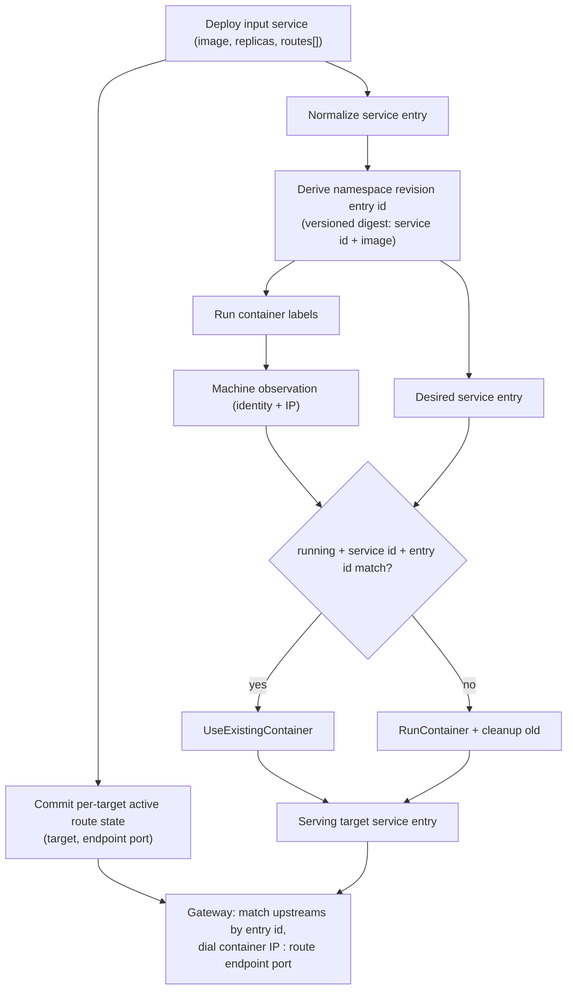

# Deploy Update Equivalence - Plan

## Goal Capsule

- **Objective:** Make deploy planning decide whether each service container needs replacement by comparing namespace revision entry identity (a versioned per-service digest of replacement-requiring fields), make routed endpoint port changes an endpoint reroute instead of a replacement, and make route bindings multi-domain.
- **Authority:** `VISION.md`, `CONTEXT.md`, `AGENTS.md`, `docs/plans/2026-06-30-001-feat-namespace-deploy-spine-plan.md`, ADR 0004, ADR 0008, ADR 0009, ADR 0022, ADR 0023.
- **Execution profile:** Focused follow-up. Keep the deploy worker shape and current operation evidence; change the identity, route state, and gateway matching inputs that decide usable service containers and serveable upstreams.
- **Stop conditions:** Stop if the work grows into dependency phases, canaries, standalone route operations outside deploy manifests, health-gated reroutes, registry digest resolution, or a generic diff engine. (In-place endpoint reroute and multi-domain routes are in scope by explicit decision; mutable Docker *resource* updates such as CPU/memory remain out.)
- **Tail ownership:** Rust core owns runtime deploy planning. Cloud renders deploy manifests (including domains and ports) and submits them; core derives namespace revision entry identity and decides replacement. Ployz is deliberately dumb about where route changes come from.

---

## Product Contract

### Summary

Ployz should decide whether a service container is already usable for a deploy by comparing the container's observed namespace revision entry identity to the desired namespace revision entry. A namespace revision can change because another service changed; unchanged services should not restart just because the namespace-level graph id changed.

Route state is not container state. A routed endpoint port change is an endpoint reroute — a route-level state commit inside the deploy — not a container replacement, because gateways dial a container's observed IP on the route's endpoint port (ADR 0023). A service can bind any number of domains, each with its own endpoint port, and several domains may share one port.

This follows the useful Uncloud shape (compare current normalized state to requested state, then leave or replace) but goes one step further than Uncloud's current shipped behavior on ports: Uncloud still recreates on port changes only because their ingress port state lives in container labels; their own code marks that as a TODO to lift once port state moves out of labels. Ployz's route state already lives in KV, so we lift it now.

### Problem Frame

The current deploy planner already has a reuse step: `UseExistingContainer` is emitted when an observed container is running for the requested service and target revision. That is too coarse once namespace deploys become the public model. If the request uses one namespace revision id for every service, then changing `api` can make `web` appear stale even when `web`'s service definition did not change.

Three couplings make this worse today:

1. Gateway projection (`GatewayUpstreamKey`) requires the container's own observed port to equal the route's declared port, so port changes force container churn even though the gateway could simply dial a different port.
2. Containers only join the gateway endpoint network when a route existed at creation, so a later route attach cannot reach reused containers at any port.
3. Deploy input carries at most one route per service, so multiple domains cannot bind to one service at all.

### Requirements

**Namespace revision entry identity**

- R1. Core must derive a namespace revision entry identity as a hex-encoded sha256 digest over a versioned canonical encoding of service id and image reference (ADR 0022).
- R2. The identity must change when the service image reference changes, and must fold in service id so two services never share an identity.
- R3. The identity must remain stable when unrelated services in the same namespace change, when replica count changes, and when route targets or endpoint ports change.
- R4. The canonical encoding must carry an explicit format version so future field additions are a deliberate version bump, not silent hash drift.

**Routes and endpoint reroute**

- R5. Deploy input must accept any number of routes per service (`routes: Vec<DeployRoute>`), each with an independent target and endpoint port; an empty list means the service has no routes.
- R6. Active route state must be stored one record per route target, all referencing the owning service; deploy input is the single declarative writer of route state.
- R7. A deploy that changes only a route's endpoint port must commit the new route state and leave matching containers in place (endpoint reroute); no container replacement, plan step, or machine action may be required for it.
- R8. Every service container must join the gateway endpoint network at creation, regardless of routes (ADR 0023).

**Planning behavior**

- R9. Deploy planning must classify a running observed service container as usable exactly when service id, namespace revision entry identity, and running state match the desired namespace revision entry. Planner outcomes stay two-way: usable or replace.
- R10. Deploy planning must emit `UseExistingContainer` for usable containers before scheduling new containers, and `RunContainer` plus cleanup for containers whose identity no longer matches.
- R11. Deploy planning must not require eligible machines when all desired replicas are already satisfied by usable observed containers.
- R12. Deploy planning must not infer replacement need from stale passive observations alone; operation-owned runtime snapshots remain the planning input.

**Runtime evidence**

- R13. Machine-created service containers must carry labels sufficient to reconstruct namespace revision entry identity in runtime observations; the endpoint-port container label is removed along with its role in network attachment and upstream matching.
- R14. Managed container observations must expose the namespace revision entry identity needed by the planner and passive projections, and the container's endpoint network IP whenever it is running.
- R15. Gateway upstream matching must select containers by service id and namespace revision entry identity and dial the container IP on the route's endpoint port; the container's own declared port must not participate in matching.
- R16. Public Rust and TypeScript wire fields must use `namespace_revision_id` for namespace graph identity and `namespace_revision_entry_id` for service entry identity, with no `target_revision` aliases.

**Scope control**

- R17. This plan must not resolve mutable image tags by querying registries; string-equal image references compare as unchanged (AE7).
- R18. This plan must not add health gating to endpoint reroutes; route port changes apply directly, and a port nothing listens on fails at the traffic layer (accepted in ADR 0023).
- R19. This plan must not add standalone route operations; route changes arrive only as rendered deploy manifests.
- R20. This plan must not add a generic service-spec diff engine beyond the current deploy input fields.

### Acceptance Examples

- AE1. **Unchanged service in changed namespace:** Given a namespace currently runs `web` and `api`, when a deploy changes only `api`, then the planner reuses running matching `web` containers and replaces only `api` containers.
- AE2. **Changed image:** Given `api` currently runs `ghcr.io/acme/api:old`, when deploy input asks for `ghcr.io/acme/api:new`, then `api` containers are not usable and replacements are planned.
- AE3. **Endpoint reroute:** Given `web` runs with a route on endpoint port `3000`, when deploy input declares the same image with endpoint port `8080`, then existing `web` containers are reused, route state commits port `8080`, and the gateway dials the same containers on `8080` with no container replacement.
- AE4. **Route attach to a running service:** Given `worker` runs with no routes, when deploy input adds a route, then existing `worker` containers are reused and become gateway upstreams, because they already joined the endpoint network at creation.
- AE5. **Multi-domain:** Given deploy input binds `example.com` and `www.example.com` to `web` on the same endpoint port, then both routes serve from the same usable containers; detaching one domain in the next manifest removes only that route.
- AE6. **Scaled replicas:** Given two usable `worker` containers and deploy input asks for three replicas, then the planner reuses two and schedules one new container.
- AE7. **Mutable tag limitation:** Given deploy input still says `nginx:latest` and no digest is present, when the remote tag changes, then Ployz does not claim to detect that change.
- AE8. **Fully satisfied deploy:** Given all desired replicas already have usable containers, when no eligible machines are available, then planning succeeds with only `UseExistingContainer` steps.

### Scope Boundaries

#### In Scope

- Versioned per-service namespace revision entry identity digest (ADR 0022).
- Unconditional endpoint network attachment at container creation and gateway dialing by route port (ADR 0023).
- Multi-domain route bindings: `Vec<DeployRoute>` deploy input, per-target active route records, multi-route commit and cleanup.
- Endpoint reroute as a route-level commit inside ordinary deploys.
- Service container labels and observations that carry entry identity; removal of the endpoint-port label.
- Planner reuse and cleanup decisions based on usable service container rules.
- Focused tests around unchanged-service reuse, changed-service replacement, reroute, route attach/detach via manifest, multi-domain, and scale changes.

#### Deferred to Follow-Up Work

- Standalone route operations outside deploy manifests (attach/detach commands with cert gating per ADR 0002); they must write the same per-target route state this plan defines.
- Health-gated or verified reroutes.
- Pull-policy support such as `always` or `if-not-present`; registry digest resolution for mutable tags.
- Mutable Docker resource updates (CPU, memory, ulimits) that do not recreate a container.
- Dependency-derived phases and canary rollout.
- Rich Compose adapter equivalence for volumes, configs, commands, environment, hooks, and placement once those fields exist.

#### Out of Scope

- Reusing old-revision container labels by pretending they belong to a new revision.
- Background reconciliation that silently mutates cluster truth.
- A generic operation engine or generic spec-diff framework.
- Cloud-side runtime diffing.
- Machine-local port-override ledgers (rejected in ADR 0023).

---

## Planning Contract

### Key Technical Decisions

- KTD1. **Use namespace revision entry identity for container usability.** Namespace revision identity is too broad for unchanged-service reuse because one service change would invalidate every container in the namespace.
- KTD2. **Keep namespace revision entry derivation in `ployz-core`.** The same identity must drive labels, observations, planner reuse, serving target entries, SDK types, and tests. It is a versioned sha256 hex digest folding in service id (ADR 0022), following the existing `sha2` convention in `machine.rs`.
- KTD3. **Planner outcomes stay two-way.** Uncloud's third outcome (`needs-update`) turned out to be route-level for the port case: once gateways dial route ports, a port change leaves every container usable and only route state moves. No per-container update step exists in this plan.
- KTD4. **Route state is not container state.** Identity excludes route targets and endpoint ports; `ActiveRouteState` is stored per target; deploy manifests are the single declarative writer. Endpoint reroute is a KV commit, applied directly without a health gate (ADR 0023).
- KTD5. **Containers always join the endpoint network.** Matches Uncloud (`EndpointsConfig` is unconditional in their container create path); kills the "reused container is unreachable after route attach" class entirely. The `plz.endpoint_port` label loses both jobs (network decision, upstream match) and is deleted.
- KTD6. **Do not detect mutable tag drift without immutable input.** If callers deploy `latest` repeatedly, Ployz compares only the image reference string.
- KTD7. **Replace generic revision ids with named revision ids.** `NamespaceRevisionId` for the full namespace graph and `NamespaceRevisionEntryId` for one service entry; rename wire fields without compatibility aliases (greenfield reset).

### High-Level Technical Design

### Assumptions

- Current deploy service fields are service id, image reference, replica count, and routes; only service id and image reference affect the entry identity.
- Replica count belongs to the desired namespace revision entry but not to one container's identity.
- KV shape changes (per-target route records, renamed fields) need no migration: alpha resets per ADR 0021.
- Docker same-network connectivity is unrestricted by exposed ports, so dialing a port other than the created one works at the network layer (verified against Docker docs and Railway's private-networking model).

### Risks & Dependencies

- **Rename churn:** `RevisionId` and `target_revision` are used broadly. Implementation must update call sites, labels, gateway input, tests, and generated TypeScript together.
- **Unverified reroute:** a route port nothing listens on fails at the traffic layer with no deploy-time evidence. Accepted deliberately (ADR 0023); document it, do not silently mitigate it.
- **Silent revert via manifests:** because deploy input is the single declarative writer, a manifest that still declares an old port or omits a domain will revert or detach it. This is by design (Cloud re-renders complete manifests); the CLI contract should make the declarative semantics obvious.
- **Gateway mismatch:** serving targets, observations, and gateway matching must all move to entry identity in the same change or reused containers stop routing.
- **Network capacity:** every container now consumes an endpoint-network address. Trivial at small-cluster scale; noted for completeness.

### Sources & Research

- `VISION.md`, `CONTEXT.md`, `STRATEGY.md`
- `docs/plans/2026-06-30-001-feat-namespace-deploy-spine-plan.md`
- ADR 0002, ADR 0004, ADR 0008, ADR 0009, ADR 0018, ADR 0021, ADR 0022, ADR 0023
- `crates/ployz-core/src/deploy.rs`, `crates/ployz-core/src/machine_runtime.rs`, `crates/ployz-core/src/state.rs`
- `crates/ployzd/src/deploy_worker.rs`, `crates/ployzd/src/gateway.rs`, `crates/ployzd/src/docker/runner.rs`, `crates/ployzd/src/docker/labels.rs`
- Uncloud reference: `pkg/client/deploy/container.go` (EvalContainerSpecChange; port-recreate TODO), `internal/machine/docker/server.go` (unconditional network attach), `internal/proxy/proxy.go`
- Docker networking docs (EXPOSE is metadata, not access control); Railway private networking (no port mapping layer; dial the listening port)

---

## Implementation Units

### U1. Add Namespace Revision Entry Identity

- **Goal:** Add the versioned per-service digest identity for one desired service container shape.
- **Requirements:** R1, R2, R3, R4, AE1, AE2, AE7, KTD1, KTD2, KTD6, KTD7.
- **Dependencies:** None.
- **Files:**
  - `crates/ployz-core/src/ids.rs`
  - `crates/ployz-core/src/deploy.rs`
  - `crates/ployz-core/tests/deploy_planner.rs`
  - `crates/ployz-core/tests/wire_contract.rs`
- **Approach:** Replace the generic `RevisionId` with `NamespaceRevisionId` and `NamespaceRevisionEntryId`. Derive the entry id as a sha256 hex digest (existing `sha2` convention) over a versioned canonical encoding of service id and image reference. Replica count and routes stay outside the id. Image comparison stays string-based.
- **Execution note:** Start with core tests that prove unchanged service identity survives unrelated namespace changes and all route changes.
- **Patterns to follow:** Typed id wrappers, `JoinTokenFingerprint` digest construction in `machine.rs`, `serde(deny_unknown_fields)`.
- **Test scenarios:**
  - Same service id + image derive the same entry id; encoding version participates in the digest.
  - Different service ids with identical images derive different entry ids.
  - Changing only another service in the namespace does not change this service's entry id.
  - Changing image reference changes the entry id; repeating `nginx:latest` does not.
  - Changing replica count, route target, or endpoint port does not change the entry id.
- **Verification:** Core tests prove equivalence is stable where replacement is unnecessary and changes exactly when replacement is required.

### U2. Multi-Domain Routes And Route State

- **Goal:** Deploy input carries any number of routes per service; active route state is one record per target; deploy is the single declarative writer.
- **Requirements:** R5, R6, R7, AE3, AE5, KTD4.
- **Dependencies:** U1 (renamed ids flow through route state).
- **Files:**
  - `crates/ployz-core/src/deploy.rs`
  - `crates/ployz-core/src/state.rs`
  - `crates/ployz-nats/src/core_state/active_route.rs`
  - `crates/ployzd/src/deploy_worker/preparation.rs`
  - `crates/ployz/src/commands/deploy.rs`
  - `crates/ployz-core/tests/deploy_planner.rs`
  - `crates/ployzd/tests/deploy_command_preparation.rs`
- **Approach:** `DeployServiceSpec.route: Option<DeployRoute>` becomes `routes: Vec<DeployRoute>` (empty = no routes). Store `ActiveRouteState` keyed per route target; route commit upserts declared targets, updates changed endpoint ports in place (endpoint reroute), and removes records for targets the manifest no longer declares. Drop the single-route `ActiveRouteMismatch` shape in favor of per-target reconciliation. CLI `--route` may repeat.
- **Test scenarios:**
  - Two targets on one service, same port, both committed; removing one from the manifest removes only that record.
  - Port-only change updates the existing target record and produces no container replacement or plan step.
  - Empty `routes` removes all route records for the service.
  - Two targets with different endpoint ports on one service both commit.
- **Verification:** Preparation tests prove route state reconciles per target and reroutes commit without touching container plans.

### U3. Always-Attach Networking And Label Cleanup

- **Goal:** Every service container joins the endpoint network at creation; entry identity replaces revision + port labels.
- **Requirements:** R8, R13, R14, AE4, KTD5.
- **Dependencies:** U1.
- **Files:**
  - `crates/ployz-core/src/machine_runtime.rs`
  - `crates/ployzd/src/docker/labels.rs`
  - `crates/ployzd/src/docker/runner.rs`
  - `crates/ployzd/src/machine_runtime/runner.rs`
  - `crates/ployzd/src/machine_runtime/protocol.rs`
  - `crates/ployzd/tests/machine_service_runtime.rs`
  - `crates/ployzd/tests/docker_observer.rs`
  - `crates/ployzd/tests/machine_rpc.rs`
- **Approach:** `create_body` attaches every service container to `ENDPOINT_NETWORK_NAME` unconditionally (Uncloud parity) and stops deriving `exposed_ports`/network config from the route port. Delete `ENDPOINT_PORT_LABEL`; add the namespace revision entry id label. Observations report the container's network IP whenever running (`ContainerEndpoint` becomes IP-only or port moves out of it), plus the entry id parsed from labels.
- **Test scenarios:**
  - A service container created with no routes joins the endpoint network and reports an IP.
  - Labels render and parse the entry id; missing/invalid entry id labels are rejected for managed service containers.
  - Machine observation snapshots carry entry id and IP for running containers.
  - Machine RPC run request round-trips the entry id and no longer carries an endpoint port.
- **Verification:** Machine runtime tests prove new containers and observations preserve entry identity and are always reachable on the endpoint network.

### U4. Plan Usable Service Containers By Entry Identity

- **Goal:** Deploy preparation and planning select usable containers by entry identity; outcomes stay two-way.
- **Requirements:** R9, R10, R11, R12, AE1, AE2, AE6, AE8, KTD1, KTD3.
- **Dependencies:** U1, U3.
- **Files:**
  - `crates/ployz-core/src/deploy.rs`
  - `crates/ployz-core/tests/deploy_planner.rs`
  - `crates/ployzd/src/deploy_worker/preparation.rs`
  - `crates/ployzd/src/deploy_worker/facts.rs`
  - `crates/ployzd/tests/deploy_command_preparation.rs`
  - `crates/ployzd/tests/deploy_command_preparation_nats.rs`
- **Approach:** Replace `is_running_service_revision` + `reusable_for_route` with a usable-service-container check on running state, service id, and entry id only (route port no longer gates reuse). Keep round-robin scheduling for missing replicas and cleanup candidates for stale service containers.
- **Execution note:** Add planner tests before changing preparation; this is the smallest proof that unchanged services do not restart.
- **Test scenarios:**
  - Unchanged `web` is reused when `api` has a different entry id.
  - Changed image for `api` causes `api` run steps and cleanup for old `api` containers.
  - Route and port changes alone never produce run or cleanup steps.
  - Two usable containers, desired three replicas: two `UseExistingContainer`, one `RunContainer`.
  - Fully satisfied replicas succeed with no eligible machines.
  - Duplicate observations for the same container count once.
  - A passive stale observation alone is not accepted as planning input.
- **Verification:** Planner and preparation tests prove leave-or-replace decisions match the current runtime snapshot.

### U5. Gateway Dials Route Ports By Entry Identity

- **Goal:** Gateway matches upstreams by entry identity and dials container IP on the route's endpoint port.
- **Requirements:** R15, AE3, AE4, AE5, KTD4, KTD5.
- **Dependencies:** U1, U2, U3, U4.
- **Files:**
  - `crates/ployz-core/src/state.rs`
  - `crates/ployzd/src/deploy_worker/types.rs`
  - `crates/ployzd/src/deploy_worker.rs`
  - `crates/ployzd/src/gateway.rs`
  - `crates/ployzd/src/gateway_source.rs`
  - `crates/ployzd/tests/deploy_operation.rs`
  - `crates/ployzd/tests/gateway_projection.rs`
  - `crates/ployzd/tests/gateway_process_runtime.rs`
- **Approach:** `GatewayUpstreamKey` drops `endpoint_port` and keys on service id + entry id; upstream dial address is container observed IP + route endpoint port. Serving-target entries reference the desired entry identity per service. Reused containers keep their observed identity; no label rewriting.
- **Test scenarios:**
  - A reused container projects as a serveable upstream after serving target commit.
  - After a port-only reroute, the same container is dialed on the new port with no replacement.
  - Two domains on one service both project upstreams from the same containers.
  - A container with matching service id but different entry id is ignored.
  - Deploy and gateway projection use the same entry identity for reused containers.
- **Verification:** Deploy and gateway tests prove reused containers remain serveable through reroutes and multi-domain bindings without relabeling.

### U6. Refresh Public Contract And Operator Documentation

- **Goal:** The API contract and docs state exactly what Ployz detects and what applies without verification.
- **Requirements:** R16, R17, R18, R19, AE7, KTD6, KTD7.
- **Dependencies:** U1–U5.
- **Files:**
  - `crates/ployz-core/tests/wire_contract.rs`
  - `crates/ployz-sdk-types/src/lib.rs`
  - `crates/ployz-sdk-types/tests/exports.rs`
  - `packages/ployz-sdk/src/generated.ts`
  - `packages/ployz-sdk/test/operations.test.ts`
  - `README.md`
- **Approach:** Rename wire fields to `namespace_revision_id` / `namespace_revision_entry_id` with no aliases; `routes` replaces `route` in SDK types. Document: mutable tags compare as strings (no drift detection); endpoint reroutes apply directly without a health gate; deploy manifests are the single declarative writer of route state.
- **Test scenarios:**
  - Wire contract rejects unknown or malformed entry identity fields and old `target_revision` / singular `route` fields.
  - TypeScript generated types expose `namespace_revision_id`, `namespace_revision_entry_id`, and `routes`.
  - Docs state the mutable-tag and unverified-reroute limitations.
- **Verification:** Contract tests and docs show deploy update decisions are explicit and not over-promised.

---

## Verification Contract

| Gate | Applies to | Done signal |
|---|---|---|
| `cargo test -p ployz-core deploy_planner wire_contract` | U1, U2, U4, U6 | Core identity, route reconciliation, planning, and wire behavior pass focused tests. |
| `cargo test -p ployzd machine_service_runtime machine_rpc docker_observer` | U3 | Labels, RPC, network attach, and observations preserve entry identity evidence. |
| `cargo test -p ployzd deploy_command_preparation deploy_command_preparation_nats` | U2, U4 | Preparation reconciles routes per target and selects usable containers by entry id. |
| `cargo test -p ployzd deploy_operation gateway_projection gateway_process_runtime` | U5 | Reused containers remain serveable through reroutes and multi-domain routes. |
| `cargo test -p ployz-sdk-types` plus SDK package tests | U1, U6 | Generated TypeScript contract matches Rust. |
| `cargo clippy --all-targets --all-features --locked -- -D warnings` | All units | Rust changes meet workspace lint policy. |

---

## Definition of Done

- Core derives the versioned per-service entry identity digest from normalized deploy service input (ADR 0022).
- Machine labels and observations carry entry identity; the endpoint-port label is gone; every service container joins the endpoint network at creation (ADR 0023).
- Deploy planning reuses unchanged service containers when another service in the namespace changes; route and port changes alone never replace containers.
- Deploy input carries multi-domain routes; route state reconciles per target; endpoint reroutes commit route state without touching containers.
- Gateway projection matches by entry identity and dials route ports; reused containers stay serveable through reroutes.
- Mutable image tag drift and unverified reroutes are documented as accepted limitations.
- All Verification Contract gates pass or any unrelated pre-existing failure is recorded.
- Dead compatibility shims and experimental code are removed from the final diff.
