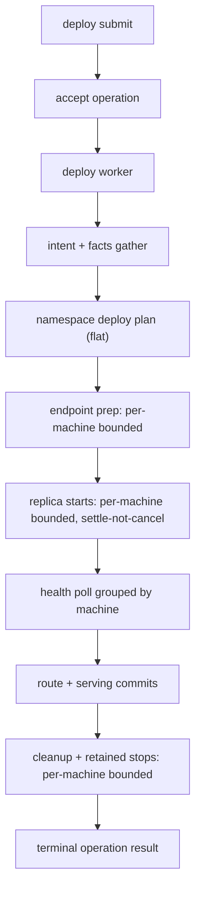
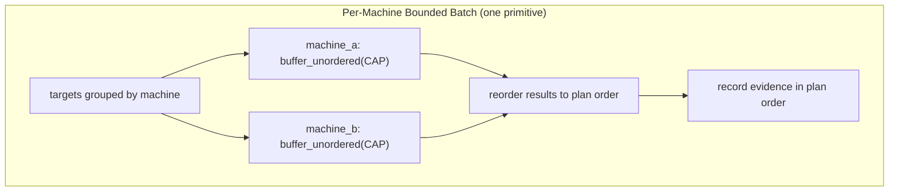

# refactor: Reduce Deploy And Runtime-Query Fan-Out Latency

## Goal Capsule

| Field | Value |
|---|---|
| Objective | Reduce deploy wall-clock latency by running independent machine work with per-machine bounded concurrency, and remove a duplicate machine-facts gather in the `runtime.snapshot` query. Two fan-out cleanups in one path; the deploy work is primary, the query work is an independent low-risk win. |
| Authority | Preserve `AGENTS.md`, `VISION.md`, `CONTEXT.md`, and accepted ADRs: mutating work stays operation-owned, evidence remains durable, and NATS services remain the command surface. |
| Execution profile | Refactor existing deploy/query internals. One internal port signature changes (`MachineContainerRuntime` becomes shared-call), and operation events gain a `recorded_at` timestamp. No product API, subject, or authority change; no new dependency. |
| Stop conditions | Stop if a change weakens operation evidence ordering, namespace commit fencing, terminal failure reporting, the known-set gather rule, or lets a failed sibling target skip other targets' work/evidence. |
| Tail owner | The implementer owns unit tests and focused integration coverage before marking the plan done. |

---

## Product Contract

### Summary

This plan keeps deploy semantics intact while reducing avoidable fan-out and fan-in latency.
Independent per-machine work runs concurrently with a per-machine concurrency cap, per-request facts are gathered once, and operation events become timestamped so push-to-healthy time is observable after the change lands.

### Problem Frame

The current deploy engine is correct for small clusters but serializes several independent steps.
In a global cluster, per-machine RTT and timeout variance make sequential endpoint preparation, replica start, health polling, and cleanup turn machine count into wall-clock latency.
The `runtime.snapshot` query separately gathers machine facts twice in one request, which adds avoidable API latency without improving freshness.

Ployz's strategy names push-to-healthy time as a key metric, but the fix must not turn deploy into a hidden reconciler or generic workflow engine.
The smallest useful improvement is to keep operation phases and evidence shape while making independent work inside a phase bounded and concurrent — and to make the latency outcome measurable rather than asserted.

### Non-Goals And Current Reality

- **There are no dependency phases or per-phase health gates in the deploy executor today.**
  `DeployPlan` is a flat `services -> steps` list (`ployz-core/src/deploy.rs`); the executor starts every container across every service in one loop, then runs one global `wait_healthy`.
  The `Phase` and `Service Dependency` glossary terms in `CONTEXT.md` are aspirational vocabulary for future dependency-ordered deploys; this plan neither implements nor relies on them.
  Replica starts here parallelize **flat** within the existing flat model. When real phases land later, the same per-machine concurrency primitive will run inside a phase without change.

### Requirements

- R1. `runtime.snapshot` must gather fresh machine facts at most once per active machine for one snapshot response.
- R2. Deploy endpoint-network preparation must run independent per-machine RPCs concurrently, bounded per machine, while preserving one operation-owned failure result.
- R3. Deploy replica starts must run concurrently, bounded per machine, within today's flat plan, without changing planning semantics or the terminal failure model.
- R4. Deploy health polling must read facts once per machine per poll and evaluate all relevant containers from that machine snapshot.
- R5. Deploy cleanup and retained-container stop attempts must run independent per-machine RPCs, bounded per machine, and still record per-target failures.
- R6. Operation evidence must remain user-readable and deterministic: plan, stage transitions, per-container starts, cleanup results, and one terminal result stay visible and in plan order.
- R7. The implementation must use existing Rust/Tokio/futures patterns already present in the repo instead of adding a scheduler, actor system, or generic operation engine.
- R8. Concurrency for mutating machine RPCs is **per-machine bounded**: at most `PER_MACHINE_CAP` in-flight RPCs to any one machine, with machines running concurrently. A single deploy-local constant governs every per-machine batch.
- R9. Operation events must carry a `recorded_at` timestamp so push-to-healthy time and per-stage duration are observable from the operation event log without new metrics infrastructure.

### Scope Boundaries

- In scope: deploy execution latency, the `runtime.snapshot` duplicate fact gather, a per-machine bounded batch primitive, an operation-event timestamp, and focused tests for concurrency, ordering, and failure evidence.
- Out of scope: changing public operation API contracts, changing deploy planning semantics, introducing dependency phases, changing route/serving commit authority, replacing NATS Service API, or introducing background reconciliation.

#### Deferred to Follow-Up Work

- Batch route and serving-target intent writes behind a single `intent.changed` publish group **if** post-landing stage timings (now observable via R9) show commit/publish time is material.
- Rich latency metrics/dashboards beyond the raw `recorded_at` signal delivered here.

---

## Planning Contract

### Key Technical Decisions

- KTD1. **Per-machine bounded concurrency, one primitive.**
  Group targets by machine; run machines concurrently; within a machine drive its targets through `buffer_unordered(PER_MACHINE_CAP)`; reorder results to plan order before recording evidence.
  A machine is a single responder whose Docker daemon is the shared bottleneck, and the latency problem is cross-machine RTT variance, so the bound belongs per machine, not globally.
  One deploy-local `PER_MACHINE_CAP` constant (start value 10) governs starts, cleanup, and retained stops. Ployz is small-cluster, so `machines x PER_MACHINE_CAP` is a fine global ceiling.
  `ponytail:` one cap constant everywhere; split per-operation caps only if starts and cleanup ever need different ceilings.
- KTD2. **The runtime port becomes shared-call.**
  `MachineContainerRuntime`'s methods take `&mut self` today, so concurrent futures cannot share one port. Convert the four methods to `&self` (the Nats adapter holds an `async_nats::Client`, which is `Arc`-cheap and multiplexes concurrent request/reply). Recording test doubles move to interior mutability. This, not a private helper, is the enabling change.
  The machine responder already serves 32 concurrent requests per endpoint (`EndpointExecutionPolicy::default`), so a client cap of 10 delivers real parallelism.
- KTD3. **Evidence is collected then emitted in plan order.**
  Concurrent completion order varies, so per-machine batch results are reordered to plan-slot order before durable evidence is recorded. `ContainerStarted` events are recorded after a batch settles, in plan order, not inline per completion.
- KTD4. **Concurrent starts settle; they are never cancelled.**
  On any failure in a per-machine start batch, let in-flight starts finish, retain every created/reused/failed container as evidence, record `ContainerStarted` for the successes in plan order, and report the first failure in plan order as the single operation failure. Cancelling in-flight starts risks leaking a half-created container that is never retained or stopped.
- KTD5. **Group health by machine per poll.**
  A machine facts snapshot is the natural testimony unit; reading it once per poll and checking every expected container on that machine removes the current container-by-container N+1 loop. Same grouping as KTD1, applied to reads.
- KTD6. **Reuse facts inside `runtime.snapshot`.**
  Build `MachineSnapshot` values and runtime containers from one facts gather per active machine. The gateway-status read stays a separate `FactCache` source and is unaffected.
- KTD7. **Timestamp events, don't build metrics.**
  Add `recorded_at` (unix ms) to recorded operation events. Push-to-healthy and per-stage duration then fall out of the existing event log. No metrics system, no new subject.

### High-Level Technical Design

### Sequencing

1. U6 (event `recorded_at`) and U1 (snapshot gather) are independent and low-risk; either can land first.
2. U2 (shared-call port + per-machine batch primitive) is the foundation for U3/U4/U5 and lands before them.
3. U3 (endpoint prep, cleanup, retained stops) before U4 (replica starts) because its result aggregation is simpler and it exercises the primitive on best-effort paths first.
4. U4 (replica starts) after U3, with the settle-not-cancel failure model pinned by tests.
5. U5 (health grouping) after U4, because health waits consume the started-container list.

---

## Implementation Units

### U1. Reuse Machine Facts In Runtime Snapshot

- **Goal:** Build runtime snapshot machines and containers from one fresh facts gather per active machine.
- **Requirements:** R1, R7
- **Dependencies:** None
- **Files:** `crates/ployzd/src/operation_api/queries.rs`, `crates/ployzd/tests/control_runtime.rs`
- **Approach:** Split the reusable parts of `MachineQueryService::list` so `RuntimeSnapshotQueryService::snapshot` reads intent once, gathers facts once, derives machine snapshots from the facts map, and derives containers from the same facts values.
  The gateway-status `FactCache` read stays separate. Keep `machine.list` behavior unchanged for its standalone endpoint.
- **Patterns to follow:** `read_available_machine_facts` / `read_available_machine_facts_by_id` in `crates/ployzd/src/roles/machine/client.rs`; existing `control_runtime_serves_runtime_snapshot_projection` coverage.
- **Test scenarios:**
  - Runtime snapshot with one active machine and one container returns the same machine, service, route, container, revision, release, and instance data as today.
  - Runtime snapshot with an active machine whose facts RPC is unavailable still returns the active machine with empty observation fields and produces no containers for that machine.
  - An instrumented facts reader proves one snapshot request performs one facts request per active machine, not two.
- **Verification:** Runtime snapshot tests cover existing projection output and duplicate-gather prevention.

### U2. Convert Machine Runtime Port To Shared Calls And Add A Per-Machine Bounded Batch

- **Goal:** Make concurrent machine RPCs possible, and provide the single per-machine bounded primitive that U3/U4/U5 reuse.
- **Requirements:** R2, R5, R6, R7, R8
- **Dependencies:** None
- **Files:** `crates/ployzd/src/operations/deploy/ports.rs`, `crates/ployzd/src/roles/machine/client.rs`, `crates/ployzd/src/operations/deploy/mod.rs`, `crates/ployzd/tests/deploy_operation.rs`, `crates/ployzd/tests/deploy_operation/fixtures.rs`
- **Approach:**
  1. Convert `MachineContainerRuntime`'s four methods from `&mut self` to `&self`. Update the `NatsMachineContainerRuntime` impl (no real mutation exists) and the executor's `&mut` threading.
  2. Rework the recording doubles (`RecordingRuntime`) to interior mutability (`Mutex`/atomics). Replace the sequential `fail_after_first` counter and `containers.pop()` logic with concurrency-deterministic equivalents keyed by request identity, so out-of-order completion is stable.
  3. Add a private deploy-module helper: given ordered targets, group by machine, drive each machine's targets through `buffer_unordered(PER_MACHINE_CAP)`, run machines concurrently, and return results in input (plan) order. Define `PER_MACHINE_CAP` as a deploy-local constant (start 10).
- **Patterns to follow:** `buffer_unordered` in `crates/ployzd/src/roles/machine/client.rs`; recording fixtures in `crates/ployzd/tests/deploy_operation/fixtures.rs`.
- **Test scenarios:**
  - A batch of successful targets returns results in input order even when recording futures complete out of order.
  - A batch with one failed target returns that target's failure without dropping later completed targets' results when the call site needs per-target evidence.
  - A per-machine batch with more targets than `PER_MACHINE_CAP` never exceeds the cap in flight to one machine: the double tracks in-flight count via an `Arc<AtomicUsize>` and asserts peak `> 1` (overlap happened) and peak `<= PER_MACHINE_CAP` (bounded).
- **Verification:** The port is shared-call, the helper is private with no generic operation semantics, and overlap plus per-machine boundedness are proven deterministically (no wall-clock timing assertions).

### U3. Parallelize Endpoint Preparation And Cleanup

- **Goal:** Convert sequential endpoint-network preparation, cleanup removals, and retained-container stops into per-machine bounded concurrent RPCs.
- **Requirements:** R2, R5, R6, R7, R8
- **Dependencies:** U2
- **Files:** `crates/ployzd/src/operations/deploy/mod.rs`, `crates/ployzd/tests/deploy_operation.rs`, `crates/ployzd/tests/deploy_operation/fixtures.rs`
- **Approach:** Apply the U2 primitive to `ensure_endpoint_networks`, `cleanup_superseded_containers`, and `stop_retained_containers`.
  Endpoint preparation stays fail-fast at the operation level. Cleanup and retained stops stay best-effort: collect every target result into existing cleanup evidence and retained artifacts, in plan order.
- **Patterns to follow:** Existing `with_step_timeout`; existing `cleanup_evidence` construction.
- **Test scenarios:**
  - Endpoint preparation records requests for every dataplane member and fails the deploy when one member returns unavailable.
  - Cleanup attempts every planned target even when one removal fails, and records both removed and failed targets in cleanup evidence.
  - Retained stop attempts every retained container after a deploy failure and records stop-failed artifacts without erasing the original deploy failure.
  - Concurrent cleanup returns evidence sorted by plan target order, not completion order.
- **Verification:** Existing deploy failure and cleanup tests still pass; new tests prove no target is skipped because a sibling failed.

### U4. Parallelize Replica Starts (Flat, Settle-Don't-Cancel)

- **Goal:** Start independent replicas concurrently, per-machine bounded, within today's flat plan, preserving the terminal failure model.
- **Requirements:** R3, R6, R7, R8
- **Dependencies:** U2, U3
- **Files:** `crates/ployzd/src/operations/deploy/mod.rs`, `crates/ployzd/tests/deploy_operation.rs`, `crates/ployzd/tests/deploy_operation/fixtures.rs`
- **Approach:** Run all `RunContainer` steps through the U2 primitive. `UseExistingContainer` steps stay inline and produce no `ContainerStarted` evidence, as today.
  Apply KTD4: let each per-machine start batch settle, retain every created/reused/failed container, record `ContainerStarted` for successes in plan-slot order, and report the first failure in plan order as the single operation failure. No planner change; `ployz-core` is untouched.
- **Patterns to follow:** `DeployRun` / `fail_run_container` retention in `crates/ployzd/src/operations/deploy/mod.rs`; deploy worker event-order assertions in `crates/ployzd/tests/deploy_operation.rs`.
- **Test scenarios:**
  - Two replicas on two machines both start and produce the same final outcome and per-container evidence as the current sequential path, with evidence in plan order.
  - When one start in a batch fails and others succeed, all created/reused containers are retained, successes still emit `ContainerStarted`, and the first-in-plan-order failure is the terminal result.
  - Existing-container reuse participates in health checks but creates no duplicate container-started evidence.
- **Verification:** Deploy operation tests pin evidence order and the settle-not-cancel retention/failure model under concurrent starts.

### U5. Group Health Polling By Machine

- **Goal:** Replace per-container facts RPCs in each health poll with one facts RPC per machine per poll.
- **Requirements:** R4, R6, R7
- **Dependencies:** U4
- **Files:** `crates/ployzd/src/operations/deploy/driver.rs`, `crates/ployzd/tests/deploy_operation.rs`, `crates/ployzd/tests/deploy_operation/fixtures.rs`, `crates/ployzd/tests/machine_service_runtime.rs`
- **Approach:** Build a map of expected containers by machine inside `MachineFactsHealthChecker::wait_healthy`.
  Each poll reads each machine's facts once, evaluates all expected containers for that machine, and preserves the per-container `HealthObservationMemory` initial-exit grace. Failure reporting still names the exact machine and container.
- **Patterns to follow:** `HealthObservationMemory` in `crates/ployzd/src/operations/deploy/driver.rs`; `NatsMachineFactsReader`.
- **Test scenarios:**
  - Two expected containers on one machine cause one facts read per poll; both are evaluated from that snapshot.
  - Containers across two machines cause one facts read per machine per poll.
  - A missing container keeps polling until timeout, matching current behavior.
  - A container observed exited before ever running keeps the initial grace; a container that fails after running returns unhealthy immediately.
  - A facts read failure returns unhealthy naming the machine and one affected expected container.
- **Verification:** Health checker tests cover same-machine grouping, multi-machine grouping, and preserved failure/grace semantics.

### U6. Record Operation Event Timestamps

- **Goal:** Make push-to-healthy time and per-stage duration observable from the operation event log.
- **Requirements:** R9
- **Dependencies:** None
- **Files:** `crates/ployz-core/src/ops/replay.rs` (or wherever the recorded-event envelope lives), the event append/record path, and TypeScript export surface if the envelope is exported.
- **Approach:** Add a `recorded_at` unix-ms field to the recorded operation event envelope (`ReplayedOperationEvent` currently carries only `sequence`). Stamp it once at append time in the sequencer. This is a durable evidence-shape change, not a metric.
  `ponytail:` timestamp the envelope, not each variant — one field, every event, no per-event opt-in.
- **Patterns to follow:** Existing unix-ms stamping in machine facts (`observed_at_unix_ms`).
- **Test scenarios:**
  - A recorded event round-trips through replay with a non-zero `recorded_at`.
  - Two events recorded in sequence have non-decreasing `recorded_at`.
- **Verification:** Replay returns timestamped events; a deploy's `PlanCreated -> Completed` span is computable from the event log.

### U7. Preserve Evidence And Document The Latency Shape

- **Goal:** Make the new bounded-concurrent deploy shape visible to maintainers without changing the operator-facing API.
- **Requirements:** R6, R7
- **Dependencies:** U1, U2, U3, U4, U5, U6
- **Files:** `crates/ployzd/src/operations/deploy/mod.rs`, `crates/ployzd/src/operations/deploy/driver.rs`, `docs/architecture/nats-control-plane.md`
- **Approach:** Keep comments timeless and limited to invariants where concurrent collection might otherwise look surprising (plan-order reordering, settle-not-cancel).
  Update architecture docs only if the final shape changes the described deploy execution; do not add an operational promise beyond bounded operation-owned fan-out.
- **Patterns to follow:** Operation/evidence language in `VISION.md`, `CONTEXT.md`, ADR 0028/0029.
- **Test scenarios:** None — this unit documents behavior already covered by U1–U6.
- **Verification:** Comments describe invariants, not edit history; docs still say operations own mutations and evidence.

---

## Verification Contract

| Gate | Applies to | Done signal |
|---|---|---|
| Deploy operation tests | U2, U3, U4, U5 | Existing deploy worker behavior still passes; new tests prove per-machine bounded overlap (peak `>1`, `<= PER_MACHINE_CAP`), plan-order evidence, and settle-not-cancel retention. |
| Control runtime tests | U1 | Runtime snapshot projection still returns machines, services, routes, containers, revisions, releases, and instances while gathering facts once per active machine. |
| Operation event tests | U6 | Recorded events carry a non-zero, non-decreasing `recorded_at`; a deploy's push-to-healthy span is computable from replay. |
| Full Rust test slice | All units | Affected crate tests pass without broad unrelated refactors. |

---

## Definition of Done

- `runtime.snapshot` performs one fresh facts gather per active machine per request.
- Endpoint preparation, cleanup, retained stops, and replica starts run per-machine bounded concurrent RPCs governed by one `PER_MACHINE_CAP` constant, with machines concurrent.
- Per-machine boundedness and cross-machine overlap are proven by a deterministic peak-concurrency test, not wall-clock timing.
- Concurrent replica starts settle without cancellation, retain every created/reused/failed container, and report one first-in-plan-order failure.
- Health polling reads one machine facts snapshot per machine per poll and checks all expected containers from that snapshot.
- Deploy operation evidence stays deterministic and in plan order.
- Operation events carry `recorded_at`, making push-to-healthy time observable from the event log.
- The `MachineContainerRuntime` port is the only internal signature changed; no public operation API, NATS subject, or authority boundary changes.
- No dependency phases, generic scheduler, actor framework, or speculative configuration is introduced.
- All tests named in the Verification Contract pass, and abandoned experimental code is removed.

---

## Appendix

### Sources And Research

- `STRATEGY.md` identifies push-to-healthy time and operation terminality as key metrics; U6 makes the first observable.
- `VISION.md` and `CONTEXT.md` require explicit bounded operations with durable evidence and no hidden background mutation. `CONTEXT.md`'s `Phase` / `Service Dependency` terms are future vocabulary; the deploy executor is flat today.
- `docs/adr/0028-...` and `docs/adr/0029-...` define known-set gathers, NATS transport, and local evidence ownership.
- `crates/ployzd/src/operation_api/queries.rs`: `RuntimeSnapshotQueryService::snapshot` gathers machine facts twice (via `machine.list` and again directly).
- `crates/ployzd/src/operations/deploy/mod.rs`: sequential endpoint prep, container starts, cleanup, retained stops; flat start loop then one global `wait_healthy`.
- `crates/ployzd/src/operations/deploy/ports.rs`: `MachineContainerRuntime` methods take `&mut self` (the concurrency blocker).
- `crates/ployzd/src/operations/deploy/driver.rs`: container-by-container health facts polling.
- `crates/ployz-nats/src/service_runtime.rs`: endpoints serve 32 concurrent requests by default, so a client-side per-machine cap of 10 is effective.
- `crates/ployz-core/src/ops/replay.rs`: `ReplayedOperationEvent` carries `sequence` only — no timestamp today.
