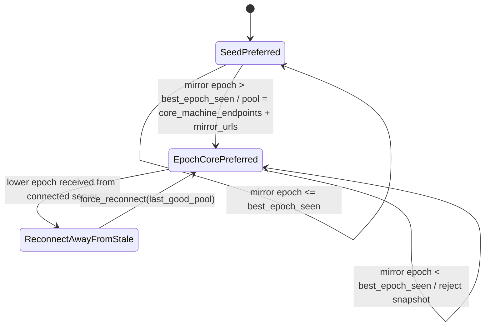
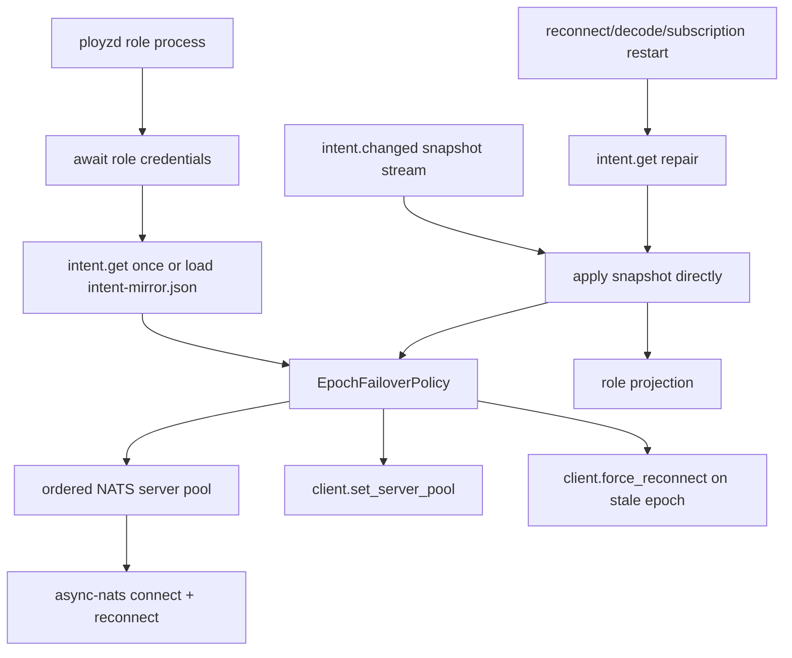

# refactor: Epoch-driven NATS failover policy

## Goal Capsule

| Field | Value |
|---|---|
| Objective | Make every authenticated NATS client use one shared connection policy, with machines and role processes reprioritizing promoted cores by Control-Plane Epoch. |
| Authority hierarchy | NATS remains transport; core intent and Control-Plane Epoch remain authority; client pool ordering is transport preference, not cluster truth. |
| Execution profile | Bounded refactor plus tests; no new election, no background membership mutation, no new config flag. |
| Stop condition | A crashed-core promotion makes surviving role clients prefer the promoted core without process restart, while stale lower-epoch cores are deprioritized and cannot pull clients back. |

---

## Product Contract

### Summary

Ployz already decided in ADR 0030 and ADR 0031 that hub-loss recovery is N independent, epoch-gated reconnections using native NATS multi-server support. The implementation should make that literal: all authenticated NATS client setup goes through one shared connector, and clients that have a machine-local intent mirror let epoch changes drive server-pool priority.

### Problem Frame

The current shape still treats `PLOYZ_NATS_URL` as the primary URL in too many places. That lets a process fail over when a pool exists, but it does not make the promoted core become primary after the process observes a higher Control-Plane Epoch. It also leaves connection policy split across `ployz-nats`, `ployzd`, `ployz-keeper`, and `ployzctl`, which makes future promotion bugs likely.

### Requirements

- R1. Authenticated NATS connection setup must have one shared API for seed-only and failover-capable clients.
- R2. A failover-capable client must start with its configured seed plus mirrored Reachable Machine control endpoints when a mirror exists.
- R3. Once a client observes an intent snapshot with an epoch higher than the epoch it booted from, the current core machine's roster-derived control endpoints replace the bootstrap seed as the client pool head. The old seed is not retained unless it is also present in the accepted mirror.
- R4. If a client later receives a lower-epoch snapshot than its highest accepted epoch, it must reject that snapshot, keep the last good higher-epoch pool, and reconnect away from the stale core.
- R5. Client-side pool priority must not mutate machine lifecycle, reachable-machine truth, operation evidence, or roster intent.
- R6. `ployzd` machine, gateway, and DNS roles must share the same epoch/pool state machine and the same intent stream consumer.
- R7. `ployzd` control, `ployzctl`, keeper join redemption/reporting, cloud bootstrap, and test support must route through the same shared connection API with explicit seed-only or context-only policy when they do not own a mirror.
- R8. Existing stale pre-promotion join behavior must stay explicit: a joiner with only an old bundle and no mirror should fail against the old core rather than silently redeeming against a new authority.
- R9. `intent.changed` must be the live snapshot stream for role processes. `intent.get` is used at startup and as repair after reconnect, decode failure, or subscription restart; role-local polling/wake refresh loops should go away.

### Scope Boundaries

- In scope: authenticated NATS connection policy, server-pool ordering, epoch-driven pool updates, caller migration, tests, and the four-server promotion verification hook.
- Out of scope: automatic promotion, automatic demotion, machine removal, lifecycle reconciliation, Cloud authority changes, private overlay transport, and changing route/gateway/DNS product semantics.
- Deferred to follow-up work: persisting an already-promoted preferred core into role env files. This plan keeps runtime pool priority in the NATS client and mirror state.

---

## Planning Contract

### Key Technical Decisions

- KTD1. **Centralize policy in `ployz-nats`.** The native `async-nats` reconnect machinery already handles multiple URLs, ordering, pool updates, and force reconnect. Ployz should feed it the right ordered pool rather than building another reconnect loop.
- KTD2. **Keep mirror interpretation in `ployzd`.** `ployz-nats` should not import `IntentSnapshot` or machine-local mirror storage. `ployzd` owns role-local recovery context and supplies ordered pools to the shared connector.
- KTD3. **Epoch replaces the bootstrap seed.** Seed-first is correct only before the client sees a higher epoch. After that, the accepted higher-epoch snapshot's `core_machine_id` selects the pool head from the mirrored roster. The old seed is just bootstrap material and should not linger as a special fallback.
- KTD4. **`intent.changed` carries the live snapshot.** Empty invalidation messages plus per-role polling are the current hack. The live path should apply the snapshot from NATS directly; `intent.get` repairs missed or bad messages.
- KTD5. **Seed-only remains a first-class policy.** Keeper stale joins, one-shot `ployzctl` calls, control local loopback, and test fixtures should still use the same connection API but with no mirror-driven pool mutation.
- KTD6. **No new env var.** The existing `PLOYZ_NATS_URL`, CA file, seed file, and local mirror path are enough. Adding `PLOYZ_NATS_URLS` would leak internal recovery policy into install/config before it needs to.

### High-Level Technical Design

### Assumptions

- The implementation branch includes the mirror files and promotion reuse design from ADR 0031 and the recent promotion work.
- Control-Plane Epoch is already present on `IntentSnapshot`; if the checked-out branch predates that field, implementation starts by landing the existing promotion-epoch work or rebasing onto it.
- All URL ordering should preserve the order of Reachable Machine control endpoints already recorded in intent; do not invent IP ranking in this plan.

### Sources & Research

- `docs/adr/0013-v1-uses-direct-tls-nats.md` keeps v1 on direct TLS-authenticated NATS.
- `docs/adr/0030-hub-loss-recovery-machines-re-point-to-an-operator-promoted-core.md` defines recovery as independent epoch-gated reconnections, not coordinated cutover.
- `docs/adr/0031-recovery-seams-a-hand-rolled-epoch-and-mirrored-intent-snapshot.md` explicitly selects native `async-nats` multi-server plus mirrored Reachable Machines.
- `crates/ployz-nats/src/connect.rs` owns authenticated NATS options and should remain the connection-policy center.
- `crates/ployzd/src/roles/machine/process.rs`, `crates/ployzd/src/roles/gateway/process.rs`, and `crates/ployzd/src/roles/dns/process.rs` are the role clients that currently own separate refresh/watch behavior and must converge on one stream consumer.

---

## Implementation Units

### U1. Shared authenticated server-pool API

- **Goal:** Extend `ployz-nats` so callers connect through one API that accepts an ordered server pool while preserving the existing single-seed path as a trivial one-element pool.
- **Requirements:** R1, R7
- **Dependencies:** None
- **Files:** `crates/ployz-nats/src/connect.rs`, `crates/ployz-nats/tests/connect.rs`, `crates/ployz-nats/tests/secured_connect.rs`
- **Approach:** Add a small pool type or function-level parameter that validates non-empty ordered URL lists. Keep `require_tls`, NKey auth, custom inbox prefix, `ignore_discovered_servers`, and `retain_servers_order` in the central options builder. Keep `connect_authenticated` as the seed-only convenience wrapper if that is the smallest compatibility path.
- **Patterns to follow:** Current `authenticated_connect_options` and `NatsClientUrl` validation in `crates/ployz-nats/src/connect.rs`.
- **Test scenarios:**
  - Connect with one valid URL and confirm behavior matches the existing seed-only path.
  - Connect with multiple URLs where the first is unavailable and the second is live; expected result is a successful authenticated client and an error string that lists the pool only when all fail.
  - Reject an empty pool before calling `async-nats`.
  - Preserve invalid URL rejection for whitespace/control characters.
- **Verification:** All authenticated product callers can use the same API without custom connect logic.

### U2. Epoch failover policy for mirrored role clients

- **Goal:** Add the simple state machine that turns mirrored intent snapshots into ordered NATS server pools.
- **Requirements:** R2, R3, R4, R5
- **Dependencies:** U1
- **Files:** `crates/ployzd/src/roles/machine/process.rs` or a new `crates/ployzd/src/roles/nats_failover.rs`, `crates/ployzd/src/roles/machine/intent_mirror.rs`, `crates/ployzd/tests/role_process.rs`
- **Approach:** Keep one local state object with `best_epoch_seen` and `last_good_pool`. Before a higher epoch is observed, render `seed + mirrored Reachable Machine endpoints`. After a higher epoch is observed, render the current core machine's roster-derived control endpoints followed by the remaining mirrored Reachable Machine endpoints; the bootstrap seed disappears unless the accepted mirror also names it. Reject lower epochs and keep the last good higher-epoch pool. This state object should not write intent, lifecycle, or facts.
- **Patterns to follow:** `MachineIntentMirror::store` already rejects lower epochs; mirror that rule for connection preference without moving storage ownership into `ployz-nats`.
- **Test scenarios:**
  - With no mirror, render only the configured seed.
  - With same-epoch mirror, render seed first plus reachable machine URLs.
  - With higher-epoch mirror, render the higher-epoch core machine's control endpoints first plus remaining reachable machine URLs, with no configured-seed fallback.
  - With epoch +2 after epoch +1, update `best_epoch_seen` and make the newest mirror order primary.
  - With a lower-epoch snapshot after a higher one, keep the previous higher-epoch pool and report that reconnect should be forced.
  - Ensure pool rendering deduplicates URLs that appear as both core and mirror candidates.
- **Verification:** The policy is a pure tested state machine with no network dependency.

### U3. Replace role refresh loops with one intent stream consumer

- **Goal:** Wire machine, gateway, and DNS through one shared `intent.changed` snapshot consumer that updates role projections, persists the mirror, and updates the NATS client pool while running.
- **Requirements:** R2, R3, R4, R6, R9
- **Dependencies:** U1, U2
- **Files:** `crates/ployzd/src/roles/machine/process.rs`, `crates/ployzd/src/roles/gateway/process.rs`, `crates/ployzd/src/roles/dns/process.rs`, `crates/ployzd/tests/machine_runtime.rs`, `crates/ployzd/tests/gateway_process_runtime.rs`, `crates/ployzd/tests/dns_process_runtime.rs`
- **Approach:** On startup, each role calls `intent.get` once or loads the local mirror if the core is unavailable. During runtime, one shared task subscribes to `intent.changed`, decodes the full snapshot, applies it directly to the role projection, stores the mirror, and feeds the epoch policy. On reconnect, decode failure, or subscription restart, call `intent.get` once as repair. Delete role-local polling refresh loops and watcher-as-wake plumbing where the stream can drive the update directly.
- **Patterns to follow:** `NatsIntentReader` for repair reads, gateway's existing `intent.changed` subscription as the starting point, and ADR 0031's rule that the mirror is recovered from the drumbeat.
- **Test scenarios:**
  - Machine role starts before promotion with a mirror containing B and attempts a pool containing old A plus B.
  - Gateway and DNS start with the same pool behavior as machine.
  - Gateway and DNS update projections from `intent.changed` snapshots without a one-second polling loop.
  - A reconnect or malformed `intent.changed` causes exactly one `intent.get` repair read.
  - A role that receives higher epoch from B updates pool order to B-first and drops old A unless the accepted mirror still names A.
  - A role that receives lower epoch from healed A rejects it and calls the reconnect hook toward the last good B-first pool.
  - A missing or corrupt mirror falls back to seed-only and recovers on the next valid snapshot.
- **Verification:** Machine, gateway, and DNS no longer have separate NATS failover rules or role-local polling refresh loops for intent.

### U4. Migrate seed-only clients onto the shared API explicitly

- **Goal:** Route keeper, ployzctl, control, authorization verification, cloud bootstrap, and test-support clients through the same shared connection API with explicit seed-only/context-only policy.
- **Requirements:** R1, R7, R8
- **Dependencies:** U1
- **Files:** `crates/ployz-keeper/src/main.rs`, `crates/ployz-keeper/src/cloud_bootstrap_runner.rs`, `crates/ployzctl/src/runtime.rs`, `crates/ployzd/src/roles/control.rs`, `crates/ployzd/src/adapters/nats_authorization/writer.rs`, `crates/ployz-test-support/src/nats.rs`, related tests under each crate
- **Approach:** Replace direct `connect_authenticated` calls with the shared seed-only wrapper. Do not add mirror logic to join redemption or one-shot operator clients. For `ployzctl`, keep context update on promotion as the authority for which core the operator talks to; context may later store multiple URLs, but that is not required for this fix.
- **Patterns to follow:** Existing `nats_connect_config` construction in `crates/ployzctl/src/runtime.rs` and keeper join redemption in `crates/ployz-keeper/src/main.rs`.
- **Test scenarios:**
  - Keeper stale pre-promotion join with only old A URL still fails explicitly when A is unavailable.
  - Keeper valid post-promotion join succeeds through the current context/seed URL.
  - `ployzctl` operation API client still connects with a one-element context URL.
  - Control local loopback connect remains one-element and does not subscribe to mirror policy.
- **Verification:** `rg connect_authenticated` shows only the central wrappers, tests, or intentional low-level adapter code remain.

### U5. Promotion matrix regression proof

- **Goal:** Prove the state machine against the real four-server promotion lifecycle.
- **Requirements:** R2, R3, R4, R5, R6, R8
- **Dependencies:** U1, U2, U3, U4
- **Files:** `crates/ployz-e2e/tests/dind_cluster.rs` if the local harness can model the case, plus manual matrix notes until the Hetzner promotion test is automated
- **Approach:** Keep the live Hetzner matrix as the release gate until a DIND test can cover promotion and reconnection. The decisive scenario is A crash, B promotion, C/D roles reconnecting to B and making B primary after observing the higher epoch, without A being removed from roster truth.
- **Test scenarios:**
  - A crash plus B promotion: C machine/gateway/DNS connect to B without role process restart once B is serving.
  - After C observes B's higher epoch, A is no longer first in C's client pool.
  - A power-on with lower epoch does not pull C/D back to A.
  - Explicit demote of old core repairs local roles but does not need to be the mechanism that remote stragglers rely on.
  - Pre-promotion D join token still fails against old A; post-promotion D add still succeeds against current core.
- **Verification:** Fresh four-server alpha matrix passes and records no unexpected `TimedOut` or authorization errors beyond bounded reconnect attempts.

---

## Verification Contract

| Gate | Covers | Done Signal |
|---|---|---|
| `cargo fmt --check` | All units | Formatting passes. |
| `cargo test -p ployz-nats` | U1 | Shared connect API and pool behavior pass. |
| `cargo test -p ployzd nats_failover` or focused equivalent | U2, U3 | Epoch state machine and role wiring pass. |
| `cargo test -p ployz-keeper -p ployzctl -p ployz-test-support` | U4 | Seed-only callers still work through shared API. |
| Fresh four-server promotion matrix | U5 | B becomes primary for surviving clients after higher epoch; healed A is not preferred; stale joins fail explicitly; valid joins work. |

---

## Definition of Done

- One shared authenticated NATS connection path handles ordered server pools.
- Machine, gateway, and DNS roles all use the same epoch-driven pool-priority state machine.
- Higher Control-Plane Epoch makes the promoted core primary in client pool order.
- Lower stale epochs are rejected without mutating cluster truth.
- Keeper, ployzctl, control, cloud bootstrap, and test-support callers use explicit seed-only/context-only shared connection policy.
- The release-blocking four-server matrix proves stragglers find and prefer the new core without relying on remote process restart as policy.
- Dead-end experimental connection helpers are removed before merge.
