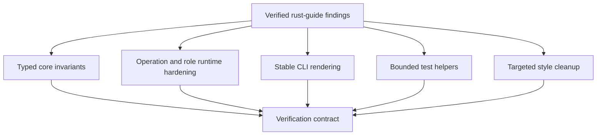

# Fix Rust Guide Audit Findings - Plan

## Goal Capsule

- **Objective:** Fix the verified rust-guide audit findings without broad style churn.
- **Authority:** `AGENTS.md`, `VISION.md`, `CONTEXT.md`, `STRATEGY.md`, and the saved rust-guide skill used for the audit.
- **Execution profile:** Bounded hardening pass across Rust production panic paths, CLI rendering, async/test timeouts, and a few targeted style gaps.
- **Stop conditions:** Stop if the work expands into repo-wide `expect` cleanup, wholesale inline-test migration, public API redesign, or new lint infrastructure.
- **Tail ownership:** Rust crates own the fixes; no Cloud, SDK consumer, or product behavior change is intended beyond safer errors and tests.

---

## Product Contract

### Summary

This plan fixes the verified audit findings that can panic production paths, leak Rust debug formatting to users, hang tests, or leave non-trivial logic untested. The work keeps Ployz's explicit-operation model intact: failures become typed errors, operation evidence remains durable, and test helpers fail with useful evidence instead of masking the behavior under test. Requirements R1-R15 are the closed accepted-finding inventory for this plan.

### Problem Frame

The audit found a small set of real rust-guide violations mixed with many acceptable test fixtures and invariant constructors. The material failures cluster around four themes: valid-state panics, user-facing debug strings, unbounded waits, and style gaps that sit directly on operational boundaries.

The fix should address those clusters at their shared source rather than patching every call site. Broad mechanical cleanup is out of scope because it would turn a safety pass into noisy churn.

### Requirements

**Panic-free production paths**

- R1. `OperationStatus::next_event_sequence` must not panic on sequence overflow.
- R2. Submit/error mapping for non-deploy commands must not use `unreachable!` in request handling.
- R3. Deploy execution commands must not encode "non-empty service list" as a panicking accessor.
- R4. Gateway, DNS, machine, and route-registry health reads or route-selection paths must not panic on lock poisoning.
- R5. Fallible constructors and serialization in user-visible production paths must return typed errors rather than `expect`.

**Stable operator output**

- R6. CLI errors must not expose `Debug` rendering of operation states or NATS URL errors.
- R7. Machine-add remote completion failures must carry typed state information or a stable user-facing category, not raw formatted enum internals.
- R8. Server-side operational messages must use the repo's structured logging/error path rather than `eprintln!` where the code is not a CLI surface.

**Bounded tests and targeted coverage**

- R9. Shared operation wait helpers must preserve the last status or error when timing out.
- R10. Test HTTP helpers must not wait forever on channels or socket reads.
- R11. Route commit fixture behavior must cover route-binding commit failures, not only serving commit failures.
- R12. eBPF bytecode validation must have direct tests for malformed, non-BPF, and missing-symbol inputs.

**Style gaps that affect execution surfaces**

- R13. Audited async port traits must use the clippy-safe local shape: private traits may use `async fn`; public traits keep explicit future-return signatures unless visibility can be narrowed or a scoped allow is justified.
- R14. Host Runner filesystem commit paths must return `FailureMessage` for invalid target filenames instead of panicking.
- R15. Only audited function-scoped imports, or imports inside functions already changed for these fixes, should move to top-level or module-level imports.

### Acceptance Examples

- AE1. **Sequence overflow:** Given an operation whose last event sequence is `u64::MAX`, when the next sequence is requested, then the caller receives a typed overflow failure rather than a panic.
- AE2. **Wrong submit failure class:** Given a non-deploy submit path receives a failure variant it cannot handle, when the API maps it, then the response is typed unavailable/internal failure rather than a panic.
- AE3. **Empty deploy command:** Given a deploy execution command has no services, when code needs the single-service accessor, then construction or access returns a typed failure.
- AE4. **Poisoned process lock:** Given a role process lock is poisoned, when health or route selection is called, then the process returns recovered state or a typed unhealthy/error result rather than panicking.
- AE5. **Remote machine incomplete:** Given machine-add finishes in a non-completed state, when `ployz` renders the error, then the output is stable CLI prose with operation id and status category, not `Failed { ... }`.
- AE6. **Operation wait timeout:** Given status polling sees errors and non-terminal statuses until budget expiry, when the helper times out, then the failure includes the last observed status or error.
- AE7. **HTTP helper stall:** Given a test upstream never sends a complete request or response, when the helper waits, then the test fails within a bounded timeout.
- AE8. **Route cutover failure:** Given route binding commit fails in deploy tests, when the operation runs, then the terminal evidence records route cutover failure.

### Scope Boundaries

#### In Scope

- The closed accepted-finding inventory represented by R1-R15.
- Small companion tests that fail on the audited behavior.
- Narrow error-type additions needed to return typed failures.
- Minimal formatting and import movement in files already touched for fixes.

#### Deferred to Follow-Up Work

- Repo-wide cleanup of every production or test `expect`.
- Moving all inline `#[cfg(test)]` modules to integration tests.
- Adding a new lint or CI policy for the rust-guide.
- Reworking the public SDK schema beyond error rendering and typed failure propagation needed by these fixes.

#### Out of Scope

- Product semantics changes to deploy, machine lifecycle, gateway routing, DNS, or NATS authority.
- New operation kinds, background reconciler behavior, or hidden recovery loops.
- New dependencies for timeout, error, or logging helpers.

---

## Planning Contract

### Key Technical Decisions

- KTD1. **Fix shared failure sources first.** The smallest safe path is to repair shared helpers and port boundaries so sibling callers inherit the fix.
- KTD2. **Typed errors beat sentinel fallbacks.** Overflow, empty services, poisoned locks, invalid filenames, and serialization failure should move through existing `thiserror`-style errors or small local error enums.
- KTD3. **CLI prose is a boundary contract.** `ployz` should render stable status categories and `Display` errors; `Debug` stays inside diagnostics and tests.
- KTD4. **Tests get bounded evidence, not perfect harnesses.** The test helper work should add timeouts and last-observed context without turning the test-support crate into a generic polling framework.
- KTD5. **Style work stays local.** Import cleanup is allowed only for audited function-scoped imports or functions already changed for behavioral fixes.
- KTD6. **Clippy gate wins.** Public async traits stay in a clippy-safe explicit-future shape unless the trait can become private or a scoped allow is justified in code.

### High-Level Technical Design

### Assumptions

- R1-R15 are the accepted-finding inventory; subagent-only findings omitted from the final audit report stay out unless an implementation unit already touches that area.
- Test-only `expect` calls remain acceptable when they are fixture assertions and not hiding operation behavior.
- `thiserror` remains the preferred pattern because it is already a workspace dependency and widely used in the affected crates.

### Lock Poison Policy

| Site | Policy |
| --- | --- |
| Gateway, DNS, and machine health snapshot locks | Recover read-only snapshots with `PoisonError::into_inner()` only when the value is cloned for health reporting; otherwise return typed unhealthy evidence. |
| Gateway and DNS process/projection locks | Return typed unavailable or unhealthy results when a poisoned lock could reflect partially-updated runtime state. |
| Pingora route registry and backend selection | Return a typed route-selection failure for poisoned locks; do not recover a suspect routing map while serving requests. |

### Risks & Dependencies

- **Signature ripple:** Changing `next_event_sequence`, deploy accessors, or async trait signatures may require several call-site updates. Keep those updates mechanical and local.
- **Error text churn:** CLI contract tests may need updates. Preserve user-facing clarity over byte-identical old debug output.
- **Timeout flakiness:** Test helper timeouts should be long enough for normal CI but short enough to fail stalled helpers with evidence.
- **Lock poison policy:** The table above is the default policy. Any exception should be documented at the implementation site with the invariant that makes recovery safe.

### Sources & Research

- `AGENTS.md`
- `VISION.md`
- `CONTEXT.md`
- `STRATEGY.md`
- `Cargo.toml`
- `docs/plans/2026-07-04-002-refactor-error-evidence-rendering-plan.md`
- `crates/ployz-core/src/ops/accessors.rs`
- `crates/ployzd/src/operation_api/error_map.rs`
- `crates/ployzd/src/operation_api/submit.rs`
- `crates/ployzd/src/operations/deploy/types.rs`
- `crates/ployzd/src/roles/gateway/pingora.rs`
- `crates/ployz/src/remote_machine_runtime.rs`
- `crates/ployz-test-support/src/ops.rs`

---

## Implementation Units

### U1. Make Core Invariants Fallible At The Boundary

- **Goal:** Replace audited core/library panics with typed failures where valid input can exceed an invariant.
- **Requirements:** R1, R3, R5, R14, R15, AE1, AE3.
- **Dependencies:** None.
- **Files:**
  - `crates/ployz-core/src/ops/accessors.rs`
  - `crates/ployz-core/src/ops/replay.rs`
  - `crates/ployzd/src/operations/deploy/types.rs`
  - `crates/ployzd/src/operations/deploy/driver.rs`
  - `crates/ployz-host-runner/src/fsx.rs`
  - `crates/ployz-core/tests/operation_status.rs`
  - `crates/ployzd/tests/deploy_operation.rs`
  - `crates/ployz-host-runner/tests/local.rs`
- **Approach:** Introduce the smallest typed error shape at each boundary. For event sequencing, return a fallible next-sequence result and update recorders to surface overflow as operation evidence or unavailable status. For deploy services, make non-empty command construction or single-service access return `Result`. For Host Runner staged directory commits, convert missing or non-UTF-8 filenames into `FailureMessage`.
- **Execution note:** Start with characterization tests for the panic cases before changing signatures.
- **Patterns to follow:** `EventSequenceError`, `OperationEventReplayLimitError`, `CoreStoreError`, and existing `FailureMessage` conversions.
- **Test scenarios:**
  - Given last event sequence `u64::MAX`, requesting the next event sequence returns a typed overflow error.
  - Given a normal last event sequence, requesting the next event sequence returns the incremented sequence.
  - Given an empty deploy execution command, single-service access or construction returns a typed failure.
  - Given a staged directory commit target without a UTF-8 filename, `commit_to` returns `FailureMessage`.
  - Given a valid staged directory commit target, existing commit behavior is unchanged.
- **Verification:** Core, ployzd deploy-operation, and Host Runner tests prove the audited panic sites are no longer reachable through valid inputs.

### U2. Harden Operation API And Role Runtime Error Paths

- **Goal:** Remove production panics and stderr logging from operation request handling and role health paths.
- **Requirements:** R2, R4, R8, AE2, AE4.
- **Dependencies:** U1 only where deploy error signatures changed.
- **Files:**
  - `crates/ployzd/src/operation_api/error_map.rs`
  - `crates/ployzd/src/operation_api/submit.rs`
  - `crates/ployzd/src/operations/machine_update.rs`
  - `crates/ployzd/src/operations/machine_lifecycle.rs`
  - `crates/ployzd/src/adapters/credentials.rs`
  - `crates/ployzd/src/roles/gateway/pingora.rs`
  - `crates/ployzd/src/roles/gateway/process.rs`
  - `crates/ployzd/src/roles/dns/process.rs`
  - `crates/ployzd/src/roles/machine/process.rs`
  - `crates/ployzd/tests/machine_add_mint.rs`
  - `crates/ployzd/tests/role_process.rs`
- **Approach:** Replace `unreachable!` branches in non-deploy submit mapping with explicit typed unavailable/internal errors. Convert server-side `eprintln!` sites in operation/runtime code to structured logging or returned health evidence. Handle poisoned locks at role boundaries according to the lock poison policy.
- **Patterns to follow:** `CoreStore::with_conn` already uses `PoisonError::into_inner`; operation API error enums already carry `Unavailable { operation_id, message }` variants.
- **Test scenarios:**
  - Given a non-deploy submit path receives a deploy-only failure variant, API mapping returns a typed error instead of panicking.
  - Given machine-update event recording fails, the failure is logged or surfaced without `eprintln!`.
  - Given machine-lifecycle terminal event recording fails, the failure is logged or surfaced without `eprintln!`.
  - Given a poisoned gateway health lock, health access does not panic.
  - Given a poisoned DNS runtime lock, served projection access does not panic.
  - Given a poisoned route registry lock, backend selection returns a typed route-selection failure.
- **Verification:** Role process and operation API tests exercise the former panic paths; grep shows no `unreachable!` remains in the audited submit mappings and no `eprintln!` remains in server/runtime files touched by this unit.

### U3. Stabilize CLI And NATS Boundary Rendering

- **Goal:** Remove user-visible debug rendering and production serialization panics from CLI/NATS boundary code.
- **Requirements:** R5, R6, R7, AE5.
- **Dependencies:** U1 where shared error types change.
- **Files:**
  - `crates/ployz/src/remote_machine_runtime.rs`
  - `crates/ployz/src/config.rs`
  - `crates/ployz/src/Host Runner_install.rs`
  - `crates/ployz/src/commands/init.rs`
  - `crates/ployz/src/commands/init/join_template.rs`
  - `crates/ployz/src/commands/ops.rs`
  - `crates/ployz/src/runtime.rs`
  - `crates/ployz-nats/src/connect.rs`
  - `crates/ployz-nats/tests/connect.rs`
  - `crates/ployz/tests/cli_contract.rs`
  - `crates/ployz/tests/deploy_cli_contract.rs`
  - `crates/ployz/tests/machine_cli_contract.rs`
- **Approach:** Replace debug-rendered machine-add states with a narrow CLI status category plus operation id. Make JSON render/write helpers return `Result` and map serde failures into existing CLI/runtime errors. Render NATS URL errors with `Display`. Make `NatsClientUrl::from_endpoint` return a typed `Result` and update call sites. Keep `NatsClientUrl::loopback` infallible only by constructing the known-valid loopback URL directly inside the type boundary.
- **Patterns to follow:** The earlier error-evidence rendering plan's rule that errors render themselves; `PloyzctlExecutionError` and `ClusterContextError` existing `Display` implementations.
- **Test scenarios:**
  - Given machine-add status is failed, pending, joining, or cancelled, remote machine CLI output uses stable prose and operation id without enum debug braces.
  - Given cluster context has an invalid NATS URL, CLI output renders the error with `Display`.
  - Given JSON serialization is forced to fail through a test-only wrapper or equivalent seam, CLI returns a typed error instead of panicking.
  - Given `NatsClientEndpoint` renders a valid URL, converting to `NatsClientUrl` still succeeds.
  - Given endpoint-to-client-URL conversion fails, the caller receives `NatsClientUrlError`.
  - Given loopback client URL construction uses a `u16` port, the implementation does not call a fallible parser that requires `expect`.
- **Verification:** CLI contract tests pin stable output; grep shows the audited `{error:?}` and `format!("{state:?}")` paths are gone from user-facing rendering.

### U4. Bound Test Helpers And Cover Route Commit Failures

- **Goal:** Make tests fail with operation evidence instead of hanging or panicking as fixture plumbing.
- **Requirements:** R9, R10, R11, AE6, AE7, AE8.
- **Dependencies:** U2 where operation API errors become typed.
- **Files:**
  - `crates/ployz-test-support/src/ops.rs`
  - `crates/ployz-e2e/tests/support/http.rs`
  - `crates/ployzd/tests/support/mod.rs`
  - `crates/ployzd/tests/deploy_operation/fixtures.rs`
  - `crates/ployzd/tests/deploy_operation.rs`
  - `crates/ployz-e2e/tests/operations.rs`
  - `crates/ployzd/tests/control_runtime.rs`
- **Approach:** Give `wait_for_terminal_status` a small `WaitForTerminalStatusError` or equivalent return type that preserves last status/error. Wrap HTTP helper channel and socket waits in bounded `tokio::time::timeout`, and cap request header reads. Use named default budgets in helper modules: 5 seconds per request or socket read, and a 16 KiB HTTP header cap. Existing tests may pass a larger explicit budget only where a current scenario proves it. Extend the route-binding fixture with failure behavior parallel to serving commit behavior, then add focused route cutover failure tests.
- **Execution note:** Add failing tests for timeout/error evidence before changing helper signatures so call-site updates preserve intent.
- **Patterns to follow:** `poll_until` in `ployz-test-support`, existing `ServingCommitBehavior` in deploy-operation fixtures, and e2e support helpers that capture evidence on scenario failure.
- **Test scenarios:**
  - Given status polling sees an API error then times out, the helper returns a timeout error containing that last error.
  - Given status polling sees a non-terminal status then times out, the helper returns a timeout error containing that last status.
  - Given status polling reaches a terminal status, existing callers receive that status through the new result path.
  - Given an upstream request never arrives, `TestUpstream::requests` fails within a bounded timeout.
  - Given a client stalls before HTTP headers complete, request reading fails within a bounded timeout.
  - Given route binding replacement fails during deploy, the operation reaches terminal failure with route cutover evidence.
  - Given route binding removal fails during deploy cleanup, the operation records typed failure evidence.
- **Verification:** Test-support call sites compile with explicit result handling, and deploy-operation tests cover route-binding commit failures.

### U5. Clean Targeted Rust-Guide Style Gaps

- **Goal:** Fix style findings that sit on production or port boundaries without repo-wide cleanup.
- **Requirements:** R12, R13, R15.
- **Dependencies:** U1, U2 where signatures touch shared ports.
- **Files:**
  - `crates/ployzd/src/operations/deploy/ports.rs`
  - `crates/ployzd/src/roles/machine/runner.rs`
  - `crates/ployzd/src/roles/machine/service.rs`
  - `crates/ployzd/src/adapters/nats_authorization/machine_seed.rs`
  - `crates/ployz-host-runner/src/fsx.rs`
  - `crates/ployz-host-runner/src/artifacts.rs`
  - `crates/ployz-host-runner/src/cloud_bootstrap.rs`
  - `crates/ployz-ebpf-common/src/lib.rs`
  - `crates/ployz-ebpf-common/tests/bytecode_validation.rs`
- **Approach:** Convert audited trait port methods from explicit `impl Future` returns to `async fn` only when the trait is private or visibility can be narrowed cleanly. For public traits, keep the explicit future-return signature unless a scoped clippy allow is justified. Move only audited function-scoped production imports, or imports in functions already changed for behavioral fixes, to top-level or module-level imports. Add direct eBPF validation tests rather than changing validation behavior.
- **Patterns to follow:** Existing plain async functions in ployzd ports and `thiserror`-based validation errors in core crates.
- **Test scenarios:**
  - Given malformed bytes, bytecode validation returns the expected validation error.
  - Given an object that is not an eBPF object, bytecode validation returns the expected validation error.
  - Given a BPF object missing required Ployz symbols, bytecode validation returns the expected validation error.
  - Given deploy and machine runtime fake ports for private traits, tests compile and execute through `async fn` trait methods.
  - Given an audited public trait remains explicit-future, the implementation records the clippy-safe rationale.
  - Test expectation: no dedicated runtime behavior tests for import movement because compilation is the proof.
- **Verification:** A targeted grep shows no audited private `-> impl Future<Output = ...>` remains on local port traits and no touched production files retain audited function-scoped imports. Remaining public explicit-future traits have a local rationale.

---

## Verification Contract

| Gate | Command or check | Proves |
|---|---|---|
| Workspace format | `cargo fmt --all -- --check` | Formatting and import grouping after signature changes. |
| Workspace clippy | `cargo clippy --workspace --all-targets -- -D warnings` | Rust-guide-adjacent lints and no new warnings. |
| Core and SDK tests | `cargo test -p ployz-core -p ployz-sdk-types` | Typed core invariants and public error surfaces. |
| NATS and daemon tests | `cargo test -p ployz-nats -p ployzd` | Operation API, role runtime, NATS URL, deploy fixture, and route cutover behavior. |
| CLI tests | `cargo test -p ployz` | Stable CLI rendering and serialization error paths. |
| Host Runner and eBPF tests | `cargo test -p ployz-host-runner -p ployz-ebpf-common --features ployz-ebpf-common/validation` | Host Runner filesystem failures and eBPF validation coverage. |
| E2E/test-support compile | `cargo test -p ployz-e2e --no-run` | Test helper signature changes are handled by e2e callers. |
| Grep checks | Search touched files for audited `unreachable!`, `eprintln!`, debug-rendered CLI errors, audited function-scoped imports, and private local port `impl Future` signatures. Public explicit-future traits must have a local rationale. | The audited rust-guide findings were removed or explicitly kept for the clippy-safe exception. |

---

## Definition of Done

- U1 through U5 are complete or any intentionally skipped finding is called out with a reason in the PR.
- Every former production panic path in scope now returns a typed error, recovered state, or explicit unhealthy status.
- CLI output for audited paths uses stable prose and `Display`, not Rust debug formatting.
- Shared test helpers have bounded waits and preserve last observed evidence.
- Route cutover failure coverage exists for route binding replace/remove failures.
- eBPF validation has direct tests for malformed, non-BPF, and missing-symbol inputs.
- Verification Contract gates pass or any environment-only failure is documented with exact failing command and reason.
- Remaining public explicit-future traits are either visibility-constrained later work or documented as the clippy-safe exception to the rust-guide preference.
- Abandoned experimental code from failed approaches is removed before landing.
