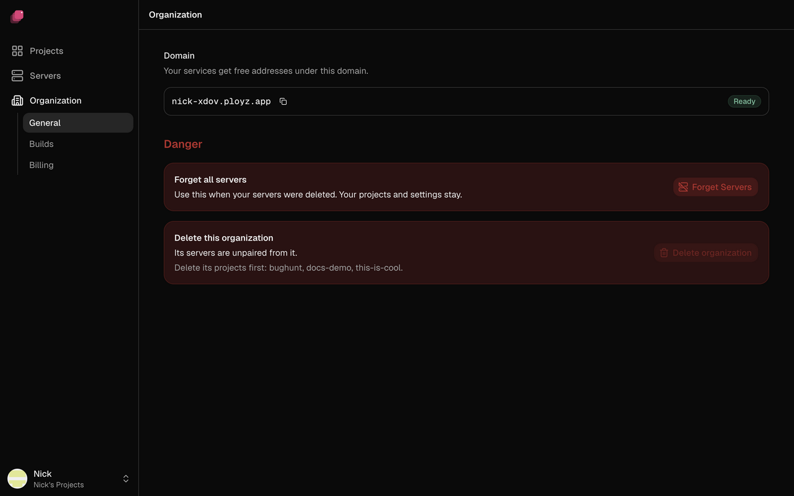
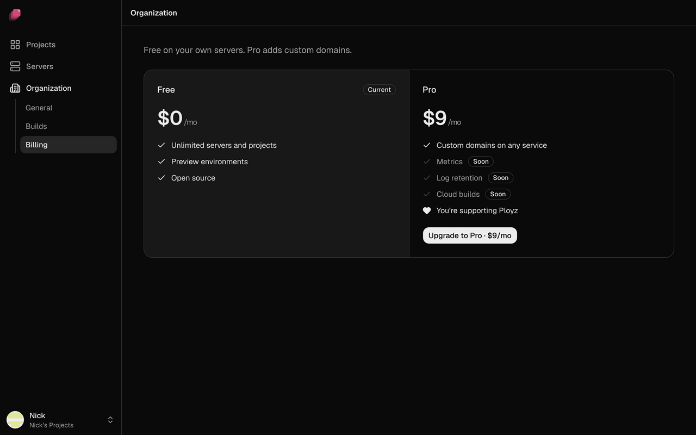

An organization holds your projects, your servers and your billing. The first time you sign in,
Ployz creates one for you, named after you (like Ada's Projects).

## Your organization

Ployz is built for one person today. You can't invite anyone to your organization yet, so there
are no teams or roles. To let a CI job act for you, make an
[organization token](../cli/overview.md#make-an-organization-token).

If you have more than one organization, switch between them under **Switch organization** in the
account menu.

In the sidebar, click **Organization** for its settings:

- **General**: your organization's **Domain**, which your services' free addresses live under.
  It appears with your first deploy. Below it, **Forget all servers** is for when your servers
  were deleted.
- **Builds**: where builds run. See [Where builds run](../builds/where-builds-run.md).
- **Billing**: your plan.

## Billing

Ployz is free on your own servers: unlimited servers and projects, preview environments and
generated https addresses. Your hosting provider bills you for the servers.

**Pro** costs $9 a month per organization and adds custom domains. Without it, you can't add a
custom domain.

1. Go to **Organization → Billing**.
2. Click **Upgrade to Pro · $9/mo** and pay in the checkout.

To change your card, get invoices or cancel, click **Manage billing** on the same page.

A [self-hosted Ployz Cloud](../self-hosting.md) has no billing, and custom domains are always
allowed.

## Delete an organization

Deleting an organization removes it with its settings and tokens, and disconnects your servers
from it. It can't be undone.

1. Delete every project in it. **Delete organization** stays disabled until you do.
2. **Cancel Pro first.** Deleting the organization doesn't cancel it: go to
   **Organization → Billing → Manage billing**.
3. Go to **Organization → General** and click **Delete organization**.
4. Type the organization's slug, as the dialog shows it, and click **Delete**.

<!-- screenshot: the Delete organization dialog with the slug typed -->

If a server is offline, the organization stays, disabled, until that server is back. Then click
**Try again**.

With no organization left, the dashboard offers **Create an organization**.

From the CLI, `ployz org rm SLUG` does the same. If this device was signed in to that
organization, it moves to another of yours and says which. With none left, run `ployz logout`,
then `ployz login`.
