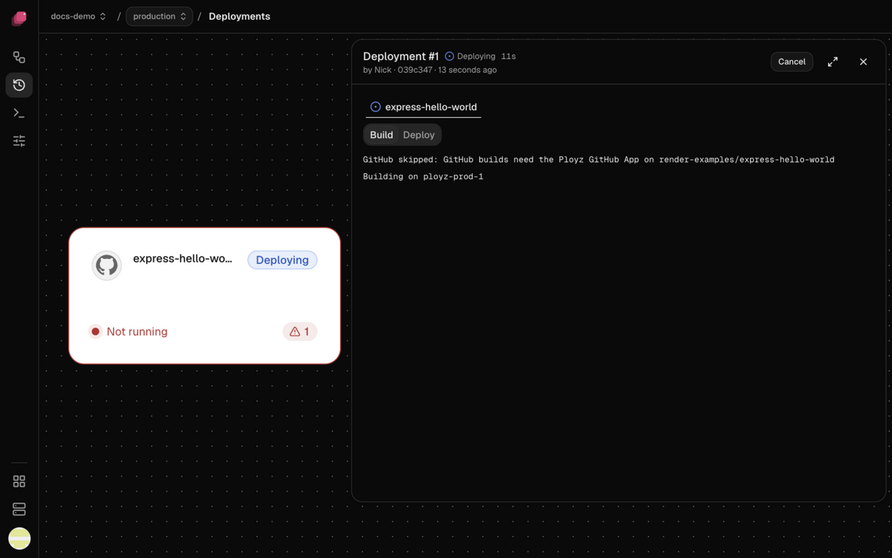

Ployz turns your code into a container image and runs it on your servers. Every service that
deploys from GitHub is built this way, with [Railpack](railpack-and-dockerfiles.md), so you
don't need a Dockerfile. Services that run a [Docker image](../deploy/docker-image.md) skip
the build.

Each deploy builds your commit on one of your servers or on GitHub Actions. The image lands on
one of your servers, which sends it to every server that runs the service. You don't need a
container registry. To choose where builds run, see [Where builds run](where-builds-run.md).

## When Ployz builds

Every deploy that includes a GitHub service builds it, unless nothing that goes into the build
changed: then Ployz reuses the image it already has. A push that auto-deploys builds the pushed
commit, and **Retry** builds the same commit again.

**Deploy** in the dashboard deploys the whole environment, so every GitHub service in it
moves to the newest commit on its Git branch, even if you changed only one service.

If a build fails, the deploy stops before anything changes, and your current version keeps
running. Images that did build are reused when you deploy again.

## Read the build log

1. Open the deployment. **Deploy** opens it for you; later, find it in the service's
   **Deployments** tab, or click **Logs** in the bottom bar while it runs.
2. Pick the service's tab, then **Build**.

The first lines say where the build runs, like `Building on web-1`, or
`Building on GitHub Actions:` with a link to the run on GitHub. A step that fails ends with a
line that starts `ERROR`. A failed build stays on **Build**, with the error at the top of the
page.

## When a build waits

A build can wait before it starts:

- **Behind another deployment** in the same environment. See
  [When another deployment is running](../deploy/deployments.md#when-another-deployment-is-running).
- **For room on a server.** Each server runs as many builds at once as its **Builds at once**
  allows. Raise it, or let more servers run builds.
- **For a GitHub runner.** If your servers come next in the build order, the build moves to
  them when GitHub doesn't start it in time.

To stop waiting, click **Cancel** on the deployment.

## When a build takes too long

A build on your servers fails after 30 minutes. On GitHub Actions it has 2 hours, and if it
runs out of time there, the next builder in your build order takes it. To give builds on a
server more time, see [Build resources and cache](build-resources-and-cache.md#give-builds-more-time).

## Good to know

- **Changing a variable rebuilds** the GitHub services that use it on their next deploy, because
  builds can read variables. Changing replicas, domains, or CPU and memory limits doesn't.
- **Git submodules, Git LFS and very large repositories don't build.** Keep large files out of
  the repository; see [Troubleshooting builds](../troubleshooting/builds.md#my-repository-is-too-big-or-uses-submodules).
- **A build gets your service's variables, secrets included.** See
  [Use variables at build time](railpack-and-dockerfiles.md#use-variables-at-build-time).

Next: [change how your app builds](railpack-and-dockerfiles.md), with commands or your own
Dockerfile.
