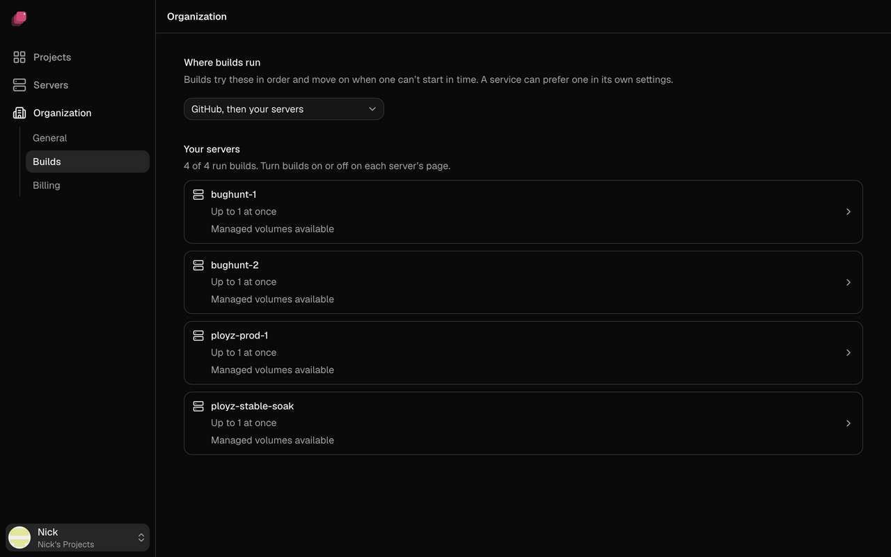

Ployz builds your app on your own servers, or on GitHub Actions in your app's repository. Your
organization's **build order** says which one a build tries first. If it can't take the build,
the next one does.

Out of the box, builds run on your servers. Add one workflow file to a repository and its
builds move to GitHub Actions, which takes the load off your servers.

## Build on your servers

Every server runs builds unless you turn it off.

1. Go to **Servers** and open a server.
2. Under **Builds**, turn **Run builds here** on or off.
3. Set **Builds at once** to how many builds it may run together.


Ployz prefers the server that built the service last, because its cache makes builds faster. A
build that has started on a server stays there: if it fails, the deploy fails. If your servers
mix x86 and ARM, see [When your servers mix x86 and ARM](railpack-and-dockerfiles.md#when-your-servers-mix-x86-and-arm).

## Build on GitHub Actions

Builds run on GitHub's runners, in the service's repository, and count towards that
repository's Actions minutes. Each repository needs one workflow file; you don't add any
secrets. The **GitHub Actions** section appears once a service builds from a repository
through the Ployz GitHub App.

> [!NOTE]
> A GitHub build receives your service's variables, secrets included, so it can build your
> app the same way your servers would. To keep them on your servers, choose **Your servers
> only** and don't set any service's **Preferred Builder** to **GitHub Actions**.

1. Go to **Organization → Builds**.
2. Under **GitHub Actions**, click **Add workflow ↗** next to the repository. GitHub opens the
   file, already filled in.
3. Commit it to the repository's default branch, even if your service deploys another Git
   branch.

The repository shows **Waiting for commit**, then a check mark. If it shows **Installation
lacks permission**, approve **Actions: Read and write** for the Ployz GitHub App in GitHub.

<details>
<summary>The workflow file</summary>

```yaml
name: Ployz build
on:
  workflow_dispatch:
    inputs:
      build: { required: true, type: string }
      cloud: { required: true, type: string }
      runner: { required: false, type: string, default: ubuntu-latest }
permissions:
  contents: read
  id-token: write
jobs:
  build:
    runs-on: ${{ inputs.runner }}
    steps:
      - uses: getployz/build@v1
        with:
          build: ${{ inputs.build }}
          cloud: ${{ inputs.cloud }}
```

</details>

When GitHub can't take a build, the build log says why, and the next builder takes it:

- **The workflow is missing, disabled or not on the default branch**, or the repository shows
  **Installation lacks permission**. Fix it in GitHub, as above.
- **The service deploys a public repository without the GitHub App**, or **runs on both x86 and
  ARM servers.** These build on your servers. With **GitHub only**, they fail, so keep your
  servers in the order for them.
- **You deployed with `ployz up`.** Uploads always build on your servers.


## Choose the build order

1. Go to **Organization → Builds**.
2. Pick an order under **Where builds run**.



| Order | What happens |
| --- | --- |
| **GitHub, then your servers** | The default. GitHub first when the repository has the workflow, otherwise your servers. |
| **Your servers, then GitHub** | Your servers first. GitHub only when none of your servers runs builds. |
| **Your servers only** | Never GitHub, unless a service prefers **GitHub Actions**. |
| **GitHub only** | Only GitHub, and a build waits for a GitHub runner however long that takes. Uploads from `ployz up` still build on your servers. |

## Prefer a builder for one service

1. Open the service and go to **Settings → Build**.
2. Set **Preferred Builder** to **GitHub Actions** or one of your servers.


The service tries that builder first, then follows the build order. A preferred server keeps
the build on your servers, even with **GitHub only**. **Auto** follows the build order alone.
**Preferred Builder** applies at once, from the next build.

## When a build fails

A build moves to the next builder only when a builder can't take it. If a build step fails, on
GitHub or on your servers, the build fails: moving it wouldn't fix your code. Either way, the
deploy stops before anything changes.

When no builder can take a build, it fails with one of these:

- `No eligible Build Machine was selected; no build was started.` Your servers were last in
  the order and none could take it. Turn on **Run builds here** on an online server, or pick an
  order that ends with GitHub.
- `…No other Builder in your Build Order can take it`. GitHub was last and couldn't take it.
  The build log says why GitHub was skipped. Fix that, or pick an order that ends with your
  servers.

See [Troubleshooting builds](../troubleshooting/builds.md) for failed build steps.
