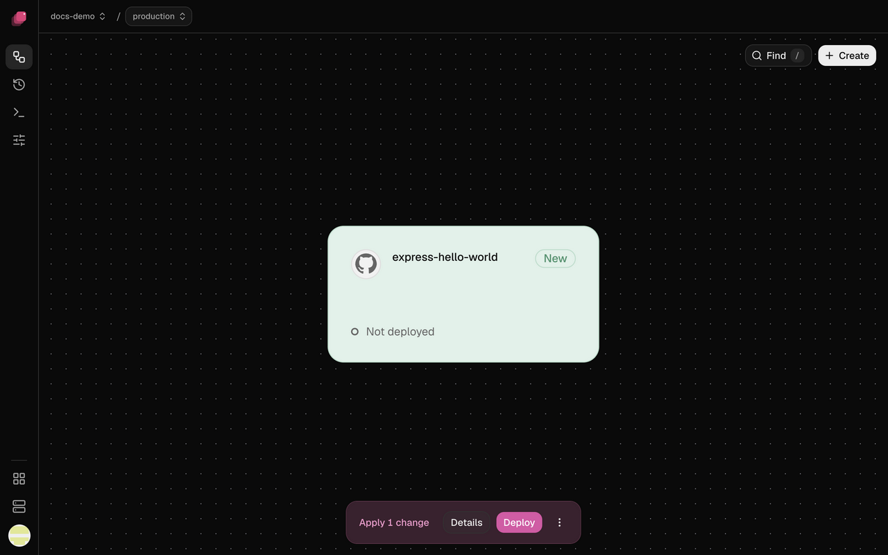
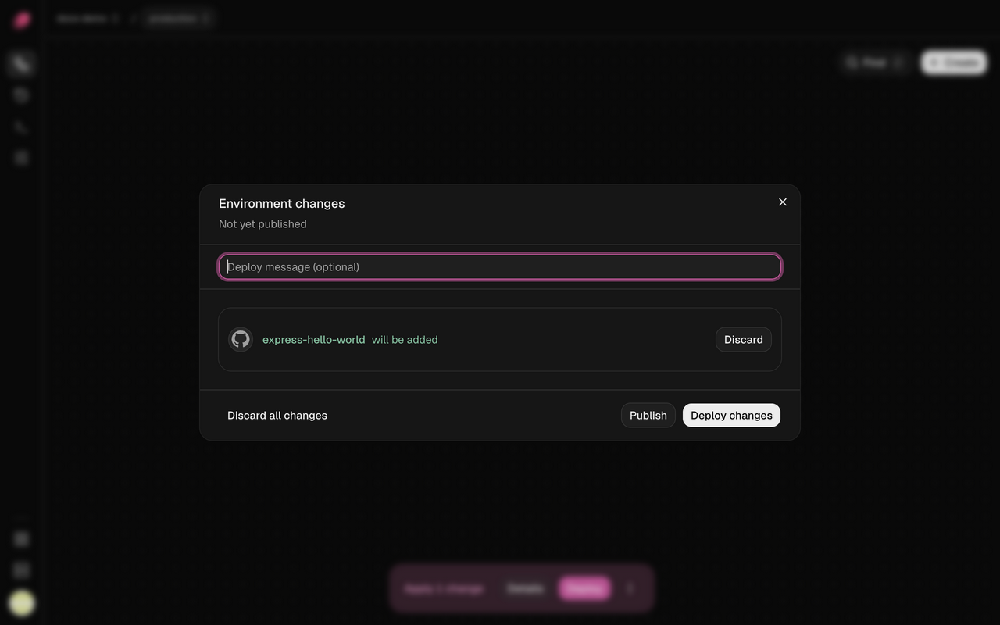
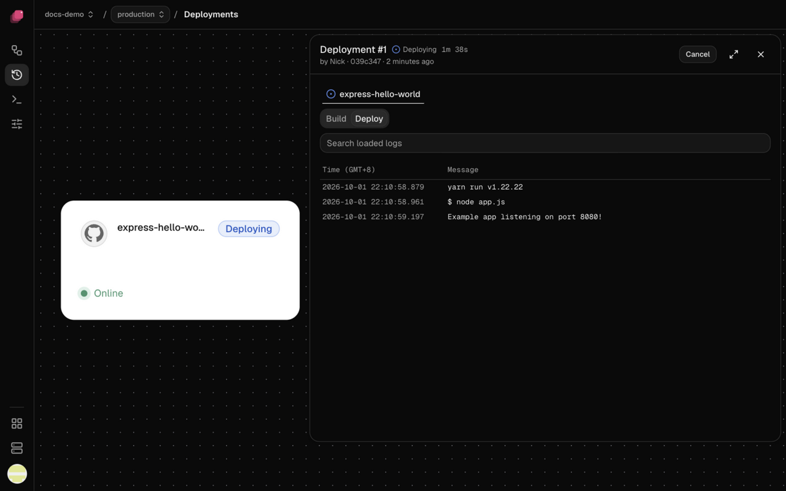

Nothing you change in the dashboard reaches your servers until you deploy it. Your edits pile up
as staged changes, like a draft, and **Deploy** makes your servers match. Each deploy becomes a
deployment, with its own page and logs.

## Stage changes

Every edit saves as you make it, and your services keep running as they were. A staged field
turns pink until you deploy it (hover it to see what's running now), and the bottom bar counts
your changes, like **Apply 3 changes**.



Deleting a service, volume, variable or domain is staged too; discard it and it comes back.

A few settings apply the moment you change them instead, and Discard doesn't undo them:
**Auto-deploy**, **Wait for CI**, **Watch paths**, **Preferred Builder** and a new secret for a
private image.

## Deploy your changes

1. In the bottom bar, click **Details** to review each change. Add a
   **Deploy message (optional)** if you like.
2. Click **Deploy changes**. **Deploy** in the bottom bar skips the review.



Ployz opens the new deployment's page. A deploy covers the whole environment, not only what you
changed: every GitHub service moves to the newest commit on its Git branch, and if you've added
or lost a server, replicas spread over the servers you have now (if a service's volume was on a
lost server, see [When a server goes down](../services/scaling.md#when-a-server-goes-down)).
Everything else keeps running as it is.

**Publish** in **Details** saves your changes without deploying them. Your next deploy takes them
along, including one started by a push to GitHub; changes you haven't published stay behind.

To undo, click **Discard** beside a change, or open **⋮** and choose **Discard all changes**.
Discarding a service or volume you never deployed deletes it.

The dashboard's **Deploy** needs a staged change. Deploying again with nothing staged is
CLI-only for now:

```sh
ployz deploy
```

## When another deployment is running

An environment runs one deployment at a time. While one runs, **Deploy** reads **Deploy next**
and yours waits as **Queued**. If you deploy again while one is waiting, the newest one takes its
place.

## Follow a deployment

**Deployments** in the sidebar lists every deployment, newest first. A deployment's page shows
its status, who started it and the commit it ships, and if it failed, the reason in red under the
header. Each service it included has a tab with its **Build** and **Deploy**
[logs](../observe/logs.md).



| Status | What it means |
| --- | --- |
| **Queued** | Waiting for another deployment, or for GitHub Actions to build it |
| **Deploying** | Building, then rolling out |
| **Deployed** | Every change applied |
| **Failed** | Something stopped it. A service marked **Not attempted** never started. |
| **Cancelled** | Someone cancelled it |
| **Unknown** | Ployz can't tell what applied. Retry it. |

## Retry or cancel a deployment

- **Retry**, on a failed, cancelled or unknown deployment, ships the same commit and settings
  again. To ship a fix, change it and deploy instead.
- **Cancel**, on a running deployment, stops it at its next step. What it already changed stays
  until your next deploy.
- On a queued deployment, **Deploy now** starts it if nothing is running ahead of it, and **⋮ →
  Cancel deployment…** takes it out of the queue.

## Deploy without downtime

Ployz swaps in the new version one replica at a time: it starts a new one, waits until it's
ready, then stops an old one, so your app keeps serving. Before any replica stops, every server
taking web traffic stops sending it requests. If a server can't confirm that within 10 seconds,
the replica stops anyway and the deploy warns which server didn't answer.

- **Set a health check.** Under **Settings → Deploy**, set **Healthcheck** to a path like `/up`.
  A new replica is ready when that path answers with a 2xx status. A redirect, to `https://` or
  `/login` for example, fails the check. Without a health check, the old replica stops a few
  seconds after the new one starts, ready or not.
- **A service with a [volume](../services/volumes.md) has a short gap.** Its old replica stops
  first, so two never write the same files.
- **Migrations run first.** A **Pre-deploy command**, like `npm run migrate`, runs once with the
  new code before any replica is replaced. If it fails or runs past 5 minutes, the deployment
  fails and the old version keeps running.
- **Services start in order.** If `web`'s [variables](../services/variables.md) reference
  `${{ postgres.DATABASE_URL }}`, `postgres` comes up first.

## When a deploy fails

Where a new replica doesn't come up, the old one keeps serving. Ployz doesn't roll back: what
was already replaced keeps the new version, and services later in the order stay as they were.

> [!WARNING]
> Ployz doesn't undo a pre-deploy command. If a migration ran and the deploy then failed, your
> database keeps the change while the old version of your app runs against it.

Fix the cause and deploy again; see [Troubleshooting deployments](../troubleshooting/deployments.md).
Or click **Fix it on a branch** on the deployment's page to try the fix in a
[branch](../environments/environments.md) first.

## Confirm a deploy that deletes data

When a deploy would delete a volume's data, like a deleted volume or database, **Deploy deletes
data** lists what goes. Type your `project/environment`, like `my-app/production`, and click
**Deploy**. If you didn't mean it, cancel, then discard the deletion in **Details**.
