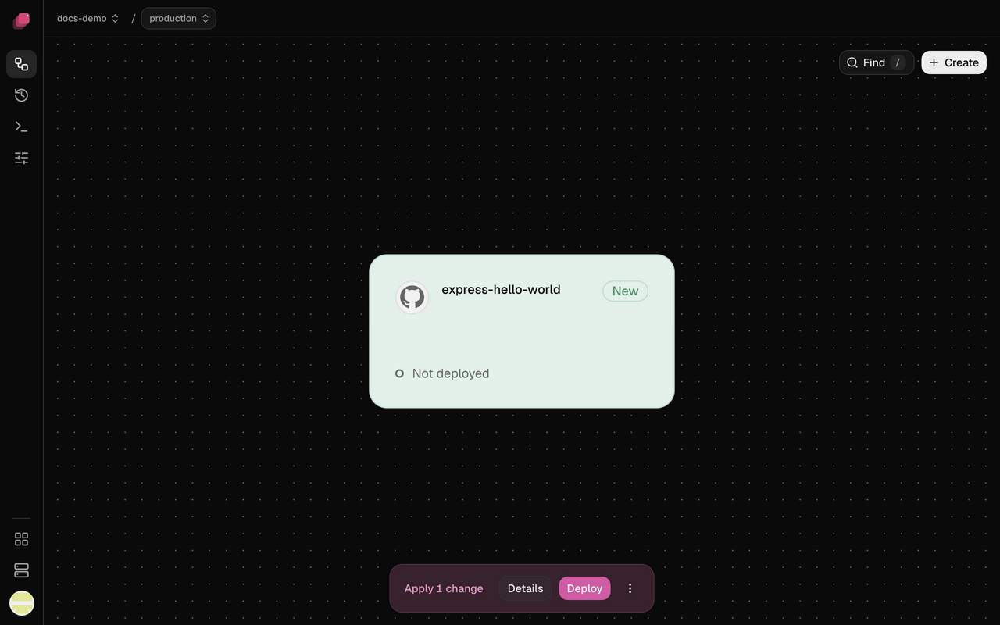
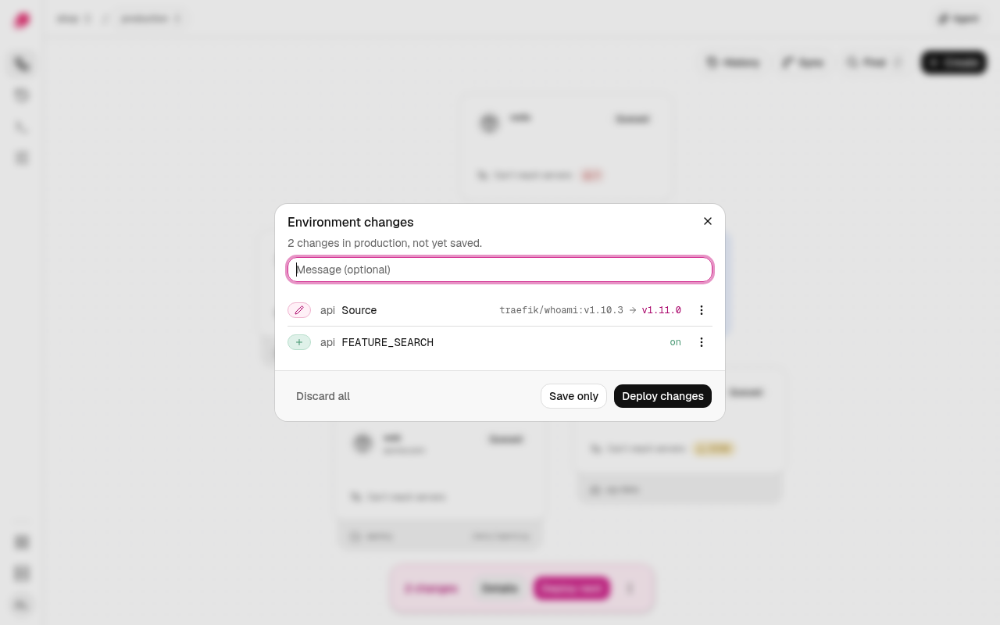
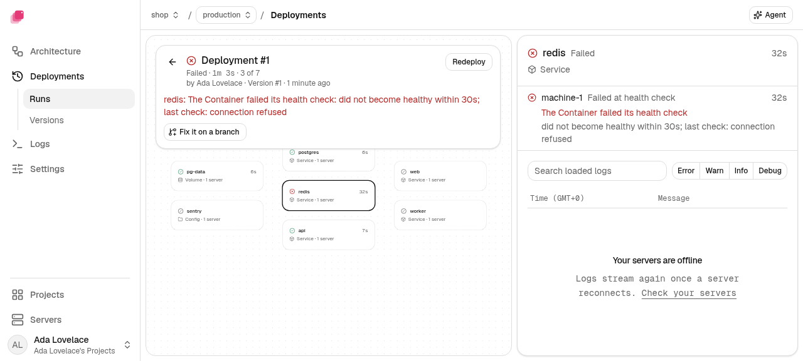

Nothing you change in the dashboard reaches your servers until you deploy it. Your edits pile up
as staged changes, like a draft, and **Deploy** makes your servers match. Each deploy becomes a
deployment, with its own page and logs.

## Stage changes

Settings save as you change them. Config files save when you click **Save**. Your services keep
running as they were. A staged field
turns pink until you deploy it (hover it to see what's running now), and the bottom bar counts
your changes, like **3 changes**.



Deleting a service, volume, variable or domain is staged too; discard it and it comes back.

A few settings apply the moment you change them instead, and Discard doesn't undo them:
**Auto-deploy**, **Wait for CI**, **Watch paths**, **Preferred Builder** and a new secret for a
private image.

## Deploy your changes

1. In the bottom bar, click **Details** to review each change. Add a
   **Message (optional)** if you like.
2. Click **Deploy changes**. **Deploy** in the bottom bar skips the review.



Ployz opens the new deployment's page. A deploy covers the whole environment, not only what you
changed: every GitHub service moves to the newest commit on its Git branch, and if you've added
or lost a server, replicas spread over the servers you have now (if a service's volume was on a
lost server, see [When a server goes down](../services/scaling.md#when-a-server-goes-down)).
Everything else keeps running as it is. Deploying only some services, such as with
`ployz deploy web`, also deploys the saved changes of the services they reference, and the
deployment's page lists them. A secret that is **Not set** never stops a deploy: the
deploy skips it, and any variable that references it, and warns. A
[broken reference](../services/variables.md#reference-another-services-variable), to a service or
variable that isn't there, doesn't either: the deploy leaves that variable out the same way, or
leaves the reference empty in a config file, along with any reference that reads it, and the
deployment's page and `ployz deploy` name each one.

A deploy of the whole environment, from **Deploy** or plain `ployz deploy`, removes every service
running in the environment that the environment doesn't hold: the ones you removed, such as with
`ployz service rm`, and any other, such as one started by another tool. A deploy a Git push starts
does the same when it ships every service. `ployz deploy` and `ployz deployment show` name each
service it removes, such as `db: removed 1/1 (not in this environment)`, and `ployz deploy --plan`
warns that it will. Their volumes and data stay. A deploy that can't check a server that should
answer skips pruning, still deploys, and says `Prune skipped: not every Server answered`. A server
Ployz already knows is down doesn't stop the prune: the replicas on the other servers are removed,
as below.

Before Ployz Cloud queues a whole-environment deploy that prunes, it asks your servers what runs
there. A prune that removes a service is destructive, like `ployz service rm`:

- Where destructive actions ask first, and for every deploy an agent makes, the approval lists
  each service the prune removes, such as **Removes service extra2**.
- A [Deploy token](../account/permissions.md) can't remove one. Its deploy is refused with
  `Needs changes:destroy: this deploy removes extra2, running in this environment but not part of it. Deploy with --no-prune to keep them.`
  When nothing else runs, it deploys as usual.
- When Cloud can't ask every server that should answer, a Deploy token's deploy is refused the same
  way. Any other deploy asks first where destructive actions do, and its approval says it also
  removes any other service running in the environment. A server Ployz already knows is down isn't
  asked. When a server didn't answer because large packets to it are dropped, the refusal and the
  approval say so, such as
  `Couldn't check every server: large packets to web-3 are dropped on the mesh path`. See
  [Large packets to a server are dropped](../troubleshooting/servers.md#large-packets-to-a-server-are-dropped).
- A redeploy of a deploy that pruned prunes again, and asks or is refused the same way, by what runs
  now. `ployz deployment redeploy` takes no `--no-prune`, so a Deploy token's refused redeploy says
  `Redeploy #16 once every server answers, or have an owner or admin redeploy it.`, or, when it
  names a service it removes, `Have an owner or admin redeploy #16.`

A service started after the deploy was queued, and before it ran, is removed without being listed.

Removing a service while a server that may run one of its replicas is down, or can't be checked,
still removes the replicas on the servers that answer. The service reads removed and names that
server, such as
`rmme: removed 2/3; web-2 didn't answer, the next full deploy removes its copy once it is back`,
and the deploy exits 3. When Ployz found no replica on the servers it could check, the service
reads `rmme: removed 0/0; couldn't check web-2, the next full deploy removes any copy there`.
Either way the service is removed from the environment. A replica on web-2 may serve again once
that server is back, until your next deploy of the whole environment removes it.

To keep those other services, pick **Deploy, keep other services** in the bottom bar's **⋮** menu,
or run `ployz deploy --no-prune` (`ployz up --no-prune` too). It still removes the services you
removed, and names each one it keeps, such as `postgres: running, not in this environment; kept.`

Deploying only some services never removes another: after `ployz service rm big`,
`ployz deploy big` fails with `Service big is staged for removal; a full Deploy removes it`, and
plain `ployz deploy` removes it.

**Save only** in **Details**, in the bottom bar's **⋮** menu, or on **Deploy** while you hold Alt,
records your changes and optional message without deploying them. Ployz shows **Saved, not
deployed**. Your
next deploy takes them along, including one started by a push to GitHub; unsaved changes stay
behind. Saving again with no changes creates no new version. The CLI calls this
`ployz deploy --skip-deploy`, and accepts `--message`.

To undo, open a change's **⋮** menu and choose **Discard**, or open **⋮** in the bottom bar and
choose **Discard all changes**.
**Discard all changes** returns everything to your latest saved version, including a staged
rollback. Discarding a service or volume you never deployed deletes it. Discard does not save a
version. When part of your latest saved version is not deployed, for example because its deploy failed,
the bottom bar shows **Save #4 not deployed** with **Deploy** instead of a change count. A deploy
saves your changes before it starts, so one that ran nothing, for example because it was refused
while a server didn't answer, still leaves them saved. The bar then says **Save #4 · its deploy ran
nothing**, and `ployz diff` says `Saved as version #4. Its deploy ran nothing, so none of these
changes reached a server.` After you discard such changes, `ployz diff` and `ployz discard` name the
save as one whose deploy ran nothing beside each change they could bring back. While a
deploy of it is queued or running, for example `ployz deploy web` deploying web and the services
it references, the bar shows that deploy's status instead, **Queued**, **Preparing** or **Deploying · Save #4**, with **Deploy
next** for the rest. A deploy still waiting for CI isn't queued yet, so the bar keeps **Save #4 not
deployed**, or **Save #4 · its deploy ran nothing** after one that ran nothing. Neither its **⋮** menu nor Details offers **Discard all** then, since nothing is left to
discard.
A new service's change starts with what it runs, its image or its repository and branch, such as
`web.image: null → "nginx:1"`. Those rows have no Discard of their own: discard the service.
`ployz discard web.image` says so and names the command, `ployz discard web`.
If you discard saved changes back to what is deployed, Details still shows the draft reversal.
Saving records that reversal; Discard on its row returns it to the latest saved value.
In the CLI, `ployz discard` with no path drops every staged change in the environment, including
changes someone else staged from the dashboard or an agent, and lists each one it dropped. Pass a
path, such as `ployz discard web.env.KEY`, to drop only that change. It also names each saved change
it took out and the command that brings it back, such as `ployz discard web`. `ployz diff` lists
those rows and `ployz status` counts them. Plain `ployz discard` returns each service to what is
deployed, or, for a service a queued or running deploy is changing, to the value that deploy is
bringing in. `ployz discard --target review` matches the dashboard's **Discard all changes** and
goes back to your latest saved version.

The dashboard's **Deploy** needs a staged change. To ship the same commit and settings again,
click **Redeploy** on the newest deployment; see
[History and rollback](history-and-rollback.md#redeploy-or-cancel-a-deployment). To move GitHub
services to their branch's latest commit with nothing staged, use the CLI:

```sh
ployz deploy
```

## When another deployment is running

An environment runs one deployment at a time. While one runs, **Deploy** reads **Deploy next**
and yours waits as **Queued**. If you deploy again while one is waiting, the newest one takes its
place, and the one it replaced reads **Superseded**.

A deploy started outside that queue can still reach a service after a newer deploy did. It fails for that service and leaves the newer version serving.
See [A newer deploy is already serving](../troubleshooting/deployments.md#a-newer-deploy-is-already-serving).

On the canvas, **Deploying** shows only on the services the running deployment restarts. A service
it leaves running keeps its staged changes on its card.

## Follow a deployment

While a deployment runs, the bottom bar shows it. Once it ends, the bar shows **Deployed** for a
few seconds, or **Failed** until you dismiss it, with **Logs** to open its page. **Failed** stays
after a reload and in other tabs, as long as the failed deployment is the newest one.

**Runs**, under **Deployments** in the sidebar, lists every deployment, newest first. A
deployment's page shows its status, who started it and, if it failed, the reason in red under the
header. A service that failed on its own reads Failed, and its failure is the reason, even when
you cancelled the deployment while it ran. A cancelled deployment shows no reason when nothing in
it failed on its own. `ployz deployment show` does the same, and `ployz deploy` then ends with
`Deployment #7 was cancelled.` Below that is one card for each build, service, volume and config it
touched, laid out left to right in the order they deploy. Click a card to see each server's progress and its
[logs](../observe/logs.md). A build's card shows the build output, and a service's card shows what
its new containers printed. A failed deployment opens on the card that failed.



| Status | What it means |
| --- | --- |
| **Waiting for CI** | Held until the push's checks pass. See [Wait for CI](github.md#wait-for-ci). |
| **CI failed** | A check failed, so the commit doesn't deploy. |
| **Queued** | Waiting for another deployment, or for GitHub Actions to build it |
| **Preparing** | Started: Ployz unpacks its upload, builds and plans. `ployz deployment ls` says `preparing`. |
| **Deploying** | Rolling out |
| **Deployed** | Every change applied |
| **Failed** | Something stopped it. A service marked **Not attempted** never started: it waited on a failed service, mounts a [volume with no writer](../services/volumes.md#when-a-volume-has-no-writer), mounts a volume on a [server that doesn't run services](../services/scaling.md#give-servers-different-jobs) or on one that is [down or not answering](../services/scaling.md#when-a-server-goes-down), or depends on one of those. A service you removed reads **Removed** even when a server that may run it is down or couldn't be checked: the deployment names that server, exits 3, and your next deploy of the whole environment removes the replica there. |
| **Cancelling** | A cancel is on its way. |
| **Cancelled** | Someone cancelled it. A service it stopped partway reads **Cancelled**, not **Failed**. |
| **Superseded** | A newer deployment took its place while it was queued. |
| **Unknown** | Ployz can't tell what applied. Redeploy it. |

If a deployment fails, see [My deploy failed partway](../troubleshooting/deployments.md#my-deploy-failed-partway).

### Cleanup

After a deployment from the dashboard or GitHub ran, a **Cleanup** card appears after its last
service. It stops the old replicas the deployment couldn't stop while it ran, for example because
a server was cut off. Click it to see each old replica that is still running and why.

| Cleanup | What it means |
| --- | --- |
| **Waiting** | Retrying the old replicas still running. The card updates without a reload. |
| **Done** | Every old replica stopped |
| **Left running on server-3** | After three tries over a few minutes, these old replicas still run. A server cut off before or during the deployment shows here too, since an old replica may still run on it. So does a service that failed to deploy: cleanup leaves its old replica, which may be the one serving. Cleanup names those at once, since trying again changes nothing. |
| **A newer Deployment took over** | You deployed again before cleanup finished. The newer deployment's own cleanup takes over. |
| **Failed** | Cleanup itself hit an error, shown on the card. A cleanup Cloud lost track of also ends here, after about an hour, and lists the old replicas it last saw running. |

A replica left running keeps serving alongside the new ones once its server is back. Deploy again
to stop it. CLI deployments clean up while they run, report a replica left running at the end, and
show no **Cleanup** card.

Work your cancel stopped reads **Cancelled**. Work that failed on its own reads Failed, even in a
cancelled deployment. So does work Ployz stopped for another reason, such as another service
failing. A service reads **Cancelled** when your cancel stopped its work, even if another service
failed.

Work Ployz stopped because the deployment lost its runner reads **Interrupted**. That happens when
another deployment takes the environment over, or when the runner stops reporting in time. The
deployment then reads **Unknown**.

To follow and inspect deployments from the CLI, see
[Follow and inspect deployments](../cli/overview.md#follow-and-inspect-deployments).

## Confirm a deploy that deletes data

When a deploy would delete a volume's data, like a deleted volume or database, a removed mirror or
an old copy a move replaces, **Deletes data** lists what goes. When it makes a mirror the primary
because the primary's server isn't answering, the title reads **Data loss**, since the writes after
the mirror's last refresh are lost. Type your `project/environment`, like `my-app/production`, and
click **Deploy**. If you didn't mean it, cancel, then discard the change in **Details**.

**Save only** asks the same way, under **Next deploy deletes data**. Saving deletes nothing and
starts no deploy. Your confirmation is saved with the change, so the next deploy deletes that data
without asking again. That holds for a deploy you start and for one a Git push starts.

Deploying only some services, such as `ployz deploy web`, saves your changes too, so with a deleted
volume staged it asks the same way. It keeps that volume's data; your next deploy of the whole
environment deletes it without asking again.

Ployz asks again only when what it would delete changed since you confirmed. That happens when
another server starts holding that data, or someone stages a different copy change on that volume.
A Git push can't ask, so it keeps the data instead, and so does a push when Ployz can't reach your
servers to check. Your next deploy then asks.

If Ployz can't check your servers for that data, the deploy refuses and deletes nothing. It names
the server it couldn't reach, or the server that answered with an error, and shows that error on the
`cause:` line. Try again once that server is back or the error is fixed. For the commands that
accept the loss from the CLI, see
[Follow and inspect deployments](../cli/overview.md#follow-and-inspect-deployments).

Next: [deploy without downtime](zero-downtime.md).
