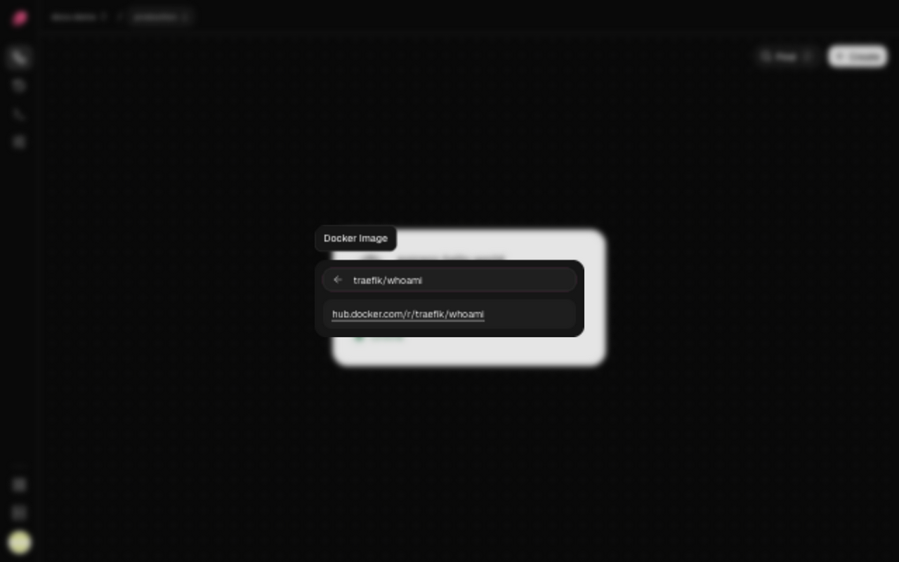

Run a prebuilt image when your CI already builds one, or to run off-the-shelf software. Ployz
pulls the image onto your servers and runs it, with nothing to build.

## Add a service from an image

Before you deploy, find the port the image listens on, like 80 for nginx. Ployz sends traffic
to the port in the service's `PORT` variable, `8080` unless you set it, so give it the image's
port: on the domain, or as a `PORT` [variable](../services/variables.md).

1. Open your project and click **Create**, then **Docker image**.
2. Enter the image, such as `nginx:1.27`, and click **Continue**. For a private image, add its
   [credentials](#use-a-private-image) next.
3. If it should be public, open the service's **Settings → Networking**, click
   [**Generate Domain**](../services/domains.md#generate-a-domain), and enter the image's port
   in **Port**.
4. Click **Deploy** in the bottom bar.



Write the image the way `docker pull` takes it. Without a tag, Ployz uses `latest`.

| Registry | Example |
| --- | --- |
| Docker Hub | `nginx:1.27`, `acme/web:1.4.0` |
| GitHub Container Registry | `ghcr.io/acme/web:1.4.0` |
| Any other registry | `quay.io/acme/web:1.4.0`, `registry.gitlab.com/acme/web:1.4.0` |
| A pinned digest | `ghcr.io/acme/web@sha256:…` |

**Mixed servers.** If your servers mix x86 and ARM, the image needs both a `linux/amd64` and a
`linux/arm64` variant.

## Change the image or its tag

1. Open the service and go to **Settings → Source**.
2. Click the pencil next to **Container image**, enter the new image and click **Continue**.
3. Deploy the change.

## Ship a new version of your image

Ployz doesn't watch registries, so pushing a new image deploys nothing. Deploying the same tag
again doesn't help either: a server that already has `latest` keeps its old copy.

Give each release its own tag, like `1.5.0` or the Git commit, and change **Container image**
to it. Doing that from your CI after it pushes the image is CLI-only:

```sh
# In CI, signed in with an organization token in PLOYZ_TOKEN
ployz set 'web.image=ghcr.io/acme/web:1.5.0'
ployz deploy web
```

With more than one project, or to deploy to an environment other than the default, add
`--project` and `--env` to both commands. See
[CLI and coding agents](../cli/overview.md#make-an-organization-token) to make the token.

## Use a private image

1. Open the service and go to **Settings → Source**.
2. Under **Registry credentials**, click **Add credentials**.
3. Fill in what the form asks for your registry, and save it.
4. Deploy the change.

| Registry | What to enter |
| --- | --- |
| Docker Hub | Your Docker ID and a personal access token |
| GitHub Container Registry | A personal access token with the `read:packages` scope |
| GitLab Container Registry | Your username and a token with the `read_registry` scope |
| Quay.io | A robot username (`namespace+robotname`) and its token |
| Google Artifact Registry | A service account's JSON key |
| AWS ECR Public | A token from `aws ecr-public get-login-password --region us-east-1` |
| Any other registry | A username and a password or token |

<!-- screenshot: the Registry credentials field with "Credentials configured" and the Docker Hub host -->

Ployz stores the secret encrypted and never shows it again; the service shows **Credentials
configured**. To replace it, click the pencil. A new secret takes effect at once, not as a staged
change, and Discard can't bring the old one back. **Disconnect** stops using credentials from
your next deploy, and **Restore** undoes it until then.

An expired token fails the next pull. Use a long-lived token where your registry offers one.
ECR Public tokens are short-lived, so replace the secret before each deploy.

## Override the start command

A service runs the image's own command. To run something else, such as a worker from the same
image:

1. Open the service and go to **Settings → Deploy**.
2. Click **Start command** and enter the command, like `npm run worker`.
3. Deploy the change.

The start command replaces the image's `CMD`, runs with `/bin/sh -c`, and keeps the image's
`ENTRYPOINT`. Minimal images without a shell can't take one. Clear the field to go back to the
image's own command.

Next: [give your app its variables](../services/variables.md).
