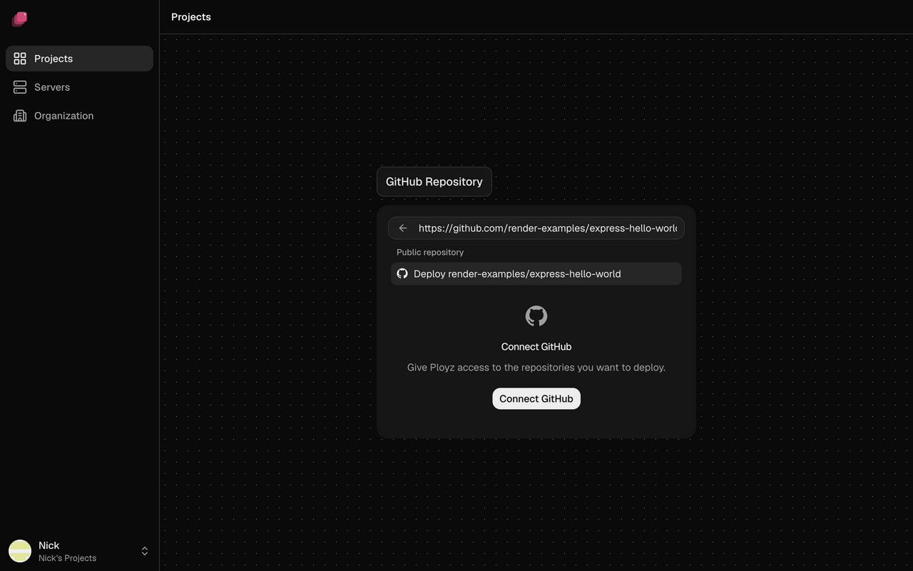
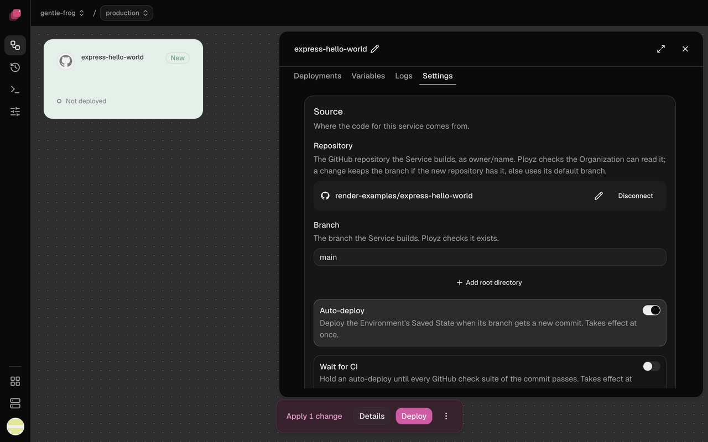

Connect a GitHub repository to a service and Ployz builds and deploys it each time you push to
its Git branch. [How builds work](../builds/overview.md) covers what happens in between.

## Add a service from a repository

1. Go to **Projects**, click **New project** and choose **GitHub repository**. (To add it to a
   project you already have, click **Create** on that project's canvas instead.) The first time,
   click **Connect GitHub**, pick the account or organization, choose the repositories Ployz may
   use, and install the Ployz GitHub App.
2. Search for the repository, or paste its URL, and pick it.
3. Before you deploy, set what your app needs to start:
   - To make it public, open **Settings → Networking** and click
     [**Generate Domain**](../services/domains.md#generate-a-domain). Enter its port in **Port**
     if your app doesn't listen on `PORT`.
   - If it needs [variables](../services/variables.md) or a
     [database](../services/databases.md) to start, add them now.
   - For one app of a monorepo, set its [root directory](#deploy-a-monorepo) under **Source**.
4. Click **Deploy** in the bottom bar.



The service is named after the repository and follows its default Git branch. The GitHub App
reads your code, pull requests and checks, and can't push code. To give Ployz more repositories
later, choose **Set up GitHub** above the repository list.

## Deploy a public repository without the app

In the repository list, type `owner/repo` or paste the repository's URL, choose **Deploy
owner/repo**, then deploy.

Without the app, Ployz never hears about pushes: no deploy on push, no **Wait for CI**, and no
[builds on GitHub Actions](../builds/where-builds-run.md#build-on-github-actions). Install the
app on the repository to get them. Until then, shipping a new commit is CLI-only for now, because
the dashboard's **Deploy** needs a staged change:

```sh
# Builds and deploys the newest commit on the service's Git branch
ployz deploy
```

## Choose the Git branch

1. Open the service and go to **Settings → Source**.
2. Next to **Branch**, click the pencil and pick a Git branch. For a public repository, type its
   name.
3. Deploy the change.



Each environment has its own settings, so production can follow `main` while staging follows
`develop`. See [Environments and branches](../environments/environments.md).

## Deploy on push

**Auto-deploy** is on for every new service. Each push to the service's Git branch deploys it, in
every environment that follows that Git branch. Turn **Auto-deploy** off under **Settings →
Source** to deploy only when you choose. It applies at once, with no deploy.

A push ships the new commit with the settings you last deployed or
[published](deployments.md#deploy-your-changes). Staged changes you haven't published stay
behind, and services the push doesn't touch keep running as they are.

## Wait for CI

Turn on **Wait for CI** under **Settings → Source** to hold a push's deploy until its GitHub
checks pass, from GitHub Actions or any other app that reports checks. It applies at once.

- If a check fails, the commit doesn't deploy. Re-run it on GitHub and the commit deploys once it
  passes, or push a fix.
- A newer push replaces a commit that's still waiting.
- If no checks run for a commit, it waits until your next push. CI that reports commit statuses
  instead of checks counts as no checks.

## Deploy only when certain files change

**Watch paths** limit auto-deploys to pushes that change files you list. Under **Settings →
Source → Watch paths**, type a pattern and click **Add**. Patterns work like `.gitignore` and
start at the root of the repository, whatever the service's root directory is. They apply at
once.

| Pattern | Matches |
| --- | --- |
| `apps/web/**` | everything under `apps/web` |
| `*.md` | Markdown files in any folder |
| `/README.md` | only the README at the root |
| `!**/*.md` | leaves out Markdown files an earlier pattern matched |

Without watch paths, any change deploys. A force push, the first push Ployz sees on a Git
branch, or a push that changes 300 files or more deploys every service on the Git branch,
whatever their watch paths.

## Deploy a monorepo

Add one service per app from the same repository, and give each its own root directory and
watch paths before you deploy it. For a repository with `apps/web` and `apps/worker`:

| Service | Root directory | Watch paths |
| --- | --- | --- |
| `web` | `/apps/web` | `apps/web/**` |
| `worker` | `/apps/worker` | `apps/worker/**` |

To set the root directory, open **Settings → Source**, click **Add root directory** and enter the
folder, starting with `/`. The build sees nothing outside that folder, and a Dockerfile path is
relative to it.

If an app imports code from elsewhere in the repository, like a shared package in a pnpm or npm
workspace, leave the root directory at `/`. Set a
[build command](../builds/railpack-and-dockerfiles.md#change-the-build-and-start-commands) and
[**Start command**](../services/settings.md#start-command) for that app instead, such as
`pnpm --filter web build`, and add the shared folder to its watch paths.

## Good to know

- **Every deploy ships the newest commit.** Clicking **Deploy** to apply a setting also picks up
  whatever is on the service's Git branch now.
- **Changing a variable rebuilds your app.** See [How builds work](../builds/overview.md#good-to-know).
- **Only the service's Git branch deploys.** Pull requests can get their own
  [preview environments](../environments/preview-environments.md) instead.
- **Merging a pull request never changes your settings.** Its code deploys like any push. Setting
  changes synced from its preview only become **Merged** in production's **Changes**, and you save
  or deploy them yourself. See
  [Queue changes for production until the merge](../environments/preview-environments.md#queue-changes-for-production-until-the-merge).

Next: [give your app its variables](../services/variables.md).
