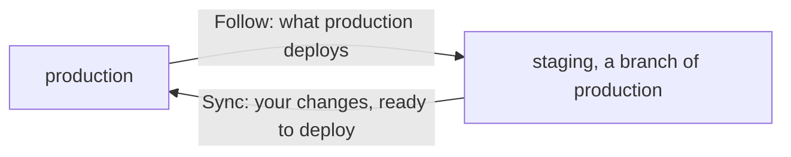
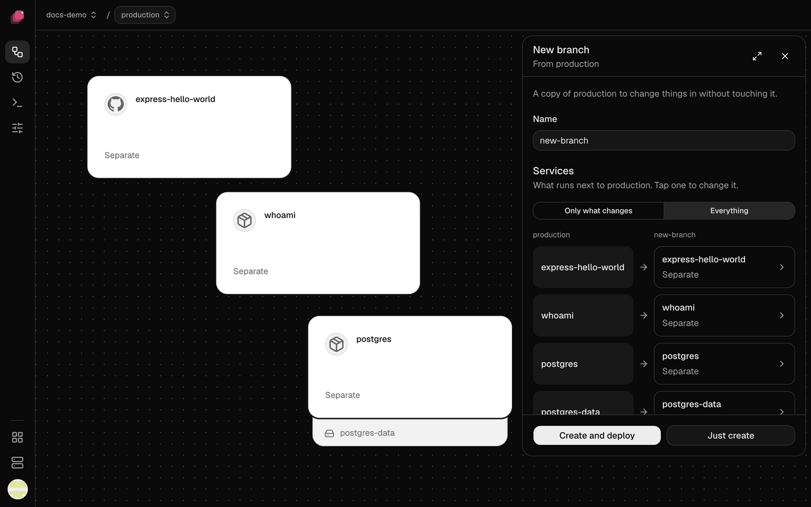
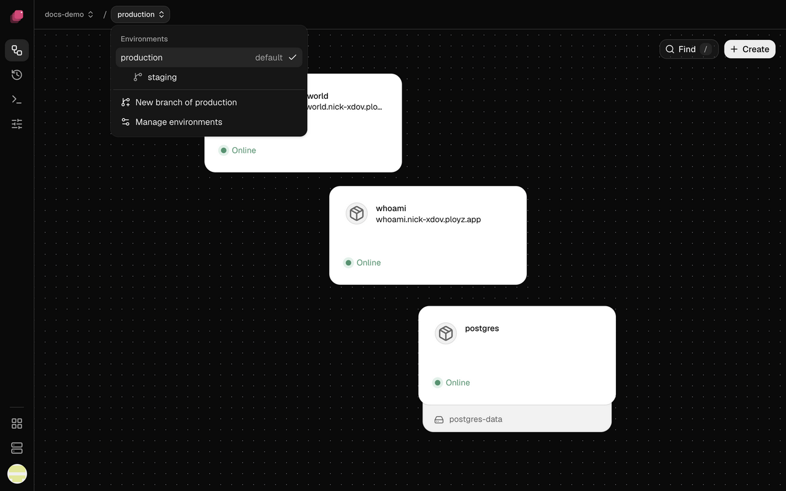
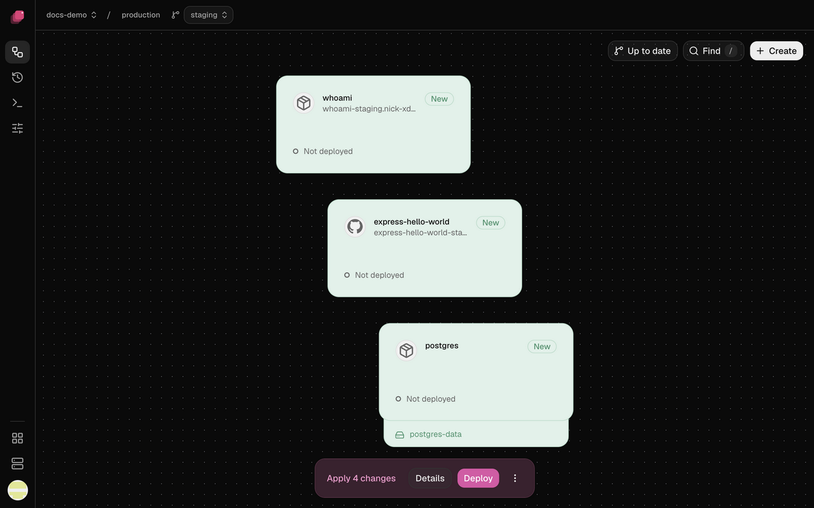
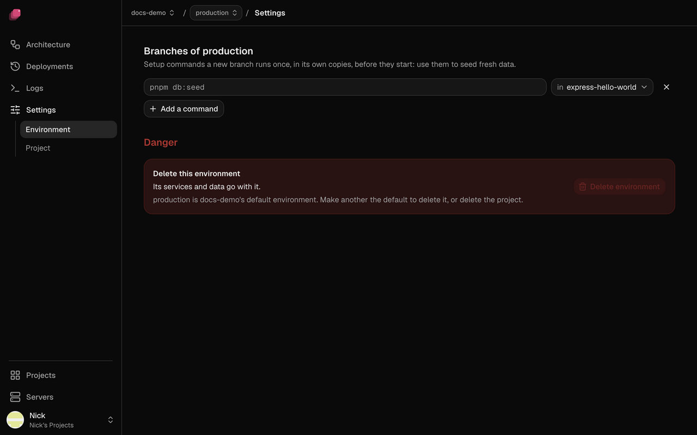

An environment is a full set of your app's services, variables and volumes, running apart
from the others. Every project starts with one, `production`.

To get another, branch one you have. A branch is a copy of another environment, called its
parent, that you can change without touching the parent. When a change works there, you sync it
back to the parent. What the parent deploys follows into the branch on its own.

The steps below make `staging` for a project `my-app` with a `web` service and a `postgres`
database, so staging gets its own copy of both and its own data. Use your own services' names.

## Create staging

1. Click **production** in the top bar, then **New branch of production**. Enter the **Name**
   `staging`.
2. Under **Services**, click **Everything**. `web` and `postgres` show **Separate**, and
   `postgres-data`, the database's volume, shows **New, empty**.
3. Optional: if your app has a command that fills a database with test data, click **Add a
   command** under **Setup command**, enter it, like `pnpm db:seed`, and pick `web` to run it in.
4. Turn on **Keep it after syncing into production**, so staging stays after you sync from it.
   Click **Create and deploy**, or **Just create** to deploy it later.

Ployz never copies data, so staging's database starts empty. A setup command runs once, before
`web` first starts, to fill it. To give every new branch of production the same commands, add
them under **Branches of production** in production's **Settings → Environment**.

## Test staging at its own address

Staging's canvas opens as it deploys. Each copy with a generated address gets its own, with
`-staging` added: if production's `web` is at `web.acme-x7q2.ployz.app`, staging's is at
`web-staging.acme-x7q2.ployz.app`. Open it to try your app against staging's own data.

To move between staging and production, click the environment's name in the top bar. Each branch
sits under its parent.

Staging's `web` follows the same Git branch as production's. To test other code there, pick
another, like `develop`, in its [Source settings](../deploy/github.md#choose-the-git-branch).

## Change a setting in staging

Try a change in staging first, like a new variable that turns on a feature:

1. On staging's canvas, open `web` and go to **Variables**.
2. Click **New Variable**. Enter the **Key** `NEW_CHECKOUT` and the **Value** `true`, and
   click **Add**.
3. Click **Deploy**.

Production doesn't change. The Sync button at the top right of staging's canvas now reads
**Sync to production · 1**.

## Sync the change to production

Syncing stages staging's changes in production, like a draft. It never deploys them.

1. On staging's canvas, click **Sync to production**.
2. Check each change, production's value against staging's. Untick one to leave it out; it's
   offered again next time.
3. Click **Sync 1 change**. A toast offers **Undo**; production's canvas opens with the change
   staged.
4. Click **Deploy**.

Sync never moves data or deletes anything in production. Replicas, CPU and memory limits, domains
and the Git branch stay as each environment has them. A change marked **Changed in production**
replaces production's value when you sync it. A secret's value never syncs: one staging added
arrives in production without a value, marked **needs a value** in its variables and in **Changes**,
and production's deploy asks you to set it first. To set it as you sync, type production's value in the secret's row of the dialog.

To keep a setting out of every sync, like a variable each environment sets its own way, click
**Never sync** beside it in the dialog, or in the variable's ⋮ menu.
The exclusion takes effect immediately. If it also discards an arrived change, the
reversal stays in the draft until you Save it.

### Take a sync back out

Until you save or deploy them, the changes a sync staged stay grouped under where they came
from. In production's bottom bar, click **Details**: **Included** lists `staging · 1 change`.

- **Remove:** in the row's ⋮ menu, click **Remove**. Production gets back what it had before
  staging was included. A change you made in production since stays.
- **Include newer changes:** when staging changed again, the row says so. Its ⋮ menu offers
  **Include newer changes**, which opens the Sync dialog for just what's new. A pull request's
  preview works the same way while it's open.
- **Undo:** the toast's **Undo** removes staging, as long as you haven't synced staging again
  since. After that, Undo is refused: Remove it in Details instead.

`ployz env sync` groups what it stages the same way, but its `--json` output leaves out what was
included: check **Details** in Ployz Cloud.

Remove is refused, and says why, when taking staging out would lose your work:

- A service staging brought was edited in production since. Discard that service, or keep staging.
- A service staging brought got its own registry credential or deployment setting (such as
  auto-deploy) in production since. Those take effect at once, outside the draft. Discard that
  service, or keep staging.
- Staging turned on a registry credential for a service in production, replacing the one
  production kept for it. Removing staging wouldn't bring production's back. Set that service's
  credential again, or keep staging.
- Another included environment changed a service staging brought. Remove that one first, or keep
  staging.
- Another service in production uses one staging brought. Change that service first, or Remove
  what brought it.

A change another included environment brought shows **Included with** that environment in the
Sync dialog, and you can't tick it, even where production also changed it: Remove that one first
to sync over it.

Clicking **Save** or **Deploy** ends what was included: the changes are production's own, and
**Included** is empty again. **Save** ends them even when no change is left to save.

## Other choices

### Share a service or leave it out

Click a service in the **New branch** panel to change what the branch gets:

| Row says | What the branch gets |
| --- | --- |
| **Separate** | Its own copy of the service, with the parent's settings and variables. |
| **New, empty** | Its own volume, with no data. |
| **production's** | No copy: the branch uses production's running service. |
| **Not included** | Nothing. Anything that uses it breaks. |

With **Only what changes**, the default, you click just the services you want to change. Services
they use stay production's: copy only `web`, and staging's `web` uses production's `postgres`.

> [!WARNING]
> A shared service with data, like `postgres`, shows **production's** in amber with a warning
> sign. The branch's code reads and writes production's data there. Click it and choose **Separate postgres** unless
> that's what you want.

To change it after you create the branch, click the shared service on the branch's canvas, then
**Make it separate**, or **Give it a new, empty one** for a database.

### Start with an empty environment

1. Open **Settings → Project**.
2. Under **Environments**, click **New environment**.
3. Enter a **Name** and click **Add environment**.

It starts with no services or variables, so you add them yourself.

### Keep a branch, or let it close

A branch that isn't kept closes after 7 days without a deploy: it comes off your servers, and its
copies and their data are deleted. It can also close as you sync it: tick **Close staging after
syncing** in the Sync dialog.

- **Keep it:** turn on **Keep it after syncing into production** when you create it. Later, open
  the Sync button's ▾ menu and check **Keep staging**.
- **Close it now:** closing a branch removes it from your servers, like deleting an environment.
  Open the Sync button's ▾ menu, then **Close staging…**. Ployz lists what goes, including changes
  you haven't synced. Type `my-app/staging` and click **Close branch**.

### Production's changes follow into staging

When production deploys something new, the change arrives in staging as a staged change, marked
**From production's deploy** in **Details**. Deploy staging to run it. If staging changed the same
setting, staging's value stays, and Details offers production's beside it: click **Use theirs**
to take it.

### Sync to another environment

The Sync button's ▾ menu also syncs into any other environment of the project, like a branch next
to staging. What staging only got from production is left out unless you tick it.

### Change the default environment

The default environment is where the project opens, for everyone in your organization. Pick
another under **Default environment** in **Settings → Project**.

### Delete an environment

1. Open the environment's **Settings → Environment**.
2. Click **Delete environment**. Ployz lists what goes, data included.
3. Type `my-app/staging` and click **Delete**.

You can't delete one that still has branches, or the default environment until you make another
one the default.

**Next:** [give every pull request its own copy of your app](preview-environments.md).
