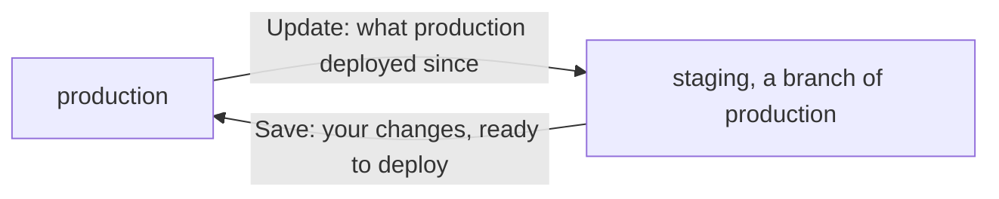

An environment is a full set of your app's services, variables and volumes, running apart
from the others. Every project starts with one, `production`.

To get another, branch one you have. A branch is a copy of another environment, called its
parent, that you can change without touching the parent. When a change works there, you save it
back to the parent.

The steps below make `staging` for a project `my-app` with a `web` service and a `postgres`
database, so staging gets its own copy of both and its own data. Use your own services' names.

## Create staging

1. Click **production** in the top bar, then **New branch of production**. Enter the **Name**
   `staging`.
2. Under **Services**, click **Everything**. `web` and `postgres` show **Separate**, and
   `postgres-data`, the database's volume, shows **New, empty**.
3. Optional: if your app has a command that fills a database with test data, click **Add a
   command** under **Setup command**, enter it, like `pnpm db:seed`, and pick `web` to run it in.
4. Turn on **Keep it after saving**, so staging stays after you save from it. Click **Create and
   deploy**, or **Just create** to deploy it later.

Ployz never copies data, so staging's database starts empty. A setup command runs once, before
`web` first starts, to fill it. To give every new branch of production the same commands, add
them under **Branches of production** in production's **Settings → Environment**.

## Test staging at its own address

Staging's canvas opens as it deploys. Each copy with a generated address gets its own, with
`-staging` added: if production's `web` is at `web.acme-x7q2.ployz.app`, staging's is at
`web-staging.acme-x7q2.ployz.app`. Open it to try your app against staging's own data.

To move between staging and production, click the environment's name in the top bar. Each branch
sits under its parent.

Staging's `web` follows the same Git branch as production's. To test other code there, pick
another, like `develop`, in its [Source settings](../deploy/github.md#choose-the-git-branch).

## Change a setting in staging

Try a change in staging first, like a new variable that turns on a feature:

1. On staging's canvas, open `web` and go to **Variables**.
2. Click **New Variable**. Enter the **Key** `NEW_CHECKOUT` and the **Value** `true`, untick
   **Sealed** (it isn't a secret), and click **Add**.
3. Click **Deploy**.

Production doesn't change. The branch button at the top right of staging's canvas now reads
**1 to save**.

## Save the change to production

Saving stages staging's changes in production, like a draft. It never deploys them.

1. On staging's canvas, click the branch button, then **Save to production**.
2. Check each change, **Current** against **New**. Click × to leave one out.
3. Click **Save to production**. Production's canvas opens with the change staged.
4. Click **Deploy**.

Save never moves data or deletes anything in production. Replicas, CPU and memory limits, domains
and the Git branch stay as each environment has them. A setting marked **Changed in production
too** replaces production's value when you save it. A secret staging added stays out of
production unless you click its **New** value and enter production's own.

## Other choices

### Share a service or leave it out

Click a service in the **New branch** panel to change what the branch gets:

| Row says | What the branch gets |
| --- | --- |
| **Separate** | Its own copy of the service, with the parent's settings and variables. |
| **New, empty** | Its own volume, with no data. |
| **production's** | No copy: the branch uses production's running service. |
| **Not included** | Nothing. Anything that uses it breaks. |

With **Only what changes**, the default, you click just the services you want to change. Services
they use stay production's: copy only `web`, and staging's `web` uses production's `postgres`.

> [!WARNING]
> A shared service with data, like `postgres`, shows **production's** in amber with a warning
> sign. The branch's code reads and writes production's data there. Click it and choose **Separate postgres** unless
> that's what you want.

To change it after you create the branch, click the shared service on the branch's canvas, then
**Make it separate**, or **Give it a new, empty one** for a database.

### Start with an empty environment

1. Open **Settings → Project**.
2. Under **Environments**, click **New environment**.
3. Enter a **Name** and click **Add environment**.

It starts with no services or variables, so you add them yourself.

### Keep a branch, or let it close

A branch that isn't kept closes after 7 days without a deploy: it comes off your servers, and its
copies and their data are deleted. It can also be deleted once its changes are saved.

- **Keep it:** turn on **Keep it after saving** when you create it. Later, click the branch
  button, then ⋮, and check **Keep this branch**.
- **Close it now:** closing a branch removes it from your servers, like deleting an environment.
  Click the branch button, then ⋮, then **Close staging…**. Ployz lists what
  goes, including changes you haven't saved. Type `my-app/staging` and click **Close branch**.

### Bring in production's changes

When production deploys something new, click staging's branch button. The panel lists what's
new, like **2 updates from production**. Click **Update**, and the changes arrive in staging as
staged changes. If staging changed the same settings, the panel warns you in amber, and Update
replaces staging's values.

### Change the default environment

The default environment is where the project opens, for everyone in your organization. Pick
another under **Default environment** in **Settings → Project**.

### Delete an environment

1. Open the environment's **Settings → Environment**.
2. Click **Delete environment**. Ployz lists what goes, data included.
3. Type `my-app/staging` and click **Delete**.

You can't delete one that still has branches, or the default environment until you make another
one the default.

**Next:** [give every pull request its own copy of your app](preview-environments.md).
