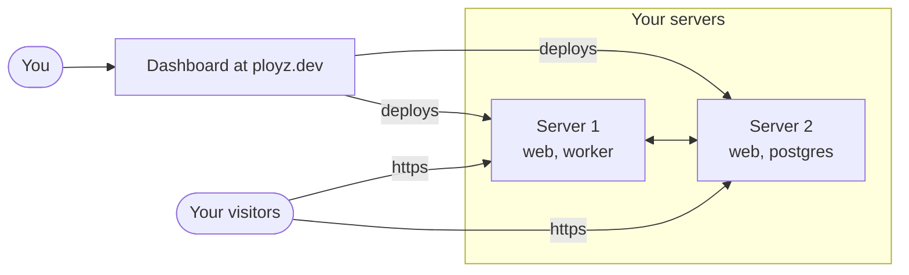

Ployz gives you what Railway or Heroku give you, Git push deploys, preview environments,
databases and https addresses, on Linux servers you own. Think of your servers as your own
small cloud: you tell Ployz what to run from the dashboard, and your servers run it.

## What you get

Pick a GitHub repository and Ployz builds your app, deploys it, and deploys again on every push.
You don't need a Dockerfile: Ployz detects Node, Python, Ruby, PHP, Go, Rust, Java, Elixir and
more, and it builds your Dockerfile if you have one. It also runs any Docker image, and adds
PostgreSQL, MySQL, Redis or MongoDB next to your app in one step.

Every pull request can get its own copy of your app at its own address. Every server serves
https itself, so there's no load balancer to rent, and a service can run as up to 50 replicas
across your servers.

## Who it's for

You have an app and want a platform's push to deploy, previews and dashboard, without paying a
platform for the servers. Or you already run a server by hand and miss having a platform.

Ployz is built for one person today, with no team roles or permissions yet. It doesn't back up
your data yet, and if a server goes down, what ran only there stops until it's back. Read the
[Production checklist](../production-checklist.md) before you move real users.

## What you need

- **A Linux server you can run commands on as root.** Any provider, a VM or bare metal, amd64
  or arm64. Ubuntu LTS, Debian 12–13 or Amazon Linux 2023 is best: there, your volumes get size
  limits. Other Linux distributions with systemd work without them. Ployz installs Docker if the server doesn't have it. See
  [Add a server](../servers/add-a-server.md).
- **A GitHub account.** You sign in with GitHub, and Ployz deploys your GitHub repositories.

## What it costs

Ployz is free on your own servers, with as many servers, projects and custom domains as you
like. Your hosting provider bills you for the servers. See
[Organizations and billing](../account/organizations.md).

## What you own

Your apps and their data live on your servers. Deploys go through ployz.dev, but your apps keep
running if it's down or goes away. Their generated `ployz.app` addresses, and custom domains
that CNAME to them, rely on Ployz's DNS; custom domains with
[A records](../services/domains.md#point-dns-at-your-servers) pointing at your servers don't.

The CLI and the software Ployz installs on your servers are Apache-2.0. The dashboard is
AGPL-3.0, and you can [run it yourself](../self-hosting.md). The code is at
[github.com/getployz/ployz](https://github.com/getployz/ployz).

**Next:** [deploy your first app](quick-start.md).
