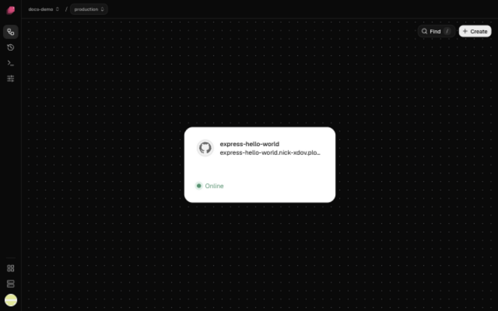

This page puts a small example app,
[render-examples/express-hello-world](https://github.com/render-examples/express-hello-world),
online at an https address on your own server.

You need a GitHub account and a server: Ubuntu LTS, Debian 12–13 or Amazon Linux 2023 with a
public IP address, that you can reach as root over SSH. A small VPS from any provider, like Hetzner or DigitalOcean, is plenty to
start. Builds run on it too, so give it 2 GB of memory or more.

## Sign in

1. Go to [ployz.dev](https://ployz.dev) and click **Deploy**.
2. Click **Continue with GitHub** and approve Ployz on GitHub.

Ployz creates your organization and opens **Add your app**.

## Add the example app

1. Choose **GitHub repository**.
2. Paste `https://github.com/render-examples/express-hello-world` into the search box.
3. Under **Public repository**, click **Deploy render-examples/express-hello-world**.

Ployz creates a project with a name like `gentle-frog`, and the app appears on its canvas as the
service `express-hello-world`. Nothing runs yet: your changes wait in the bottom bar until you
deploy.

**Using your own app?** Click **Connect GitHub** instead and install the Ployz app on your
repository, so every push deploys it; see [Deploy from GitHub](../deploy/github.md). Your app
must listen on the `PORT` variable, or you enter its port in the next step; see
[Choose the port](../services/domains.md#choose-the-port).

## Give it an address

1. Click the `express-hello-world` card, then **Settings**, then **Generate Domain** under
   **Networking**.
2. Leave **Port** blank. The example listens on `PORT`.
3. Click **Generate Domain**.

The address goes live on your first deploy.

## Add a server

While you have no server, the bottom bar shows **Add a server** where **Deploy** would be.

1. Click **Add a server** in the bottom bar.
2. Not on Ubuntu, Debian or Amazon Linux? Click **Start without it** first; see
   [Start without ZFS](../servers/add-a-server.md#start-without-zfs).
3. Click **Copy** next to the command under **Run this as root**. It works for 24 hours.
4. Connect to your server with `ssh root@203.0.113.10` (your server's IP), paste the command and
   press Enter.

The command installs Ployz and adds the server to your organization. If your provider puts a
firewall in front of it, open [these ports](../servers/add-a-server.md#open-the-firewall).

## Deploy

When the server joins, **Deploy** appears in the bottom bar, next to **Apply 2 changes**: the new
service and its address.

1. Click **Deploy**. The deployment page opens.
2. Ployz builds the app, then starts it on your server. Click **Build** or **Deploy** to follow
   the logs.
3. Wait for **Deployed**. The first build takes a minute or two.

Until the first deploy finishes, the service's card can read **Not running** with a warning.
That's expected. If the deployment fails, its page says why; see
[Troubleshooting deployments](../troubleshooting/deployments.md).

## Open your app

The card turns **Online** and shows the address, like
`express-hello-world.acme-x7q2.ployz.app`. Open it from **Settings → Networking**.

If the page doesn't load, see [My app isn't reachable](../troubleshooting/app-not-reachable.md).

**Next:** [deploy your own app from GitHub](../deploy/github.md). Connecting GitHub also turns on
deploy on push, and lets you turn on preview environments.
