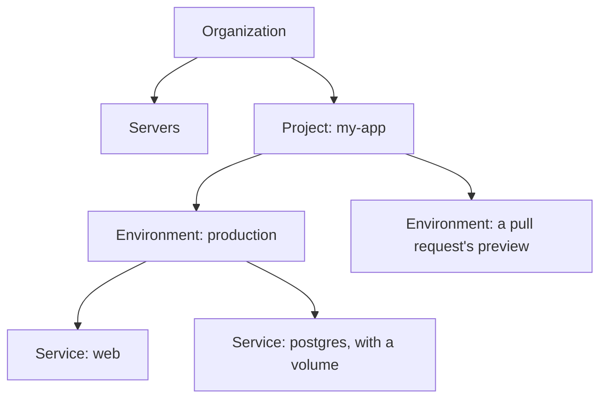

Picture boxes inside boxes: your organization holds your servers and projects, each project has
environments, and each environment runs services on your servers. Everything you change is a
draft until you deploy it.

## How your app is organized

**Organization.** Ployz creates one for you when you first sign in. It holds your servers, your
projects and your billing. See [Organizations and billing](../account/organizations.md).

**Servers.** Linux servers you own or rent, with Ployz on them. Together they're your own small
cloud: they share a private network, and Ployz spreads your services over them. See
[Add a server](../servers/add-a-server.md).

**Project.** One app and everything it needs to run, like a web app, its worker and its
database.

**Environment.** One complete copy of a project, with its own services, variables, volumes and
addresses. Every project starts with `production`. Branch it into `staging` to change things
without touching production, and turn on preview environments to get a copy for every pull
request. See [Environments and branches](../environments/environments.md).

**Service.** One thing that runs: a web app, a worker or a database. It runs your GitHub
repository, which Ployz builds, or a Docker image, as one or more replicas.
[Service settings](../services/settings.md) lists what you can set on one.

**Volume.** A disk attached to one server, where a service keeps files across deploys and
restarts, like a database's data. The service that uses it runs on that server. See
[Volumes](../services/volumes.md).

An environment opens on its canvas. Each service is a card, with its volume underneath.

## How a change ships

Your edits in the dashboard save as you make them and turn pink, like a draft. Your servers keep
running what they ran until you click **Deploy**; then Ployz makes them match. A few settings,
like **Auto-deploy**, say "Takes effect at once" and skip the draft.

The bottom bar collects your staged changes and counts them, like **Apply 1 change**. **Details**
lets you review or discard each one, and **Deploy** ships them all. Each deploy becomes a
deployment, with its own page and logs. See [Deployments](../deploy/deployments.md).

A Git push deploys too: your latest commit with the settings you last deployed. To send staged
changes along with the next push, click **Publish** in **Details**; changes you only staged
stay behind.
