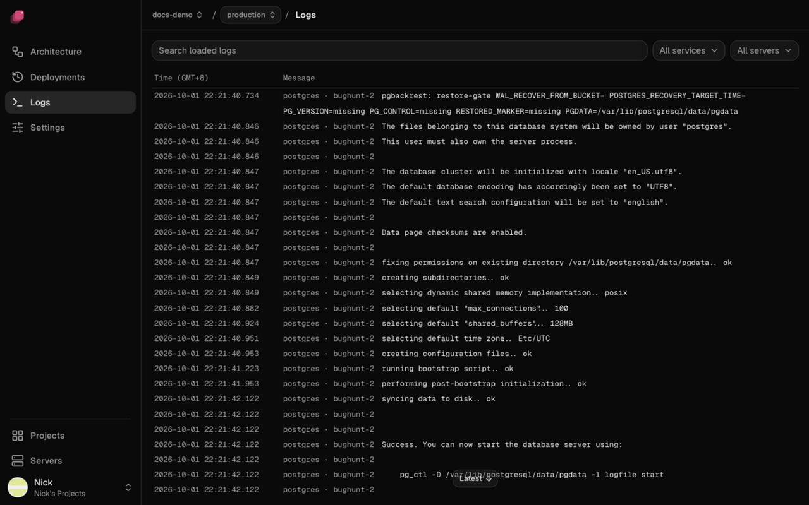

Ployz shows what your services print, live from your servers. Each deployment also keeps its
build output, so you can see why a build failed.

## See your logs

1. Open your environment.
2. Click **Logs** in the sidebar.

Lines from every service arrive as they're written. **All services** and **All servers** narrow
the list, **Search loaded logs** filters it, and **Error**, **Warn**, **Info** and **Debug** show
only lines at the levels you pick. Scroll up for older lines, back to the oldest your servers kept;
the page holds up to 30,000 lines at once.
New lines wait while you're scrolled up; **Latest** brings you back to the end and shows them.

For one service, click it on the canvas and open its **Logs** tab.

## See a deployment's logs

1. Open the deployment from **Deployments** in the sidebar, or from **Logs** in the bottom bar
   while it runs.
2. Click the service's tab.
3. Pick **Build** or **Deploy**.

**Build** shows the build output. A Docker image service has no build. **Deploy** shows what the
new containers printed, including the pre-deploy command, even after a later deploy replaced
them. See [Deployments](../deploy/deployments.md).

## Read retained logs from the CLI

`ployz logs app/api` reads retained logs without asking Docker to list containers.
This also works for a removed service. Every service argument must be qualified
as `namespace/name`, either explicitly or through project or deployment scope.
The command still needs a server observation and access to each selected server's
log store. Servers that do not answer are named, and partial results exit with code 3.

Unqualified names without scope, service IDs, container selectors, commands with
no service arguments, and `--follow` still use live container discovery.

## Good to know

- **Log collection shares a CPU budget with retained-log reads.** By default, Ployz caps its log helper at
  10% of one CPU core. Some historical reads can take several seconds. The main daemon's
  work serving those reads has a separate CPU cost.
- **Logs stay on your servers after a deploy.** Each server keeps what its containers printed,
  so an older deployment's **Deploy** tab still shows its output. Ployz keeps up to 5% of the
  disk for them, between 512 MB and 5 GB, for 30 days, and the oldest go first. It doesn't copy
  them anywhere else. To search or keep logs for longer, send them from your app to a log
  service.
- **A replica that failed keeps its output.** Its exit code appears when the server observed it,
  so you can see why it stopped.
- **Deleting an environment deletes its logs.** A removed service's logs stay until they age out.
- **Containers started before your servers ran this release** keep Docker's old log settings, and
  their logs aren't kept, until their next deploy.
- **Levels come from the line.** A JSON `level`, `lvl` or `severity` field, a logfmt `level=`, or
  a leading `ERROR`, `WARN`, `INFO` or `DEBUG` (or a tag such as `[error]`) sets it. A line
  without one counts as **Info**, stderr included.
- **Detected gaps appear in the log**, saying the lines weren't captured or couldn't be read.
  Missing output can have no gap record, such as when a container ran entirely while log
  collection was down.
- **A server that doesn't answer is named** in a banner above the log, and the other servers'
  lines still show.
- **When your servers are offline**, the page says **Your servers are offline** and keeps the
  last lines they sent.
