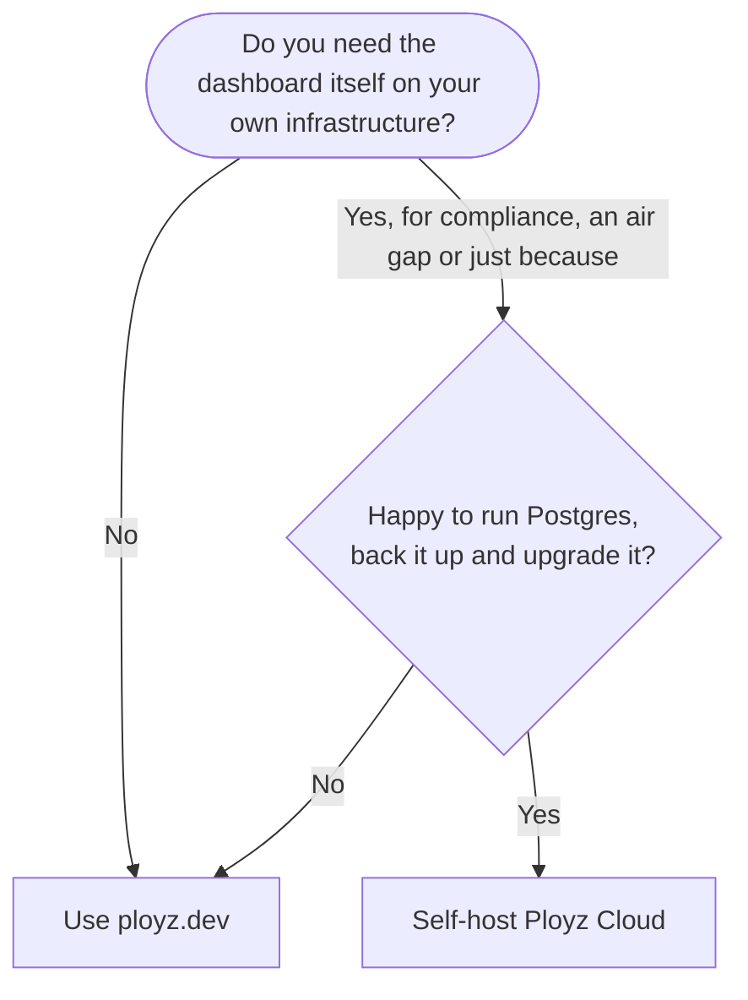

You can run Ployz Cloud, the dashboard at ployz.dev, on your own server instead of using ours.
Your apps still run on your servers either way. Self-hosting moves only the dashboard.

> [!NOTE]
> Eventually Ployz will deploy Ployz Cloud for you, like any other app. That needs templates,
> which deploy several services together in one step, and Ployz doesn't have them yet. Until
> then, run Ployz Cloud with Docker Compose, as this page shows.

## Should you self-host?

Most people should use [ployz.dev](https://ployz.dev). It's free on your own servers, we run and upgrade
it, and your apps, data and secrets stay on your servers anyway.



| | ployz.dev | Self-hosted |
| --- | --- | --- |
| Where your apps run | Your servers | Your servers |
| Who runs the dashboard | Ployz | You: setup, backups, upgrades |
| Price | Free on your own servers | Free, plus your server for the dashboard |
| Setup | Sign in with GitHub | Two GitHub apps, a server, a public https address |
| Still uses Ployz-hosted parts | All of them | The relay, hosted DNS, the installer and release binaries |

A self-hosted Ployz Cloud still reaches your servers through the relay at `relay.ployz.dev`,
gets each organization's generated domain from our hosted DNS, and installs from `ployz.sh`
and GitHub releases.

## Choose where it runs

Run Ployz Cloud on a server that **isn't** one of your Ployz servers. A Ployz server that takes
web traffic needs ports 80 and 443 for your apps, and the TLS proxy in front of Ployz Cloud
wants the same two ports. If both run on one server, the proxy wins: your domains show
**Port 80 is closed on …** and visitors get an SSL handshake error, even though port 80 answers.

| Your setup | What to do |
| --- | --- |
| A separate server for Ployz Cloud | Put Caddy or nginx on it, as in step 3. |
| One server for everything | Skip the proxy. Publish Ployz Cloud with a [Cloudflare Tunnel](https://developers.cloudflare.com/cloudflare-one/networks/connectors/cloudflare-tunnel/) to `http://localhost:3000`, so ports 80 and 443 stay free for your apps. |
| A server where only Ployz Cloud's proxy uses 80 and 443 | Turn off web traffic for that server: `ployz server set <name> --accepts-ingress=false`. Your apps then need another server for their domains. |

You need:

- A Linux server with Docker Compose that can run `linux/amd64` images.
- A public https address for the dashboard, like `https://cloud.example.com`, from your proxy
  or tunnel.

## 1. Create the GitHub apps

Ployz Cloud needs two GitHub apps: an OAuth App for signing in, and a GitHub App for reading
repositories. In both, replace `https://cloud.example.com` with your address.

**OAuth App.** Create it under **Settings → Developer settings → OAuth Apps**:

| Field | Value |
| --- | --- |
| Homepage URL | `https://cloud.example.com` |
| Authorization callback URL | `https://cloud.example.com/api/auth/callback/github` |

Keep its **Client ID** and a new client secret for step 2.

**GitHub App.** Create it under **Settings → Developer settings → GitHub Apps**, on your account
or your GitHub organization:

| Field | Value |
| --- | --- |
| Homepage URL | `https://cloud.example.com` |
| Webhook URL | `https://cloud.example.com/api/github/webhook`, with **Active** checked |
| Webhook secret | The output of `openssl rand -hex 32`. Keep it for step 2. |
| Repository permissions | Contents: Read-only. Checks: Read and write. Metadata: Read-only. Actions: Read and write. Pull requests: Read-only. |
| Subscribe to events | Push, Check suite, Workflow run, Pull request |

Then generate a private key on the app's page, and note its **App ID** and its slug, the name in
its URL `github.com/apps/<slug>`.

## 2. Configure

1. Download the compose file and the example settings from the latest
   [release](https://github.com/getployz/ployz/releases) into a new directory:

   ```sh
   mkdir ployz-cloud && cd ployz-cloud
   curl -fsSLo compose.yml https://github.com/getployz/ployz/releases/latest/download/ployz-cloud-compose.yml
   curl -fsSLo .env https://github.com/getployz/ployz/releases/latest/download/ployz-cloud.env.example
   ```

2. Generate the secrets, one per line:

   ```sh
   for name in POSTGRES_PASSWORD BETTER_AUTH_SECRET APP_ENCRYPTION_SECRET INNGEST_EVENT_KEY INNGEST_SIGNING_KEY; do
     echo "$name=$(openssl rand -hex 32)"
   done
   ```

3. Fill in `.env`:

   | Variable | Value |
   | --- | --- |
   | `APP_URL` | Your public address, like `https://cloud.example.com` |
   | `POSTGRES_PASSWORD`, `BETTER_AUTH_SECRET`, `APP_ENCRYPTION_SECRET`, `INNGEST_EVENT_KEY`, `INNGEST_SIGNING_KEY` | The generated secrets |
   | `GITHUB_CLIENT_ID`, `GITHUB_CLIENT_SECRET` | The OAuth App's client ID and secret |
   | `GITHUB_APP_ID`, `GITHUB_APP_SLUG` | The GitHub App's ID and slug |
   | `GITHUB_APP_WEBHOOK_SECRET` | The GitHub App's webhook secret |
   | `GITHUB_APP_PRIVATE_KEY` | The whole private key PEM, in quotes |

   Leave every `POLAR_*` and `POSTHOG_*` variable unset: that turns off billing and product
   analytics. If a required value is missing, `web` and `worker` stop with a `ConfigError`.

> [!WARNING]
> Keep `APP_ENCRYPTION_SECRET` the same forever, and back it up with the Postgres volume
> `ployz-cloud-self-host_postgres-data`. It encrypts the credentials Ployz Cloud stores, so a new
> value makes them unreadable.

## 3. Start it

1. Create the database tables, then start everything:

   ```sh
   docker compose run --rm web npm run db:migrate
   docker compose up -d
   ```

2. Point your proxy or tunnel at port 3000, or at `WEB_PORT` if you set it. With Caddy on a
   separate server, the whole config is:

   ```
   cloud.example.com {
     reverse_proxy localhost:3000
   }
   ```

3. Run `docker compose ps`. Ployz Cloud is ready when `worker` shows **healthy**.

## 4. Sign in and add a server

1. Open your address and sign in with GitHub.
2. Install the GitHub App as the same GitHub user, from the dashboard or from
   `github.com/apps/<slug>`. Sign in first: Ployz Cloud links an installation only to a GitHub
   account that has already signed in.
3. [Add a server](servers/add-a-server.md). You need one even if it's the server Ployz Cloud
   runs on: Ployz Cloud is only the dashboard, and your apps run on the servers you add. The
   command the dashboard gives you already points at your address.

The CLI signs in to ployz.dev unless you point it at yours:

```sh
ployz login --cloud-url https://cloud.example.com
```

In CI, set `PLOYZ_CLOUD_URL` next to `PLOYZ_TOKEN`; see
[Make an organization token](cli/overview.md#make-an-organization-token).

## Upgrade

Download the new release's compose file over `compose.yml`, then:

```sh
curl -fsSLo compose.yml https://github.com/getployz/ployz/releases/latest/download/ployz-cloud-compose.yml
docker compose pull
docker compose run --rm web npm run db:migrate
docker compose up -d
```

Nothing migrates the database on start, so run the migration on every upgrade.
`docker compose up -d` can take up to 30 minutes: `worker` finishes the work it's running
before it stops.

## Good to know

- **Back up one volume.** Everything Ployz Cloud stores, your organizations, projects and
  settings included, is in `ployz-cloud-self-host_postgres-data`.
- **Adding a GitHub permission later.** Existing installations keep working without it until
  their owner approves the new permissions on GitHub.
- **Behind Cloudflare?** Your apps' domains need **SSL/TLS** set to **Full (strict)**. See
  [My domain is behind Cloudflare](troubleshooting/app-not-reachable.md#my-domain-is-behind-cloudflare).
