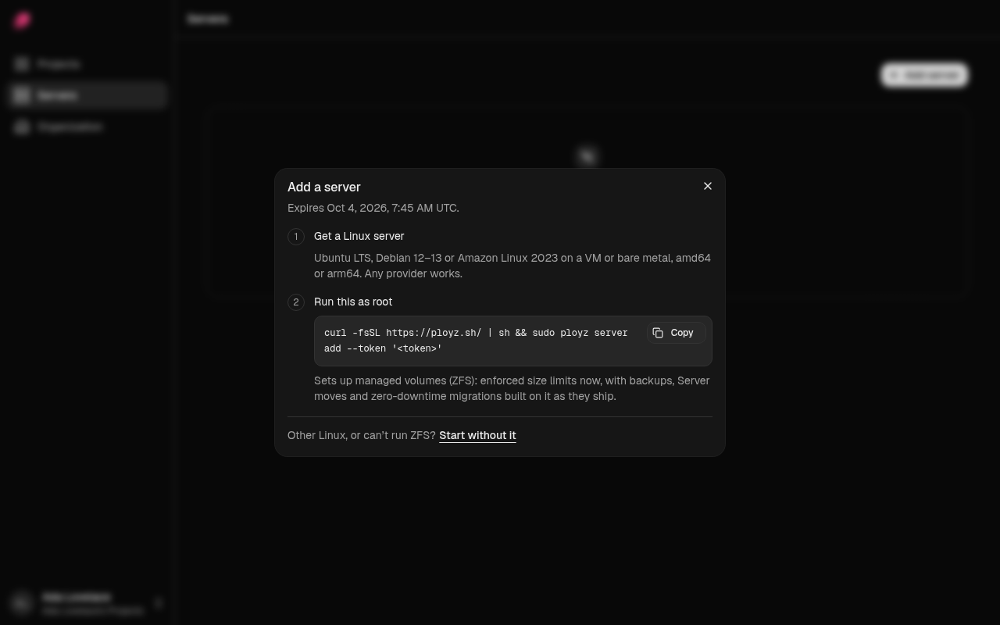

Your apps run on your own servers. To add one, you paste a single command into it, and it joins
your other servers on a private network.

## What you need

- **A Linux server with systemd**, amd64 or arm64, from any provider: a Hetzner Cloud server, a
  DigitalOcean Droplet, a bare-metal box.
- **Ubuntu LTS, Debian 12–13 or Amazon Linux 2023 on a VM or bare metal** for managed volumes.
  Anything else works [without them](#start-without-zfs).
- **A main disk of 30 GB or more.** Ployz keeps a quarter of the disk, at least 10 GB, free for
  the system. On EC2, raise the root volume from its 8 GB default when you launch the instance.
- **Root**, or a user that can run `sudo`.
- **Outbound internet access**, and a **public IP address** on at least one server so visitors
  can reach your apps.

You don't need Docker: Ployz installs it if it's missing.

## Add a server

1. Go to **Servers** and click **Add server**. While you have no server, the bottom bar of your
   environment offers **Add a server** too.
2. Not on Ubuntu, Debian or Amazon Linux, or can't run ZFS? Click **Start without it** in the dialog first; see
   [Start without ZFS](#start-without-zfs).
3. Click **Copy** next to the command under **Run this as root**.
4. Open a shell on the server, as root or as a user with `sudo`, and paste the command. The
   server takes its hostname as its name; to choose another, add `--name web-1` to the end.



The command looks like this:

```sh
curl -fsSL https://ployz.sh/ | sh && sudo ployz server add --token '...'
```

When it finishes, the server shows on the **Servers** page, ready for builds, services and web
traffic. The command works for 24 hours; open the dialog again for a new one. If the server
doesn't show up, see [Troubleshooting servers](../troubleshooting/servers.md).

Add more servers the same way, even at different providers. Nothing moves onto a new server until
you deploy; see [Scaling](../services/scaling.md#add-a-server).

## Start without ZFS

The command sets up managed volumes with ZFS, so every [volume](../services/volumes.md) gets a
storage limit. ZFS needs:

- Ubuntu LTS with its stock kernel, Debian 12 or 13, or Amazon Linux 2023.
- Secure Boot off, on Debian and Amazon Linux.
- A VM or bare metal, not an OpenVZ or unprivileged LXC container.
- Free space on the main disk for your volumes.

On Ubuntu, ZFS comes ready-made. On Debian and Amazon Linux, the server builds it, so the command
takes longer: 15–20 minutes on a 2-vCPU Amazon Linux Server, a few minutes on Debian. The build
tools stay installed, so ZFS can be rebuilt when the kernel updates.

If your server can't run ZFS, click **Start without it** under "Other Linux, or can't run ZFS?"
in the dialog. The command then ends in `--storage none`, and **Use ZFS instead** switches
back.

The server then shows **Docker only**. If none of your servers has managed volumes, every new volume,
a database's included, fails to deploy until you open it and tick **Use a plain Docker volume
(not recommended)** under **Advanced**; see
[When your servers show Docker only](../services/volumes.md#when-your-servers-show-docker-only).

## Open the firewall

Ployz opens the ports it needs on the server itself. If your provider runs a firewall in front of
it, like a Hetzner Cloud Firewall, a DigitalOcean Cloud Firewall or an AWS security group, allow
these there:

| Port | From | Needed for |
| --- | --- | --- |
| TCP 80, TCP and UDP 443 | Anywhere | Your apps over https, and their certificates, on servers that take web traffic |
| UDP 51820 | Your other servers | Services on different servers reaching each other |

## Good to know

- **Operating system updates stay with you.** Ployz doesn't install them.
- **Already running Docker?** Ployz keeps it and its settings, if it's Docker 29.2 or newer
  with buildx 0.18 or newer and the containerd image store turned on. Otherwise setup stops
  before changing anything; see
  [The install stops while checking Docker](../troubleshooting/servers.md#the-install-stops-while-checking-docker).
  Docker's default never rotates container logs, so they can fill the disk; see
  [The server's disk is filling up](../troubleshooting/servers.md#the-servers-disk-is-filling-up).
- **Ployz Cloud learns a little about the server**, so we can see which setups work and which
  fail; see [What Ployz Cloud records about your servers](#what-ployz-cloud-records-about-your-servers).

## What Ployz Cloud records about your servers

When `ployz server add` finishes or fails, it sends Ployz Cloud one short report about the
server:

- The provider and instance type, read from the server's hardware info, such as Amazon EC2 `t3.small`.
- The operating system and its version, the kernel, the CPU architecture, and the kind of
  virtualization, if any.
- The number of CPUs, the memory and the size of the main disk.
- Whether you chose ZFS, the Ployz version, and whether this server started your cluster.
- How long each setup step took.
- If setup failed, the step that failed and the error you saw.

It never sends the server's hostname or name, its IP addresses, labels, tokens or secrets. A
self-hosted Ployz Cloud keeps the report to itself.

To send nothing, set `DO_NOT_TRACK=1` when you run the command:

```sh
curl -fsSL https://ployz.sh/ | sh && sudo DO_NOT_TRACK=1 ployz server add --token '...'
```

Next: [manage your servers](manage-servers.md).
