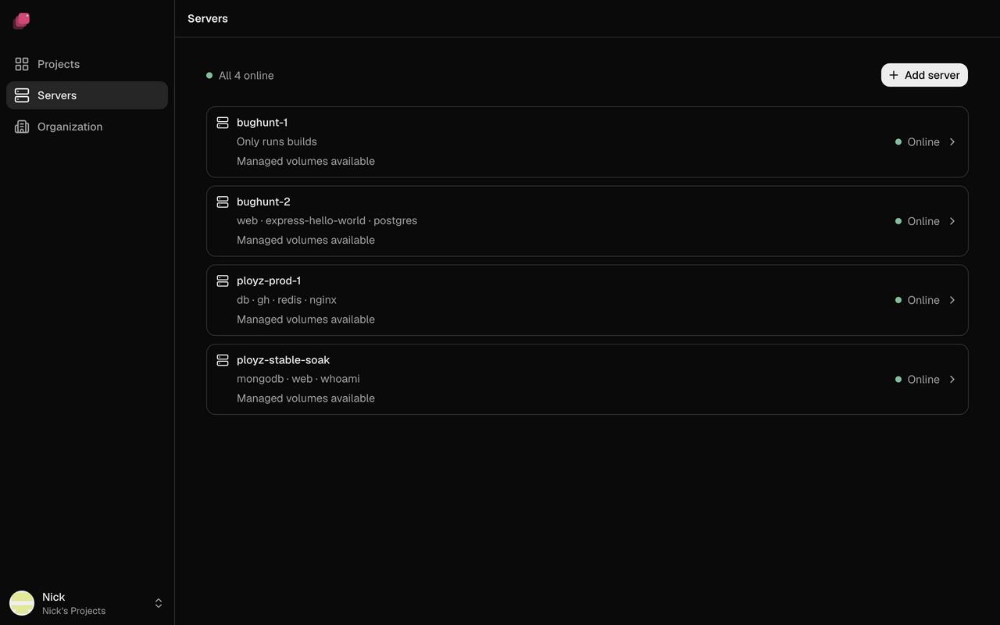
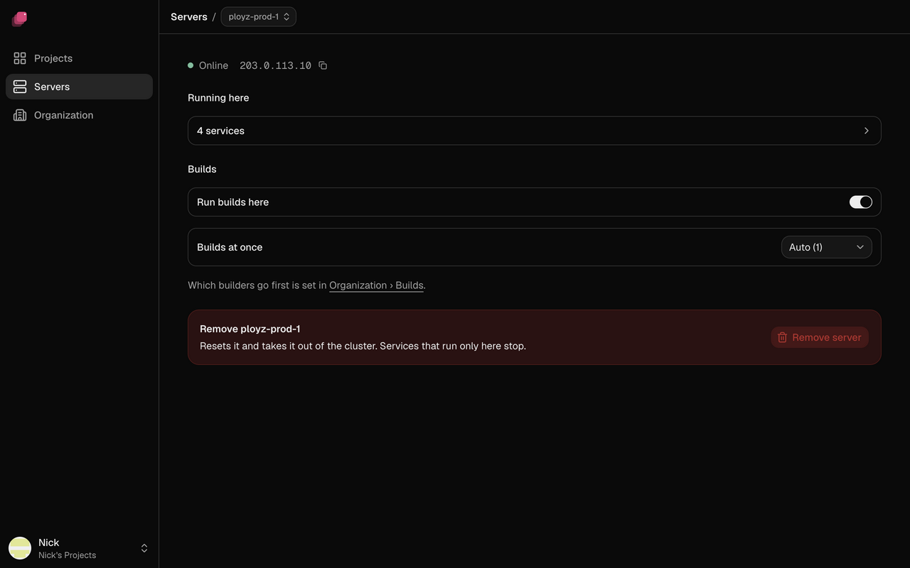

The **Servers** page lists every server in your organization. Open one to see what runs on it,
turn builds on or off, or remove it.

## Check your servers

Each row shows a server's name, the services on it, what it can store, and its status. Above the
list, a summary reads **All 3 online**, or puts problems first, like **1 offline · 2 online**.



| Status | What it means |
| --- | --- |
| **Online** | The server is up and in touch with your other servers. |
| **Building** | Online, and running builds right now. |
| **Offline** | Your other servers can't reach it. See [A server shows Offline](../troubleshooting/servers.md#a-server-shows-offline). |
| **Unknown** | Ployz can't tell whether it's up. Check it as you would an offline one. |

**Managed volumes available** means the server can hold [managed volumes](../services/volumes.md).
**Docker only** means it was added with **Start without it** and holds plain Docker volumes only.

If the page shows **Can't reach your servers right now**, see
[Troubleshooting servers](../troubleshooting/servers.md#cant-reach-your-servers-right-now).

## See what runs on a server

Click a server. Its page shows its status and public IP address, then:

- **Running here**: click it to list the server's services. While the server is offline, each one
  says whether it's **Still on** another server or **Down**.
- **Builds**: **Run builds here** and **Builds at once**. See
  [Where builds run](../builds/where-builds-run.md#build-on-your-servers).



An entry marked **Not in any Project** is left over from a deleted project or environment.
**Remove** deletes its containers and its volumes, data included, from every server.

## Change what a server does

Every server runs builds, runs services and takes web traffic. To turn one off, see
[Give servers different jobs](../services/scaling.md#give-servers-different-jobs): services move
off on your next deploy. Web traffic is the exception: the server stops taking traffic at once,
and your generated addresses stop pointing at it within the hour.

## Upgrade Ployz on a server

Servers don't upgrade themselves, and the dashboard can't upgrade them yet. This is CLI-only for
now:

```sh
# stable, beta, or an exact version like 0.2.0, on web-1 then web-2
ployz server upgrade stable web-1 web-2
```

Your apps keep running. Ployz stops at the first server that fails.

## Remove a server

> [!WARNING]
> Volumes stay on the removed server's disk, but your services lose them. Copy off any data you
> need first.

1. Open the server and click **Remove server**.
2. Ployz lists the volumes on the server. Type the server's name and click **Remove**.

<!-- screenshot: the Remove web-2? dialog listing one volume, with the name typed -->

Services that ran only on that server stop. Your next deploy replaces its replicas on your other
servers, except for services whose volume was on it (see
[When a server goes down](../services/scaling.md#when-a-server-goes-down)). Removing your last
server stops everything; your projects and settings stay, and the bottom bar shows **Add a server**
until you [add one](add-a-server.md).

If the server is unreachable, remove it without resetting it. This is CLI-only for now:

```sh
ployz server rm web-2 --no-reset --confirm web-2
```

Ployz stays installed on a removed server, so you can add it again later. To remove Ployz itself,
run `sudo ployz-uninstall` on the server after you remove it. Docker, your images and your volume
data stay on the disk.

## Forget servers you deleted

If you deleted all your servers at your provider, forget them:

1. Go to **Organization** and, under **Danger**, click **Forget Servers**. When the **Servers**
   page can't reach your servers, **Forget them and start over.** opens the same dialog.
2. Ployz lists the servers and their volumes. Type your organization's slug and click **Forget
   Servers**.

Ployz refuses while any server answers. Your projects, settings and deployment history stay, but
volume data on the forgotten servers can't be recovered. When you add a server again, Ployz deploys
your environments to it.
