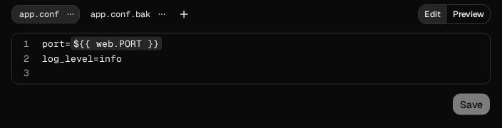
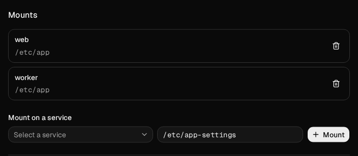
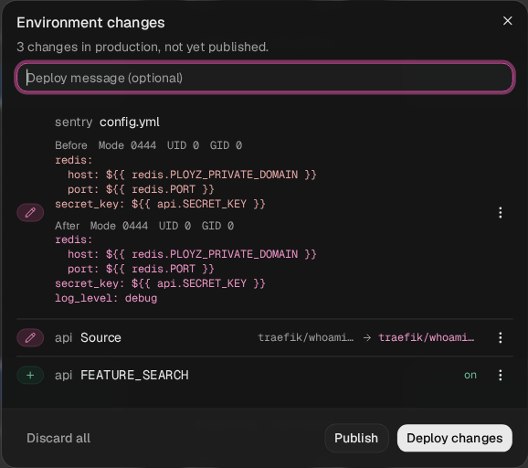

A config is a folder of text files that Ployz mounts read-only into your services. Use one for
an app's settings, a web server's configuration, or a startup script, without rebuilding its image.
Several services can share the same config.

## Create a config

1. Open your environment and choose **Create** → **Config**.
2. Enter a **Name**, such as `app-settings`, and click **Create config**.
3. In **Files**, click **Add file**, enter a **File name**, such as `app.conf`, and click **Add**.
4. Write the file's text and click **Save**.



**Save** stages your file changes. Your running services keep their current files until you deploy.
**Save** writes every edited file together. Each file's options menu shows its size and permissions;
each file holds up to 256 KB. Unsaved edits stay visible if a save fails.

File names can include folders, such as `conf.d/site.conf`, with up to four path segments.
Use relative paths without `..`.

## Mount it into a service

1. In the config's **Mounts**, click **Mount on a service**, then choose a **Service**.
2. Enter an absolute **Directory**, such as `/etc/app`, and click **Mount**.
3. Repeat for another service that needs the same files.
4. Click **Deploy** in the bottom bar.



The service reads `app.conf` at `/etc/app/app.conf`. Each directory holds one config or volume,
so choose another directory if one is already mounted there.

The config's panel shows each mount's actual directory. Open the menu at the end of its row and choose
**Edit directory** to move it, or **Unmount** to detach it on the next deploy.
Unmounting keeps the config and its files.
A refused mount keeps your entered directory so you can correct it and retry.

## Reference a service's variable

In a file, write `${{ web.PORT }}` to use `web`'s `PORT`, or `${{ postgres.DATABASE_URL }}`
for its database address. Type `${{` for suggestions. Include the service name, even when only
one service mounts the config.

Click **Preview** to check the text with its references filled in. Secret values stay masked.
The file your service receives contains the resolved values, so grant the app access only to
secrets it needs. **Details** shows your authored references, including `${{ web.PORT }}`,
without revealing the secret they reference.

## Review or discard file changes

1. Click **Save** after editing a file, then open **Details** in the bottom bar.
2. Review the full **Before** and **After** text, with each file's mode, user ID, and group ID.
3. To undo one file, open its actions menu and choose **Discard**. Choose
   **Discard all of app-settings** to undo the whole config.
4. Click **Deploy changes** to apply the files, or **Publish** to save the staged configuration
   without changing running services.



When a deployed config changes, **Details** names the services that restart on the next deploy.
Services that do not mount it keep running. An unchanged redeploy keeps the existing replicas.
A file is one change, so discarding it restores both its text and permissions.

## Set file permissions

New files use mode `0444` and user and group ID `0`. In a file's options menu, turn on
**Executable** to use `0555`, then click **Save**. The mount stays read-only.

Custom modes and user and group IDs are CLI-only for now. For an app that reads files as user
`1000`, set the owner and permissions together:

```sh
ployz config put app-settings app.conf --from ./app.conf --mode 0440 --uid 1000 --gid 1000
```

The dashboard shows custom permissions and preserves them when you edit the text.

## Good to know

- **Small text files.** Each file holds up to 256 KB of UTF-8 text. Keep larger files in your
  image or a [volume](volumes.md).
- **Shared changes.** Editing one config affects every service that mounts it. Create another
  config when a service needs different files.
- **Remove or unmount.** **Remove file** removes a file after deployment. **Unmount**
  keeps the config and its files. **Delete config** removes its mounts everywhere on the next
  deploy, and you can discard the change before deploying.

When you delete a config and create another with the same name before deploying, they remain
separate configs. To keep the deleted config, first rename or discard its replacement; keeping
both under one name would conflict. CLI discard accepts `configs.@UUID` to select one exact
config; a shared name is refused when it could select either config. A service mount can
likewise be selected with `web.configs.@UUID`; discarding it preserves another config's mounts,
even when the configs share a name.

Next, [review your deployments](../deploy/deployments.md).
