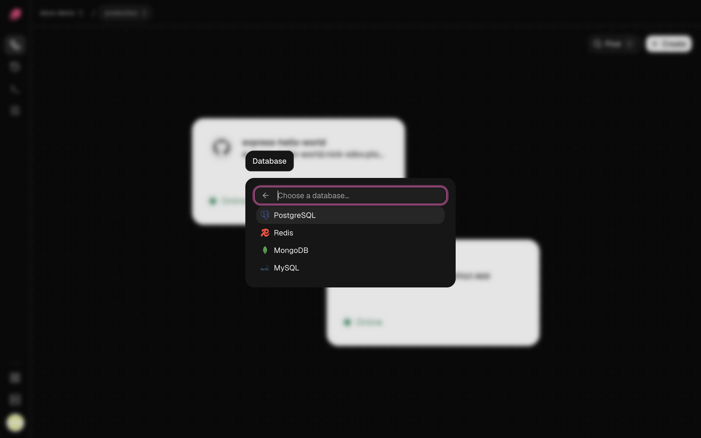

Ployz adds PostgreSQL, MySQL, Redis or MongoDB to your environment in one step, with a volume
for its data, a generated password and the variables your app needs to connect. After that,
it's an ordinary service you can change like any other.

> [!WARNING]
> Ployz doesn't back up databases yet. If the server that holds a database is lost, so is its
> data. Take your own dumps and keep them off your servers: see
> [Back up a database](#back-up-a-database).

## Add a database

1. On your project's canvas, click **Create**.
2. Choose **Database**, then **PostgreSQL**, **MySQL**, **Redis** or **MongoDB**.
3. Its data goes on a 5 GB [volume](volumes.md). For more room, click the volume, change
   **Storage limit (GB)** and click **Save storage** now: you can't after you deploy it.
4. Click **Deploy**.



You get a service named after the database. Its connection variables are exported for your
other services to reference, and its password is sealed. They use Railway's names, like
`PGHOST` and `PGPASSWORD`, so an app moving from Railway can keep reading them.

| | Version | Service | URL variable | Port | User |
| --- | --- | --- | --- | --- | --- |
| PostgreSQL | 18 | `postgres` | `DATABASE_URL` | 5432 | `postgres` |
| MySQL | 9.4 | `mysql` | `MYSQL_URL` | 3306 | `root` |
| Redis | 8.2 | `redis` | `REDIS_URL` | 6379 | `default` |
| MongoDB | 8.0 | `mongodb` | `MONGO_URL` | 27017 | `mongo` |

PostgreSQL and MySQL start with a database named `ployz`.

## Connect your app

1. Open your app's service, go to **Variables** and click **New Variable**.
2. Enter `DATABASE_URL` as the **Key**, and untick **Sealed**: a sealed value can't hold a
   reference. The password inside stays hidden anyway.
3. Enter `${{ postgres.DATABASE_URL }}` as the **Value** and click **Add**.
4. Click **Deploy**.


The URL points at the database's [private address](private-networking.md), like
`postgres.internal`, so the connection stays on your servers' private network. Ployz starts
the database before your app on every deploy. See [Variables](variables.md) for more on
references.

## Connect from your laptop

Databases have no public address. To reach one from your computer, forward a port to it. This
is CLI-only for now ([install the CLI](../cli/overview.md) first):

```sh
# Forward 127.0.0.1:5432 to the database, until you press Ctrl-C
ployz service port-forward postgres 5432:5432

# In another terminal: read the sealed password, then connect
ployz exec postgres -- printenv POSTGRES_PASSWORD
psql -h 127.0.0.1 -U postgres ployz
```

If 5432 is taken on your laptop, pick another local port, like `15432:5432`.

## Back up a database

Dump each database on a schedule, from a computer you trust or a CI job, and store the dumps
away from your servers, such as in object storage. A dump kept on the same server is lost with
it. Dumps are CLI-only for now. Keep `-T`: it sends the dump to the file unchanged.

```sh
# PostgreSQL
ployz exec -T postgres -- pg_dump --format=custom > postgres.dump

# MySQL
ployz exec -T mysql -- sh -c 'mysqldump -u root -p"$MYSQL_ROOT_PASSWORD" --single-transaction "$MYSQL_DATABASE"' > mysql.sql

# Redis
ployz exec -T redis -- sh -c 'redis-cli -a "$REDIS_PASSWORD" --no-auth-warning --rdb -' > redis.rdb

# MongoDB
ployz exec -T mongodb -- sh -c 'mongodump --archive -u "$MONGO_INITDB_ROOT_USERNAME" -p "$MONGO_INITDB_ROOT_PASSWORD" --authenticationDatabase admin' > mongo.archive
```

Restore a PostgreSQL dump the same way, and try it before you need it:

```sh
ployz exec -T postgres -- pg_restore --clean --if-exists -d ployz < postgres.dump
```

## Use a managed database instead

To keep your database at a provider such as Amazon RDS, Neon or PlanetScale, skip the preset.
Add the provider's connection URL to your app as a sealed variable named `DATABASE_URL`, then
click **Deploy**. If the provider only accepts known IP addresses, allow your servers' public
IPs.

## Good to know

- **The password is set once.** PostgreSQL, MySQL and MongoDB read their password only when
  they first set up their volume. If you change the password variable later, change it in the
  database too, or your app can't connect. Redis reads `REDIS_PASSWORD` each time it starts.
- **Redis can lose its last minute of writes** if it crashes.
- **Deleting a database deletes its data.** Deleting its service in the dashboard also deletes
  its volume, unless another service mounts it. The deploy asks you to confirm first.

Next: [test changes in a preview environment](../environments/preview-environments.md).
