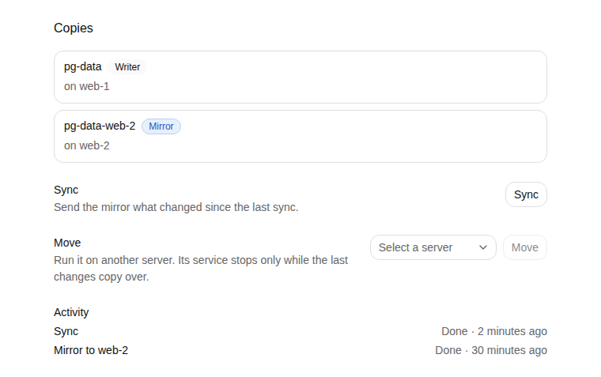

A volume lives on one server. With Ployz Cloud you can keep a read-only copy of it on a second
server, called a mirror, and move the volume and the service that mounts it to another server.
Without Cloud, volumes stay on the server that has them.

## In Ployz Cloud

Open a managed volume after its first deploy. **Copies** shows where it is: the volume on the
server that writes it, and its mirror as `data-web-2`. Mirror, Sync, Move, Release and Restore
appear when they can run, and **Activity** lists the last runs and how they ended. The volume's
tray on the canvas shows its mirror too, and "Moving to web-2" during a move.



The commands below do the same from the CLI. Deleting a mirror is CLI-only.

## Mirror a volume

A mirror holds the volume's data as of its last sync. It refreshes only when you sync it, and a
volume has at most one.

```
ployz volume mirror data --to web-2     # copy data to web-2; it shows as data-web-2
ployz volume sync data                   # send what changed since the last sync
ployz volume mirror rm data-web-2        # delete the mirror
ployz volume runs data                   # what ran on this volume, and how it ended
```

Each command starts a run in Ployz Cloud and prints its id. Add `--wait` to wait for it to
finish. One run at a time per volume: a second one is refused and names the run in progress.

## Move a volume to another server

```
ployz volume move data --to web-2
```

Your service keeps running while Ployz copies the volume and its image to `web-2`.
Then Ployz stops the service, sends what changed during the copy, and starts the service on
`web-2` with the same volume. Your service is down only for that last step. A service that
takes a while to stop or start doesn't fail the move: Ployz waits for Docker, up to ten minutes
for each stop or start.

The old server keeps a read-only copy, shown as `data-web-1`. Moving back sends only what
changed since. If the volume already has a mirror on `web-2`, the move starts from it. From the
moment the service stops until the move ends, deploys of it are refused.

## When a move stops

A move can stop if a server or Ployz Cloud goes away during it. `ployz volume runs data` shows
why. What happens next depends on how far it got.

- **Before the handover**, Ployz starts your service again on the old server, with all its
  data. The run fails and names what went wrong. Run the move again when you're ready.
- **After the handover**, the volume belongs to the new server, and your service stays down
  until the move finishes there. The run says so: `volume move data --to web-2 again continues
  from there`. Run that line; it picks up where the move stopped.

If the move stopped and nothing started your service again, release the volume:

```
ployz volume release data
```

Release starts the service again on the old server. It's refused once the volume has been
handed over, and names the move to run instead.

After the handover, finishing the move still needs the old server to answer. If the old server
dies, your service stays down until it comes back or you restore the volume.

## Restore a volume

When the server that wrote a volume is gone, make a copy on another server the writer:

```
ployz volume restore data --from web-2
```

Restore needs `web-2` to hold the only copy of the volume. If other servers hold copies, it is
refused and names them; remove them with `ployz volume mirror rm` first. A mirror holds the data as of
its last sync, so restoring one loses the writes after it, and the run says when that was:
`data restored on web-2 from <time>; writes after that time are lost`. Restore doesn't start your service.
Deploy it next.

If you removed the old server with `--no-reset`, Restore waits until 11 minutes after the removal
before it acts. See [Remove a server](../servers/manage-servers.md#remove-a-server).

## Good to know

- **A server must answer for its volume to move.** If the volume's server is down, neither a
  move nor a release can run, and the run says which server did not answer. See
  [When its server goes down](volumes.md#when-its-server-goes-down).
- **A mirror is not a backup.** It holds the data as of its last sync, on one of your servers.
  Keep your own copies off your servers; see [Back up a database](databases.md#back-up-a-database).
- **A mirror that fell behind for good** is refused with `data-web-2 diverged`. Run
  `ployz volume sync data --full` to copy everything again.
- **Deleting a volume deletes its mirror.** So does deleting its environment. A mirror that is
  the volume's only copy left is removed only with `--confirm data`, because its data goes with
  it.
