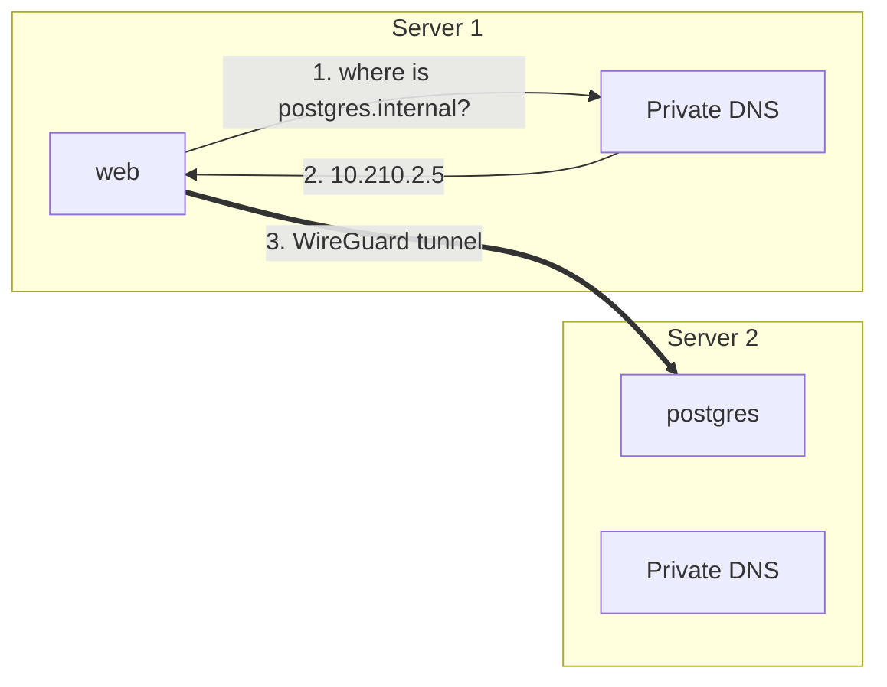
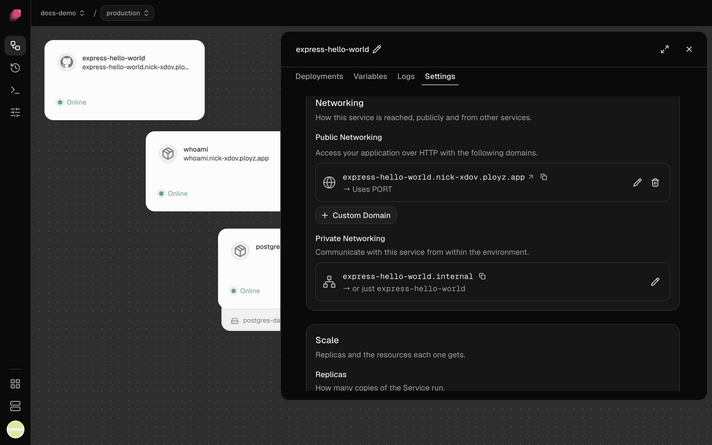

Services in the same environment reach each other at `NAME.internal`, on any port, over a
private network that spans all your servers. Nothing is reachable from the internet unless you
give it a [domain](domains.md).

## How it works

Your organization's servers are joined into one private network, like a small cloud of your
own. Every pair of servers is linked by an encrypted WireGuard tunnel, over their private LAN
when they share one and over the internet when they don't. Every container gets a private
address on that network.



When `web` connects to `postgres.internal`, a DNS server on web's own server answers with the
private addresses of postgres's healthy replicas, wherever they run. The connection then goes
straight to postgres, through the tunnel if it's on another server. With several replicas, each
answer lists them in a different order, so connections spread across them.

Every server keeps its own copy of where each service runs and answers from it. Private
traffic never passes through Ployz Cloud, so your services keep reaching each other while Ployz
Cloud is down, and the rest keep working when one server goes offline.

## Connect to another service

Reference the other service's address in a variable. Every service has a
`PLOYZ_PRIVATE_DOMAIN` variable that holds its `NAME.internal` address, and a `PORT`:

```sh
DATABASE_URL=${{ postgres.DATABASE_URL }}
WEB_URL=http://${{ web.PLOYZ_PRIVATE_DOMAIN }}:${{ web.PORT }}
```

A reference tells Ployz the two services are linked: `worker` starts after `web` on every
deploy, and a [branch](../environments/environments.md) that uses its parent's `web` still
reaches it. A typed `web.internal` reaches the same place, but Ployz can't see the link. The
databases Ployz creates connect this way. See [Variables](variables.md).

- Use `http://`, not `https://`. Traffic between your servers is already encrypted.
- Any port works. You don't declare ports for private traffic.
- `localhost` is the service's own container, never another service.

A service's private name is in its **Settings → Networking**, under **Private Networking**,
with a copy button, for trying it from a shell. If a connection fails, see
[One service can't reach another](../troubleshooting/app-not-reachable.md#one-service-cant-reach-another).



## Change a service's private name

The private name starts as the service's name, and renaming the service keeps it.

1. In **Settings → Networking**, under **Private Networking**, click the pencil.
2. Enter the new name in **Edit private endpoint**. Leave it blank to go back to the service's
   name.
3. Click **Deploy**.

References follow the new name. Services that typed the old one stop reaching it, so update
them in the same deploy.

## Connect from your laptop

Domains carry http and https only, so to reach a service like a database from your own
computer, forward a port with the CLI, as in
[Connect from your laptop](databases.md#connect-from-your-laptop). The [CLI](../cli/overview.md)
page shows how to point it at your project and environment.

## Good to know

- **Names stay inside one environment.** In staging, `postgres.internal` is staging's
  `postgres`.
- **A name finds only healthy replicas.** While no replica of a service is healthy, its name
  doesn't resolve. Check that service's **Logs**.
- **Names are scoped to an environment; addresses aren't.** Projects and environments on
  your servers share one private network. A container that knows another environment's
  private address can connect to it, so give databases a password (the ones Ployz creates
  have one). Run anything that must be walled off in its own organization, on its own servers.
- **Servers must reach each other on UDP port 51820.** Without it, services on different
  servers can't reach each other.
