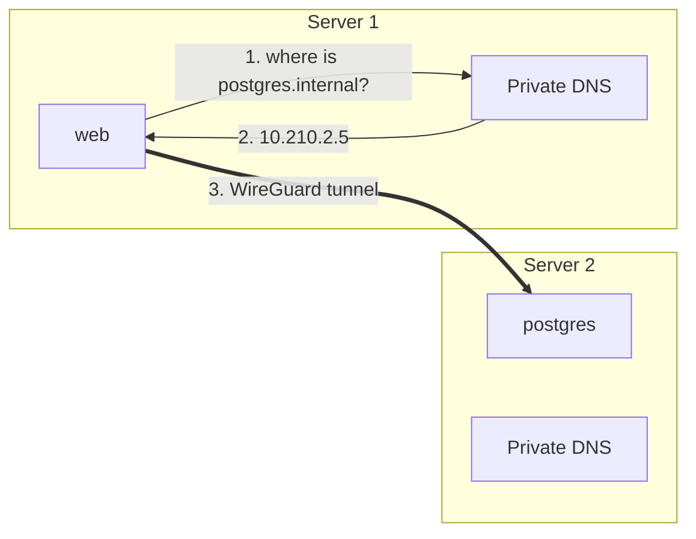
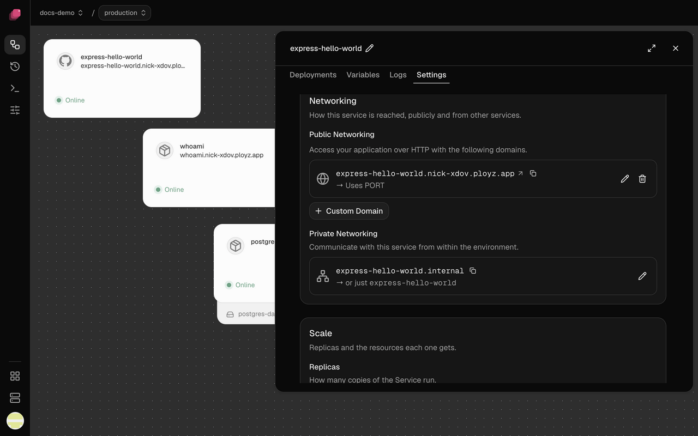

Services in the same environment reach each other at `NAME.internal`, on any port, over a
private network that spans all your servers. Nothing is reachable from the internet unless you
give it a [domain](domains.md).

## How it works

Your organization's servers are joined into one private network, like a small cloud of your
own. Every pair of servers is linked by an encrypted WireGuard tunnel, over their private LAN
when they share one and over the internet when they don't. Every container gets a private
address on that network.

On a server with IPv6, the server's web server also gets a private IPv6 address, so IPv6 visitors
to your domains reach your app with their own address in `X-Forwarded-For`. Your services get one
too, so they can reach the internet over IPv6. Your app doesn't need to listen on IPv6 for this.

A service that publishes a port on the server is the exception. It stays IPv4-only, so the port
reaches an app that listens only on IPv4. The port still answers IPv6 visitors, but your app sees
them as the server's private gateway, such as `10.210.0.1`, and the service can't reach IPv6
addresses.

A service that was running before the server's upgrade to 0.3.6 gets its IPv6 address the next
time Ployz replaces its container, such as at a deploy that changes its image or a variable. The
upgrade itself restarts nothing.


```mermaid
flowchart LR
  subgraph s1["Server 1"]
    web["web"]
    dns1["Private DNS"]
  end
  subgraph s2["Server 2"]
    postgres["postgres"]
    dns2["Private DNS"]
  end
  web -- "1. where is postgres.internal?" --> dns1
  dns1 -- "2. 10.210.2.5" --> web
  web == "3. WireGuard tunnel" ==> postgres
```

When `web` connects to `postgres.internal`, a DNS server on web's own server answers with the
private addresses of postgres's ready replicas, wherever they run. The connection then goes
straight to postgres, through the tunnel if it's on another server. With several replicas, each
answer lists them in a different order, so connections spread across them.

Every server keeps its own copy of where each service runs and answers from it. Private
traffic never passes through Ployz Cloud, so your services keep reaching each other while Ployz
Cloud is down, and the rest keep working when one server goes offline.

Private DNS keeps answering while Ployz restarts or upgrades on a server, and while the server
can't reach the others. It answers from the last copy it loaded. After a reboot it starts
answering once the server has loaded where your services run.

Two cases still interrupt it briefly. The first upgrade from 0.2.3 or earlier pauses private DNS
and the server's place in the cluster on each server, while they move out of Ployz into
their own processes. When an upgrade replaces private DNS itself, lookups over UDP
carry on, but a connection a service holds open to it over TCP can close, and the service has to
reconnect.

The private network also stays connected while Ployz stops, restarts or upgrades on a server.
Your running services keep reaching services on the other servers. The first upgrade to 0.3.1
is the exception. Ployz fixes each container's private address, and on a server with IPv6 it also
adds IPv6 to the container network, so containers drop off the network for up to about two
seconds. They keep running and keep their addresses, but connections open to them at that moment
can close.

A container keeps its private address when Docker or the server restarts, so traffic for one
service never reaches another that came back at its address. A new container takes an address
no other container has used recently. This holds for the IPv4 address that `NAME.internal`
answers with. A container's IPv6 address can change when Docker or the server restarts, so don't
connect to one by it.

## Connect to another service

Reference the other service's address in a variable. Every service has a
`PLOYZ_PRIVATE_DOMAIN` variable that holds its `NAME.internal` address, and a `PORT`:

```sh
DATABASE_URL=${{ postgres.DATABASE_URL }}
WEB_URL=http://${{ web.PLOYZ_PRIVATE_DOMAIN }}:${{ web.PORT }}
```

A reference tells Ployz the two services are linked: `worker` starts after `web` on every
deploy, and a [branch](../environments/environments.md) that uses its parent's `web` still
reaches it. A typed `web.internal` reaches the same place, but Ployz can't see the link. The
databases Ployz creates connect this way. See [Variables](variables.md).

- Use `http://`, not `https://`. Traffic between your servers is already encrypted.
- Any port works. You don't declare ports for private traffic.
- `localhost` is the service's own container, never another service.

A service's private name is in its **Settings → Networking**, in the **Private address** row.
If a connection fails, see
[One service can't reach another](../troubleshooting/app-not-reachable.md#one-service-cant-reach-another).



## Change a service's private name

The private name starts as the service's name, and renaming the service keeps it.

1. In **Settings → Networking**, type the new name in **Private address** and press Enter. Clear
   it to go back to the service's name.
2. Click **Deploy**.

References follow the new name. Services that typed the old one stop reaching it, so update
them in the same deploy.

## Connect from your laptop

Domains carry http and https only, so to reach a service like a database from your own
computer, forward a port with the CLI, as in
[Connect from your laptop](databases.md#connect-from-your-laptop). The [CLI](../cli/overview.md)
page shows how to point it at your project and environment.

## Good to know

- **Names stay inside one environment.** In staging, `postgres.internal` is staging's
  `postgres`.
- **A name finds only ready replicas.** A replica is ready once it runs, or once it passes its
  [healthcheck](settings.md#healthcheck) if it has one. One that passed stays even if its check
  fails later, and its service card shows an amber **⚠**. While no replica is ready, the name
  doesn't resolve. Check that service's **Logs**.
- **Names are scoped to an environment; addresses aren't.** Projects and environments on
  your servers share one private network. A container that knows another environment's
  private address can connect to it, so give databases a password (the ones Ployz creates
  have one). Run anything that must be walled off in its own organization, on its own servers.
- **Servers must reach each other on UDP port 51820.** Without it, services on different
  servers can't reach each other.
