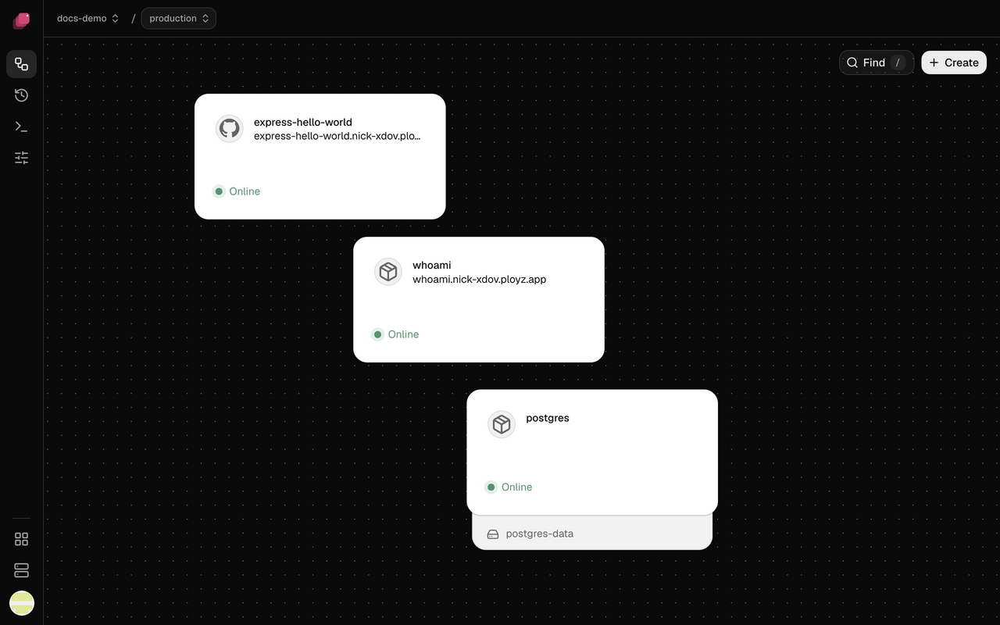
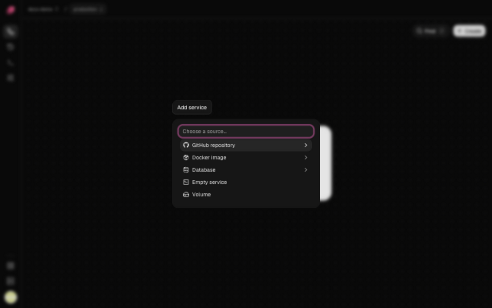

A service is one part of your app, like a web server, a worker or a database. Each card on your
environment's canvas is a service, and Ployz runs it as one or more replicas on your servers.



## Add a service

1. Open your environment and click **Create** at the top right of the canvas.
2. Choose what the service runs, then pick the repository, image or database.
3. Click **Deploy** in the bottom bar.



| Choose | For | More |
| --- | --- | --- |
| **GitHub repository** | Your code, which Ployz builds and deploys on each push | [Deploy from GitHub](../deploy/github.md) |
| **Docker image** | An image your CI builds, or off-the-shelf software | [Deploy a Docker image](../deploy/docker-image.md) |
| **Database** | PostgreSQL, MySQL, Redis or MongoDB, with a volume for its data | [Databases](databases.md) |
| **Empty service** | A service you give a source later | [Add a source](settings.md#add-a-source) |

The new service shows **New** on the canvas until you deploy. It has no public address until you
[generate a domain](domains.md#generate-a-domain).

## Find your way around a service

Click a service on the canvas to open its panel. **Deployments** lists its
[deployments](../deploy/deployments.md), **Variables** holds its [variables](variables.md),
**Logs** shows what it [prints](../observe/logs.md), and **Settings** holds the rest, from its
source to its restart policy: [Service settings](settings.md) explains each field.

## Rename a service

1. Click the pencil next to the service's name at the top of its panel.
2. Type the new name and click **Save**.

The rename is staged. Other services keep reaching it at its private name, which stays the same,
and [references](variables.md#reference-another-services-variable) to it keep working. To change
the private name, see [Private Networking](settings.md#private-networking).

## Delete a service

Right-click the service on the canvas, or open its **Settings**, and click **Delete service**.
Then deploy. Until you do, it keeps running, and discarding the change brings it back.

Deleting a database's service also deletes its volume and data, unless another service mounts
it. The deploy asks you to confirm first: see
[Confirm a deploy that deletes data](../deploy/deployments.md#confirm-a-deploy-that-deletes-data).

## Restart, stop or open a shell

The dashboard can't restart or stop a service, or run a command in it, yet. These are CLI-only
for now:

```sh
ployz service restart web          # stop, then start, with the same settings
ployz service stop web             # stays stopped until you start or deploy it
ployz service start web
ployz exec web                     # a shell in one of its containers
ployz exec web npm run migrate     # or one command
```

A restart doesn't pick up staged changes. Deploy for that.
