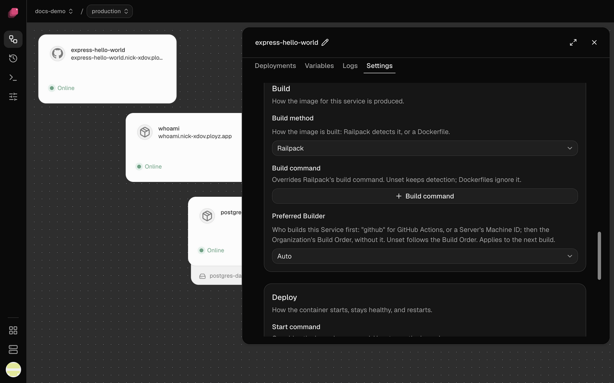
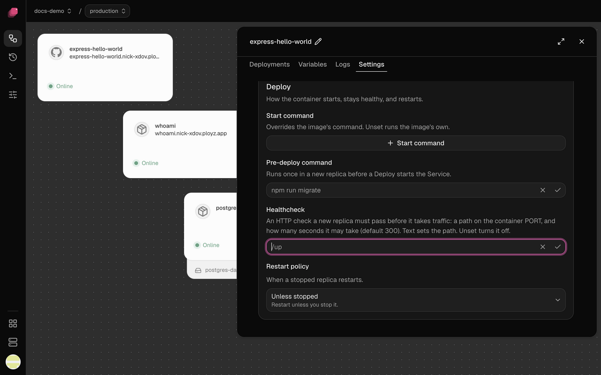

Open a service on the canvas, then click **Settings**. Your changes are staged until you
[deploy](../deploy/deployments.md), except the few marked **Takes effect at once**.

## Source

A repository service shows **Repository** through **Watch paths**, an image service shows
**Container image** and **Registry credentials**, and an empty service shows **Add a source**.
A service from `ployz up` shows only a note to run it again.

### Repository

Click the pencil to build another repository instead. The service keeps its Git branch if the
new repository has one by that name, and otherwise takes that repository's default branch.
**Disconnect** leaves the service with no source after your next deploy. See
[Deploy from GitHub](../deploy/github.md).

### Branch

Starts as the repository's default Git branch. Each environment has its own, so production can
follow `main` while staging follows `develop`. See
[Choose the Git branch](../deploy/github.md#choose-the-git-branch).

### Root directory

The repository root (`/`) until you click **Add root directory** and enter a folder, like
`/apps/web`. Set it to deploy one app from a monorepo: the build sees nothing outside that
folder. See [Deploy a monorepo](../deploy/github.md#deploy-a-monorepo).

### Auto-deploy

On by default, though pushes deploy only once the Ployz GitHub App is on the repository. Turn it
off to deploy only when you click **Deploy**. **Takes effect at once**, and Discard doesn't undo it. See
[Deploy on push](../deploy/github.md#deploy-on-push).

### Wait for CI

Off by default. Turn it on so a failing check stops a commit from deploying; if no checks run
for a commit, it waits until your next push. **Takes effect at once.** See
[Wait for CI](../deploy/github.md#wait-for-ci).

### Watch paths

Empty by default, so any push deploys. Add a pattern like `apps/web/**` to deploy only when a
push changes those files; patterns start at the repository root, whatever the root directory.
**Takes effect at once.** See
[Deploy only when certain files change](../deploy/github.md#deploy-only-when-certain-files-change).

### Container image

Click the pencil to run another image or tag. Deploying the same tag again doesn't fetch a newer
copy, so give each release its own tag, like `1.5.0`. See
[Ship a new version of your image](../deploy/docker-image.md#ship-a-new-version-of-your-image).

### Registry credentials

Needed only for a private image: click **Add credentials** and fill in what your registry asks
for. Adding or disconnecting credentials waits for your next deploy, but a new secret for
credentials you already have **takes effect at once**, and Discard can't bring the old one back. See
[Use a private image](../deploy/docker-image.md#use-a-private-image).

### Add a source

An **Empty service** has nothing to run, and deploying it fails until you choose **Git
repository** or **Container image** here. See [Add a service](services.md#add-a-service).

## Networking

### Public Networking

A service you add in the dashboard has none until you click **Generate Domain**, which gives it
a free https address like `web.acme-x7q2.ployz.app`. Leave **Port** blank to send traffic to
`PORT`, `8080` unless you set it, or enter the port your app listens on. See
[Generate a domain](domains.md#generate-a-domain).

### Custom Domain

Adds a domain you own, like `app.example.com`, next to the generated one, and a service can have
as many as you need. It needs Ployz Pro, $9 a month, or a [self-hosted](../self-hosting.md) Ployz
Cloud, plus a DNS record at your DNS provider. See
[Add a custom domain](domains.md#add-a-custom-domain).

### Private Networking

Other services reach this one at `NAME.internal`, or just `NAME`, on any port. The name starts as
the service's name and stays when you rename the service; change it with the pencil, and update
services that typed the old name in the same deploy. See
[Change a service's private name](private-networking.md#change-a-services-private-name).

## Scale

### Replicas

1 by default, up to 50. Ployz gives each server one replica before any server gets a second. A
service with a volume runs one replica, and preview environments run one of each service. See
[Run more replicas](scaling.md#run-more-replicas).

### CPU limit

Empty by default, which means no limit. Set it in vCPUs, up to 64, to keep a busy service from
slowing the others on its server. Ployz doesn't check that a server has room for it, so leave
headroom. See [Scaling and multiple servers](scaling.md#run-more-replicas).

### Memory limit

Empty by default, which means no limit. Set it in GB, up to 1024. A replica that goes over it is
killed, and its [Restart policy](#restart-policy) decides whether it comes back. See
[Scaling and multiple servers](scaling.md#run-more-replicas).

## Build

Only services built from a GitHub repository have this section.

### Build method

**Railpack** by default, even when the repository has a Dockerfile. Choose
**Dockerfile** when you already have one that works, or your app needs more than Railpack can
work out. See [Railpack and Dockerfiles](../builds/railpack-and-dockerfiles.md).

### Build command

Shown with **Railpack**. Empty by default, so Railpack works out the build step; click **Build
command** and enter one, like `pnpm run build`, when it picks the wrong one. See
[Change the build and start commands](../builds/railpack-and-dockerfiles.md#change-the-build-and-start-commands).

### Dockerfile path

Shown with **Dockerfile**. Empty means `Dockerfile` in the [root directory](#root-directory). The
field suggests paths from the top of the repository, so with a root directory set, shorten them to
start from it. See
[Build with a Dockerfile](../builds/railpack-and-dockerfiles.md#build-with-a-dockerfile).

### Preferred Builder

**Auto** by default, which follows the build order under **Organization → Builds**. Pick **GitHub
Actions** to keep a busy service's builds off your servers (its repository needs the Ployz build
workflow, and GitHub receives the service's variables), or one of your servers to keep its
builds on a server whose build cache is warm. The service tries that builder first. **Takes effect at
once**, from the next build. See
[Prefer a builder for one service](../builds/where-builds-run.md#prefer-a-builder-for-one-service).

## Deploy

### Start command

Empty by default, so the service runs what the image or the build sets. Set one, like
`npm run worker`, to run something else from the same code; it runs in a shell, so `$PORT` works.
See [Override the start command](../deploy/docker-image.md#override-the-start-command).

### Pre-deploy command

Off until you click **Pre-deploy command**. Use it for migrations, like `npm run migrate`: if it
fails or runs past 5 minutes, the deploy fails and the old version keeps running, but Ployz
doesn't undo what it changed. See
[Deploy without downtime](../deploy/deployments.md#deploy-without-downtime).

### Healthcheck

Off by default, so an old replica stops a few seconds after the new one starts, ready or not.
Click **Healthcheck path** and enter a path like `/up` that answers with a 2xx status on `PORT`; a
redirect fails the check. See
[Deploy without downtime](../deploy/deployments.md#deploy-without-downtime).

### Healthcheck timeout

Shown once you set a healthcheck path. 300 seconds by default, which is also the most. A replica
that doesn't pass in time is stopped, and the old version keeps serving. See
[My new version never becomes healthy](../troubleshooting/deployments.md#my-new-version-never-becomes-healthy).

### Restart policy

**Unless stopped** by default, which brings a stopped replica back unless you stopped it. Choose
**On failure** to restart only after an error, so a task that finishes stays stopped, or **Never**
to leave it down. **Always** restarts it whenever it stops. See
[My service shows Crashed or Stopped](../troubleshooting/deployments.md#my-service-shows-crashed-or-stopped).

### Max retries

Shown with **On failure**. 10 by default, from 0 to 100; after that many restarts, the replica
stays stopped.

## Danger

### Delete service

The service keeps running until your next deploy, and discarding the change brings it back. A
database's service takes its volume and data with it, unless another service mounts the volume,
and the deploy asks you to confirm. See
[Confirm a deploy that deletes data](../deploy/deployments.md#confirm-a-deploy-that-deletes-data).
