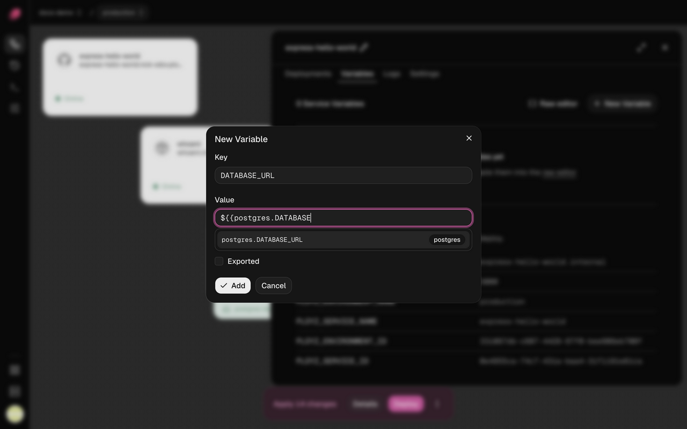

Variables are the environment variables your service starts with: settings, API keys, your
database's URL. Each service has its own, and a variable can point at another service's, so
your app always gets the database of the environment it runs in.

## Add a variable

1. Open your service and go to the **Variables** tab.
2. Click **New Variable**, and enter a **Key** and a **Value**.
3. Leave **Sealed** ticked for a secret: you can't read it back or unseal it. Untick it for a
   value you want to see, or one that holds a [reference](#reference-another-services-variable).
   Click **Add**.
4. Click **Deploy**.

<!-- screenshot: the Variables tab with a few variables, Raw editor and New Variable -->

To change or remove a variable, open the menu at the end of its row.

Your running service keeps its old values until you deploy. Changing a variable
[rebuilds](../builds/overview.md) a service built from GitHub on that deploy.

## Paste many at once

Click **Raw editor** to see the service's variables as a `.env` file (**ENV**) or as **JSON**.
Paste or edit them, then click **Update variables**.

- Deleting a line deletes that variable.
- Sealed variables aren't shown and stay as they are.
- Values you save here are plain text. Seal secrets afterwards from their menu.

## Seal a secret

A sealed variable is encrypted when you save it, and the dashboard never shows its value again.
Your service still gets the real value when it deploys.

- New variables are sealed unless you untick **Sealed**.
- To seal a plain variable, choose **Seal** from its menu. You can't unseal it.
- To change a sealed value, delete the variable and add it again.
- A sealed value is stored exactly as typed, so it can't hold a
  [reference](#reference-another-services-variable).

## Reference another service's variable

A reference fills a variable with another variable's value. Write `${{ SERVICE.KEY }}` for
another service's variable and `${{ KEY }}` for one of this service's own:

```sh
DATABASE_URL=${{ postgres.DATABASE_URL }}
WEB_URL=http://${{ web.PLOYZ_PRIVATE_DOMAIN }}:8080
```

Untick **Sealed**, then type `${{` in the value. The dashboard suggests this service's
variables, the [variables Ployz provides](#variables-ployz-provides), and other services'
exported variables. Tick **Exported** on a variable to add it to the suggestions; you can type a
reference to any variable either way.



- A reference reads the service of that name in the same environment. In staging,
  `${{ postgres.DATABASE_URL }}` is staging's database.
- A reference to a sealed variable keeps the secret hidden. Your service gets the real value.
- A service that references another starts after it on every deploy.
- Ployz refuses a reference to a service or variable that doesn't exist, and won't delete one
  that something references. Remove the reference first.
- Write `$${{` for a literal `${{`.

## Variables Ployz provides

| Variable | Value |
| --- | --- |
| `PORT` | `8080`, unless you set it. Your domains and health check reach your app on this port. |
| `PLOYZ_PRIVATE_DOMAIN` | The service's [private address](private-networking.md), like `web.internal` |
| `PLOYZ_SERVICE_NAME` | The service's private name, like `web` |
| `PLOYZ_ENVIRONMENT_NAME` | The environment's name, like `production` |
| `PLOYZ_SERVICE_ID`, `PLOYZ_ENVIRONMENT_ID` | The service's and the environment's IDs |

Only `PORT` reaches your app on its own. To read another one, reference it in a variable of
your own, like `SELF_HOST=${{ PLOYZ_PRIVATE_DOMAIN }}`. The **Variables** tab lists them, with
their values, under your own variables.

## Good to know

- **Builds see your variables, sealed ones included.** A Dockerfile can keep what it reads in
  the image, so don't pass long-lived secrets to it as `ARG`s. See
  [Use variables at build time](../builds/railpack-and-dockerfiles.md#use-variables-at-build-time).
- **Branches copy variables.** A separate copy of a service in a
  [branch](../environments/environments.md) starts with its parent's variables, sealed values
  included, and changing them leaves the parent alone. A reference to a service the branch
  shares with its parent reads the parent's values.

Next: [add a database](databases.md).
