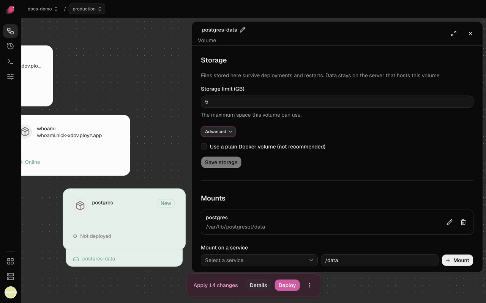

A deploy can replace your service's containers. A volume is a folder that survives:
whatever your service writes there is still there after deploys and restarts. Use one for
uploads, a SQLite file or a database's data. [Databases](databases.md) come with one.

Think of a volume as a disk plugged into one of your servers: every service that mounts it
runs on that server.

## Add a volume

1. Open your environment and click **Create**, then **Volume**. Right-clicking the canvas
   works too.
2. Enter a **Name**, like `uploads`, and a **Storage limit (GB)**. It's
   [fixed once you deploy](#choose-the-storage-limit), so leave room to grow. Click
   **Create volume**.
3. Click the new volume, then **Mount on a service**. Pick the service, enter a **Directory** inside
   its containers, like `/app/uploads`, and click **Mount**.
4. Click **Deploy**.



The volume shows as a tray under the service's card, and your app reads and writes files at
that directory. Open the menu at the end of the mount's row and choose **Edit directory** to move it.
Manage mounts from the volume's panel. Mount forms appear when you choose an action, and keep
your entered directory if a write fails.

## Choose the storage limit

The limit starts at 5 GB. A volume can't grow past it: once it's full, writes fail. The whole
limit is set aside on the server's disk, so a deploy fails if no server has room for it.

Choose with care. You can change the limit under **Storage** in the volume's panel until you
deploy the volume; after that it's fixed, even if that deploy failed. Ployz can't resize a
volume yet. To get more room, add a bigger volume, mount it in the same service at another
path, copy the files across with `ployz exec`, then swap the mount paths.

The dashboard doesn't show how full a volume is yet:

```sh
# CLI-only for now: how full is web's volume?
ployz exec web -- df -h /app/uploads
```

## Share a volume

By default, only one container writes to a volume. A service with a volume runs one replica, and no
other service can mount it. To run more replicas, or to mount it in several services, turn on
shared writes in the volume's **Storage** → **Advanced** → **Allow shared writes**, or use the CLI:

```sh
ployz volume set uploads --shared-writes
```

Do this only if your app copes with several writers at once; a database's data directory
doesn't. Everything that mounts the volume still runs on its server.

## When its server goes down

The services that mount the volume stop until the server is back. Nothing moves to another
server on its own, and a volume can't be [moved](move-a-volume.md) while its server is down. To
keep deploying your other services meanwhile, see
[When a server goes down](scaling.md#when-a-server-goes-down).

> [!WARNING]
> Ployz doesn't replicate or back up volumes. A [mirror](move-a-volume.md#mirror-a-volume)
> holds the data as of its last sync, nothing newer, and Ployz doesn't switch to it when the
> server goes down. Keep your own copies off the server; see
> [Back up a database](databases.md#back-up-a-database).

## Move a volume

With Ployz Cloud, `ployz volume move data --to web-2` moves a volume and the service that
mounts it to another server, stopping the service only for the last copy. `ployz volume mirror` keeps a read-only
copy on a second server. See [Move a volume](move-a-volume.md).

## When a volume has no writer

Each volume has one writer, the server that mounts it. A server you remove or reinstall turns
every volume it held into a copy, so the volume keeps its data but has no writer. A deploy of a
service that mounts such a volume refuses and names where the data is:

```
Volume data has no writer; it is held as web-2 (copy). Make one the writer: ployz volume restore data --from web-2
```

Run the `ployz volume restore` line it prints to make that copy the writer again, then deploy.
A volume that is [mid-move](move-a-volume.md#when-a-move-stops) refuses the same way until the
move finishes.

## When your servers show Docker only

A volume needs a server that shows **Managed volumes available** on the **Servers** page. A
server added with **Start without it** shows **Docker only** instead. If none of your servers
has managed volumes, deploying a volume fails, including the one a database gets.

[Add a server](../servers/add-a-server.md) with managed volumes, or, before you deploy, open the
volume and tick **Use a plain Docker volume (not recommended)** under **Advanced**. It has no
storage limit, so it can fill the server's disk.

## Detach a volume

In the volume's panel, open the menu at the end of a mount's row
and choose **Unmount**, then deploy. The detached row shows what the next deploy removes.
The volume and its data stay.

## Delete a volume

Deleting a deployed volume deletes its data from your servers for good.

1. Open the volume and click **Delete volume** under **Danger**. **Keep volume** undoes it.
2. Click **Delete data**, or **Deploy**.
3. Ployz shows **Deploy deletes data** with what goes. Type your `project/environment`, like
   `my-app/production`, and click **Deploy**.

A volume that was never deployed holds no data, so it goes on your next deploy without asking.

## Good to know

- **A branch gets an empty volume.** A [branch](../environments/environments.md) that copies
  a volume starts with no data, not a copy of yours.
- **Deleting a service keeps its volumes.** The exception is a [database](databases.md)
  deleted from the dashboard, which takes its volume with it.
