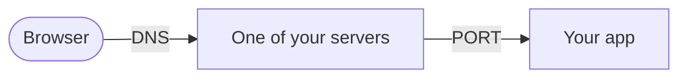
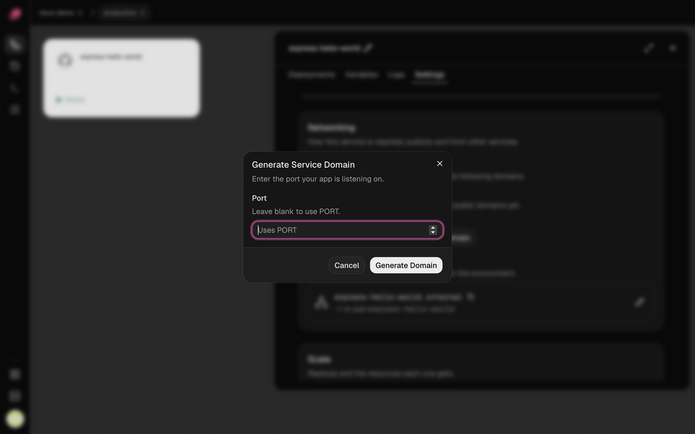

A visit to your app is a short trip: the browser looks up your domain, reaches one of your
servers over https, and that server hands the request to your app on its port. When a page
won't load, one leg of the trip is broken.



Start with your domain's status in the service's **Settings → Networking**: it names most of
the problems below. Your app's own errors are in the service's **Logs**.

## My service has no address

Services you add in the dashboard don't get a public address until you ask for one. In
**Settings → Networking**, click **Generate Domain**, leave **Port** blank to use `PORT`, then
deploy.



## My app shows 502 Bad Gateway

Your server got the request, but your app didn't answer.

1. **Listen on `0.0.0.0` and `PORT`.** An app listening on `localhost` or `127.0.0.1` turns
   away requests from outside its container:

   | App | Listen on all addresses and `PORT` |
   | --- | --- |
   | Node.js, Express | `app.listen(process.env.PORT, "0.0.0.0")` |
   | Next.js | `next start` already does. With `output: "standalone"`, add the variable `HOSTNAME=0.0.0.0`. |
   | Vite preview | `vite preview --host 0.0.0.0 --port $PORT` |
   | gunicorn | `gunicorn --bind 0.0.0.0:$PORT app:app` |
   | uvicorn | `uvicorn main:app --host 0.0.0.0 --port $PORT` |
   | Rails, Puma | `bundle exec puma -b tcp://0.0.0.0:$PORT` |
   | Laravel | `php artisan serve --host=0.0.0.0 --port=$PORT` |

   Change it in your code or in **Settings → Deploy → Start command**. If Vite preview says
   "Blocked request. This host is not allowed.", add your domain to `preview.allowedHosts` in
   `vite.config`.
2. **Check the port matches.** See the next section.
3. **Check your app is running** in its **Logs**. A replica that crashes or fails its health
   check gets no traffic; see [Troubleshooting deployments](deployments.md).

## My app listens on a different port

The domain's row says where traffic goes. **→ Uses PORT** means the `PORT` variable, which is
`8080` unless you set it. Either:

- add a `PORT` variable set to your app's port, then deploy (the health check uses it too), or
- click the pencil on the domain and set **Target port** to the port your app listens on.

## My domain shows Not Found

- **On `http://`?** Ployz serves https only and doesn't redirect yet. Use `https://`. Behind
  Cloudflare, see [below](#my-domain-is-behind-cloudflare).
- **On `https://`?** The domain isn't live yet. If its row says
  **Live after your next deploy**, click **Deploy**.

## My custom domain is waiting for DNS

You'll see **Waiting for DNS**, **DNS doesn't point here yet** or **DNS points to another
server**. Your servers can't get a certificate until your domain leads to them.

1. Click **Show DNS records** on the domain's row and create exactly those records at your DNS
   provider.
2. Delete any other A and AAAA records for the same name, like your old host's. A leftover
   AAAA record alone can block the certificate.
3. Give DNS time to spread. Your servers keep checking on their own.

## The browser can't make a secure connection

Your servers don't have a certificate for the domain yet. The domain shows **Issuing
certificate**, a DNS status, or **Certificate failed; retrying at …**. Fix any DNS status first
(see above). Otherwise give it a little time: your servers keep trying on their own.

## My domain is behind Cloudflare

- Set **SSL/TLS** to **Full (strict)**. **Flexible** reaches your servers over plain http and
  always gets Not Found.
- If the domain shows **Your proxy redirects to HTTPS: exempt /.well-known/acme-challenge/* from
  it**, Cloudflare's redirect is blocking your certificate. Set the DNS record to **DNS only**,
  or turn off **Always Use HTTPS** and add a redirect rule that sends http to https for every
  path except `/.well-known/acme-challenge/*`.

## Port 80 is closed

You'll see **Port 80 is closed on 203.0.113.10**. Your servers use port 80 to get certificates,
so Ployz leaves that server out of your organization's domain until it's open.

Open TCP port 80 and TCP and UDP port 443 to the internet on every server that takes web
traffic, in your hosting provider's firewall (like a Hetzner Cloud Firewall or an AWS security
group) as well as the server's own. Then click **Check again** under **Domain** in
**Organization → General**.

## None of my servers takes web traffic

You'll see **No Server receives traffic** or **No ingress Server has a public IP**. Either every server has web traffic turned off,
or Ployz doesn't know their public addresses. [Add a server](../servers/add-a-server.md), or fix
it from the CLI (these settings aren't in the dashboard yet):

```sh
# Take web traffic on web-1 again
ployz server set web-1 --accepts-ingress=true

# Tell Ployz web-1's public address
ployz server set web-1 --public-ip 203.0.113.10
```

## One service can't reach another

You'll see errors like `ECONNREFUSED 127.0.0.1:5432` or `getaddrinfo ENOTFOUND api.internal`.

- Use the other service's private name, like `postgres.internal`, never `localhost`. It's in
  that service's **Settings → Networking**, under **Private Networking**.
- Use the port it listens on inside its container, like `5432`.
- For a web service, use `http://`, not `https://`: traffic between services stays on your
  private network.
- A name that doesn't resolve can mean the other service isn't healthy (check its **Logs**) or
  is in another environment.
- Services on different servers need UDP port 51820 open between those servers.

See [Private networking](../services/private-networking.md).

## Good to know

- **A redirect fails the health check.** Point **Healthcheck path** at a page your app serves
  directly. See [Deployments](../deploy/deployments.md).
- **Private names stay inside one environment.** In a branch, reference
  `${{ api.PLOYZ_PRIVATE_DOMAIN }}` rather than typing the name.
